# Detekcja obiektów — YOLO od zera

> Detekcja to klasyfikacja plus regresja, uruchamiana na każdej pozycji w mapie cech, a następnie oczyszczana za pomocą non-maximum suppression.

**Typ:** Budowanie
**Języki:** Python
**Wymagania wstępne:** Faza 4 Lekcja 03 (CNN), Faza 4 Lekcja 04 (Klasyfikacja obrazów), Faza 4 Lekcja 05 (Transfer Learning)
**Czas:** ~75 minut

## Cele uczenia się

- Wyjaśnić projekt siatki i anchorów, które przekształcają detekcję w gęsty problem predykcyjny, oraz określić, co oznacza każda liczba w tensorze wyjściowym
- Obliczyć Intersection-over-Union między bboxami i zaimplementować non-maximum suppression od zera
- Zbudować minimalistyczną głowicę w stylu YOLO na szczycie wstępnie wytrenowanego backbone'u, w tym stratę klasyfikacji, objectness i regresji bboxów
- Odczytać wiersz metryki detekcji (precision@0.5, recall, mAP@0.5, mAP@0.5:0.95) i wybrać, który pokrętło obrócić jako następne

## Problem

Klasyfikacja mówi "ten obraz to pies". Detekcja mówi "tu jest pies w pikselach (112, 40, 280, 210), tu jest kot w (400, 180, 560, 310), i nic więcej w kadrze". Ta jedna zmiana strukturalna — przewidywanie zmiennej liczby oznaczonych bboxów zamiast jednej etykiety na obraz — to właśnie, na czym polega każdy autonomiczny system, każdy produkt dozoru, każdy parser układu dokumentów i każda linia wizyjna w fabryce.

Detekcja to również miejsce, gdzie pojawia się każdy kompromis inżynieryjny w wizji naraz. Chcesz bboxów, które są dokładne (głowica regresji), chcesz właściwej klasy dla każdego bboxa (głowica klasyfikacji), chcesz, żeby model wiedział, kiedy nie ma nic do wykrycia (wynik objectness), i chcesz dokładnie jednej predykcji na rzeczywisty obiekt (non-maximum suppression). Pominięcie któregokolwiek z tych elementów sprawia, że pipeline albo przeoczy obiekty, zgłosi złudne bboxy, lub przewidzi ten sam obiekt piętnaście razy w nieznacznie różnych pozycjach.

YOLO (You Only Look Once, Redmon i in. 2016) to projekt, który sprawił, że wszystko to działa w czasie rzeczywistym, wykonując to jednym przejściem forward conv net, i te same decyzje strukturalne są nadal podstawą nowoczesnych detektorów (YOLOv8, YOLOv9, YOLO-NAS, RT-DETR). Naucz się rdzenia, a każdy wariant stanie się przearanżowaniem tych samych części.

## Koncepcja

### Detekcja jako gęsta predykcja

Klasyfikator generuje C liczb na obraz. Detektor w stylu YOLO generuje `(S x S x (5 + C))` liczb na obraz, gdzie S to rozmiar siatki przestrzennej.

```mermaid
flowchart LR
    IMG["Input 416x416 RGB"] --> BB["Backbone<br/>(ResNet, DarkNet, ...)"]
    BB --> FM["Feature map<br/>(C_feat, 13, 13)"]
    FM --> HEAD["Detection head<br/>(1x1 convs)"]
    HEAD --> OUT["Output tensor<br/>(13, 13, B * (5 + C))"]
    OUT --> DEC["Decode<br/>(grid + sigmoid + exp)"]
    DEC --> NMS["Non-max suppression"]
    NMS --> RESULT["Final boxes"]

    style IMG fill:#dbeafe,stroke:#2563eb
    style HEAD fill:#fef3c7,stroke:#d97706
    style NMS fill:#fecaca,stroke:#dc2626
    style RESULT fill:#dcfce7,stroke:#16a34a
```



Każda z komórek `S * S` siatki przewiduje `B` bboxów. Dla każdego bboxa:

- 4 liczby opisują geometrię: `tx, ty, tw, th`.
- 1 liczba to wynik objectness: "czy jest obiekt wycentrowany w tej komórce?"
- C liczb to prawdopodobieństwa klas.

Razem na komórkę: `B * (5 + C)`. Dla VOC z `S=13, B=2, C=20`, to jest 50 liczb na komórkę.

### Dlaczego siatki i anchory

Zwykła regresja przewidywałaby `(x, y, w, h)` dla każdego obiektu jako bezwzględną współrzędną. To jest trudne dla conv net, bo translacja obrazu nie powinna translatować wszystkich predykcji o tę samą wartość — każdy obiekt jest przestrzennie zakotwiczony. Siatka odpowiada na to, przypisując każdy ground-truth bbox do komórki siatki, w której pada jego środek; tylko ta komórka jest odpowiedzialna za ten obiekt.

Anchory adresują drugi problem. Konwolucja 3x3 nie może łatwo zregresować bboxa o szerokości 500 pikseli z komórki cech o polu odbiorczym 16 pikseli. Zamiast tego wstępnie definiujemy `B` kształtów prior boxów (anchorów) na komórkę i przewidujemy małe delty od każdego anchora. Model uczy się wybierać właściwy anchor i go przesuwać, zamiast regresować od zera.

```
Anchor box priors (przykład dla wejścia 416x416):

  mały:    (30,  60)
  średni:  (75,  170)
  duży:    (200, 380)

W każdej komórce siatki, każdy anchor emituje (tx, ty, tw, th, obj, c_1, ..., c_C).
```

Nowoczesne detektory często używają FPN z różnymi zestawami anchorów na rozdzielczość — małe anchory na płytkich mapach o wysokiej rozdzielczości, duże anchory na głębokich mapach o niskiej rozdzielczości. Ten sam pomysł, więcej skali.

### Dekodowanie predykcji

Surowe `tx, ty, tw, th` nie są współrzędnymi bboxów; są celami regresji, które należy przekształcić przed wykreśleniem:

```
centre x  = (sigmoid(tx) + cell_x) * stride
centre y  = (sigmoid(ty) + cell_y) * stride
width     = anchor_w * exp(tw)
height    = anchor_h * exp(th)
```

`sigmoid` utrzymuje offsety centrum wewnątrz komórki. `exp` pozwala szerokości skalować swobodnie od anchora bez flipu znaku. `stride` skaluje współrzędne siatki z powrotem do pikseli. Ten krok dekodowania jest taki sam w każdej wersji YOLO od v2.

### IoU

Uniwersalna metryka podobieństwa detekcji między dwoma bboxami:

```
IoU(A, B) = area(A intersect B) / area(A union B)
```

IoU = 1 oznacza identyczne; IoU = 0 oznacza brak nakładania. IoU między predykcją a ground-truth bboxem decyduje o tym, czy predykcja liczy się jako true positive (zazwyczaj IoU >= 0.5). IoU między dwiema predykcjami to, czego NMS używa do deduplikacji.

### Non-maximum suppression

Conv net wytrenowany na sąsiadujących anchorach często przewiduje nakładające się bboxy dla tego samego obiektu. NMS keeps the highest-confidence prediction and deletes any other prediction with IoU above a threshold.

```
NMS(boxes, scores, iou_threshold):
    sort boxes by score descending
    keep = []
    while boxes not empty:
        pick the top-scoring box, add to keep
        remove every box with IoU > iou_threshold to the picked box
    return keep
```

Typowy próg: 0.45 dla detekcji obiektów. Najnowsze detektory zastępują standardowe NMS na `soft-NMS`, `DIoU-NMS`, lub uczą suppressji bezpośrednio (RT-DETR), ale strukturalny cel jest ten sam.

### Funkcja straty

Strata YOLO to trzy straty dodane z wagami:

```
L = lambda_coord * L_box(pred, target, where obj=1)
  + lambda_obj   * L_obj(pred, 1,     where obj=1)
  + lambda_noobj * L_obj(pred, 0,     where obj=0)
  + lambda_cls   * L_cls(pred, target, where obj=1)
```

Tylko komórki zawierające obiekt przyczyniają się do straty regresji bboxów i klasyfikacji. Komórki bez obiektów przyczyniają się tylko do straty objectness (ucząc model, kiedy milczeć). `lambda_noobj` jest zazwyczaj mała (~0.5), bo ogromna większość komórek jest pusta i w przeciwnym razie zdominowałaby całkowitą stratę.

Nowoczesne warianty zamieniają stratę MSE bbox na CIoU / DIoU (które optymalizują IoU bezpośrednio), używają focal loss dla nierównowagi klas, i balansują objectness z quality focal loss. Trójskładnikowa struktura pozostaje niezmieniona.

### Metryki detekcji

Accuracy nie przenosi się do detekcji. Cztery liczby, które to robią:

- **Precision@IoU=0.5** — ile z predykcji zaliczonych jako pozytywne jest faktycznie poprawnych.
- **Recall@IoU=0.5** — ile ze rzeczywistych obiektów znaleźliśmy.
- **AP@0.5** — pole pod krzywą precision-recall przy progu IoU 0.5; jedna liczba na klasę.
- **mAP@0.5:0.95** — średnia AP przez progi IoU 0.5, 0.55, ..., 0.95. Metryka COCO; najostrzejsza i najbardziej informacyjna.

Raportuj wszystkie cztery. Detektor silny na mAP@0.5 ale słaby na mAP@0.5:0.95 lokalizuje mniej więcej, ale nie precyzyjnie; napraw to lepszą stratą regresji bboxów. Detektor z wysoką precision i niskim recall jest zbyt konserwatywny; obniż próg confidence lub zwiększ wagę objectness.

## Zbuduj to

### Krok 1: IoU

Koń mechaniczny całej lekcji. Działa na dwóch tablicach bboxów w formacie `(x1, y1, x2, y2)`.

```python
import numpy as np

def box_iou(boxes_a, boxes_b):
    ax1, ay1, ax2, ay2 = boxes_a[:, 0], boxes_a[:, 1], boxes_a[:, 2], boxes_a[:, 3]
    bx1, by1, bx2, by2 = boxes_b[:, 0], boxes_b[:, 1], boxes_b[:, 2], boxes_b[:, 3]

    inter_x1 = np.maximum(ax1[:, None], bx1[None, :])
    inter_y1 = np.maximum(ay1[:, None], by1[None, :])
    inter_x2 = np.minimum(ax2[:, None], bx2[None, :])
    inter_y2 = np.minimum(ay2[:, None], by2[None, :])

    inter_w = np.clip(inter_x2 - inter_x1, 0, None)
    inter_h = np.clip(inter_y2 - inter_y1, 0, None)
    inter = inter_w * inter_h

    area_a = (ax2 - ax1) * (ay2 - ay1)
    area_b = (bx2 - bx1) * (by2 - by1)
    union = area_a[:, None] + area_b[None, :] - inter
    return inter / np.clip(union, 1e-8, None)
```

Zwraca macierz `(N_a, N_b)` parami obliczonych IoU. Użyj jej przeciwko pojedynczemu ground-truth bboxowi, tworząc jedną z tablic o kształcie `(1, 4)`.

### Krok 2: Non-max suppression

```python
def nms(boxes, scores, iou_threshold=0.45):
    order = np.argsort(-scores)
    keep = []
    while len(order) > 0:
        i = order[0]
        keep.append(i)
        if len(order) == 1:
            break
        rest = order[1:]
        ious = box_iou(boxes[[i]], boxes[rest])[0]
        order = rest[ious <= iou_threshold]
    return np.array(keep, dtype=np.int64)
```

Deterministyczny, `O(N log N)` od sortowania, i odpowiada zachowaniu `torchvision.ops.nms` na identycznych wejściach.

### Krok 3: Kodowanie i dekodowanie bboxów

Konwertuj między współrzędnymi pikselowymi a celami `(tx, ty, tw, th)`, które sieć faktycznie regresuje.

```python
def encode(box_xyxy, cell_x, cell_y, stride, anchor_wh):
    x1, y1, x2, y2 = box_xyxy
    cx = 0.5 * (x1 + x2)
    cy = 0.5 * (y1 + y2)
    w = x2 - x1
    h = y2 - y1
    tx = cx / stride - cell_x
    ty = cy / stride - cell_y
    tw = np.log(w / anchor_wh[0] + 1e-8)
    th = np.log(h / anchor_wh[1] + 1e-8)
    return np.array([tx, ty, tw, th])


def decode(tx_ty_tw_th, cell_x, cell_y, stride, anchor_wh):
    tx, ty, tw, th = tx_ty_tw_th
    cx = (sigmoid(tx) + cell_x) * stride
    cy = (sigmoid(ty) + cell_y) * stride
    w = anchor_wh[0] * np.exp(tw)
    h = anchor_wh[1] * np.exp(th)
    return np.array([cx - w / 2, cy - h / 2, cx + w / 2, cy + h / 2])


def sigmoid(x):
    return 1.0 / (1.0 + np.exp(-x))
```

Test: zakoduj bbox, a następnie zdekoduj — powinieneś otrzymać coś bardzo zbliżonego do oryginału (do odwrotności sigmoidalnej, która nie jest idealnie odwracalna, gdy `tx` nie jest w zakresie post-sigmoid).

### Krok 4: Minimalna głowica YOLO

Jedna konwolucja 1x1 na mapie cech, reshape do `(B, S, S, num_anchors, 5 + C)`.

```python
import torch
import torch.nn as nn

class YOLOHead(nn.Module):
    def __init__(self, in_c, num_anchors, num_classes):
        super().__init__()
        self.num_anchors = num_anchors
        self.num_classes = num_classes
        self.conv = nn.Conv2d(in_c, num_anchors * (5 + num_classes), kernel_size=1)

    def forward(self, x):
        n, _, h, w = x.shape
        y = self.conv(x)
        y = y.view(n, self.num_anchors, 5 + self.num_classes, h, w)
        y = y.permute(0, 3, 4, 1, 2).contiguous()
        return y
```

Kształt wyjściowy: `(N, H, W, num_anchors, 5 + C)`. Ostatni wymiar zawiera `[tx, ty, tw, th, obj, cls_0, ..., cls_{C-1}]`.

### Krok 5: Przydzielanie ground-truth

Dla każdego ground-truth bboxu zdecyduj, który `(cell, anchor)` jest odpowiedzialny.

```python
def assign_targets(boxes_xyxy, classes, anchors, stride, grid_size, num_classes):
    num_anchors = len(anchors)
    target = np.zeros((grid_size, grid_size, num_anchors, 5 + num_classes), dtype=np.float32)
    has_obj = np.zeros((grid_size, grid_size, num_anchors), dtype=bool)

    for box, cls in zip(boxes_xyxy, classes):
        x1, y1, x2, y2 = box
        cx, cy = 0.5 * (x1 + x2), 0.5 * (y1 + y2)
        gx, gy = int(cx / stride), int(cy / stride)
        bw, bh = x2 - x1, y2 - y1

        ious = np.array([
            (min(bw, aw) * min(bh, ah)) / (bw * bh + aw * ah - min(bw, aw) * min(bh, ah))
            for aw, ah in anchors
        ])
        best = int(np.argmax(ious))
        aw, ah = anchors[best]

        target[gy, gx, best, 0] = cx / stride - gx
        target[gy, gx, best, 1] = cy / stride - gy
        target[gy, gx, best, 2] = np.log(bw / aw + 1e-8)
        target[gy, gx, best, 3] = np.log(bh / ah + 1e-8)
        target[gy, gx, best, 4] = 1.0
        target[gy, gx, best, 5 + cls] = 1.0
        has_obj[gy, gx, best] = True
    return target, has_obj
```

Wybór anchora to "najlepszy kształt IoU z ground truth" — tani substytut, który odpowiada YOLOv2/v3 assignment. v5 i późniejsze używają bardziej wyrafinowanych strategii (task-aligned matching, dynamic k), które udoskonalają ten sam pomysł.

### Krok 6: Trzy straty

```python
def yolo_loss(pred, target, has_obj, lambda_coord=5.0, lambda_obj=1.0, lambda_noobj=0.5, lambda_cls=1.0):
    has_obj_t = torch.from_numpy(has_obj).bool()
    target_t = torch.from_numpy(target).float()

    # box-regression loss: only on cells with objects
    box_pred = pred[..., :4][has_obj_t]
    box_true = target_t[..., :4][has_obj_t]
    loss_box = torch.nn.functional.mse_loss(box_pred, box_true, reduction="sum")

    # objectness loss
    obj_pred = pred[..., 4]
    obj_true = target_t[..., 4]
    loss_obj_pos = torch.nn.functional.binary_cross_entropy_with_logits(
        obj_pred[has_obj_t], obj_true[has_obj_t], reduction="sum")
    loss_obj_neg = torch.nn.functional.binary_cross_entropy_with_logits(
        obj_pred[~has_obj_t], obj_true[~has_obj_t], reduction="sum")

    # classification loss on cells with objects
    cls_pred = pred[..., 5:][has_obj_t]
    cls_true = target_t[..., 5:][has_obj_t]
    loss_cls = torch.nn.functional.binary_cross_entropy_with_logits(
        cls_pred, cls_true, reduction="sum")

    total = (lambda_coord * loss_box
             + lambda_obj * loss_obj_pos
             + lambda_noobj * loss_obj_neg
             + lambda_cls * loss_cls)
    return total, {"box": loss_box.item(), "obj_pos": loss_obj_pos.item(),
                   "obj_neg": loss_obj_neg.item(), "cls": loss_cls.item()}
```

Pięć hiperparametrów, które każdy poradnik YOLO albo hardkoduje, albo przemiata. Stosunki mają znaczenie: `lambda_coord=5, lambda_noobj=0.5` odzwierciedla oryginalny artykuł YOLOv1 i nadal działa jako rozsądne domyślne.

### Krok 7: Pipeline wnioskowania

Zdekoduj surowe wyjście głowicy, zastosuj sigmoid/exp, threshold na objectness, i NMS.

```python
def postprocess(pred_tensor, anchors, stride, img_size, conf_threshold=0.25, iou_threshold=0.45):
    pred = pred_tensor.detach().cpu().numpy()
    grid_h, grid_w = pred.shape[1], pred.shape[2]
    num_anchors = len(anchors)

    boxes, scores, classes = [], [], []
    for gy in range(grid_h):
        for gx in range(grid_w):
            for a in range(num_anchors):
                tx, ty, tw, th, obj, *cls = pred[0, gy, gx, a]
                score = sigmoid(obj) * sigmoid(np.array(cls)).max()
                if score < conf_threshold:
                    continue
                cls_idx = int(np.argmax(cls))
                cx = (sigmoid(tx) + gx) * stride
                cy = (sigmoid(ty) + gy) * stride
                w = anchors[a][0] * np.exp(tw)
                h = anchors[a][1] * np.exp(th)
                boxes.append([cx - w / 2, cy - h / 2, cx + w / 2, cy + h / 2])
                scores.append(float(score))
                classes.append(cls_idx)

    if not boxes:
        return np.zeros((0, 4)), np.zeros((0,)), np.zeros((0,), dtype=int)
    boxes = np.array(boxes)
    scores = np.array(scores)
    classes = np.array(classes)
    keep = nms(boxes, scores, iou_threshold)
    return boxes[keep], scores[keep], classes[keep]
```

To jest kompletna ścieżka eval: head -> decode -> threshold -> NMS.

## Użyj tego

`torchvision.models.detection` dostarcza produkcyjne detektory z tą samą konceptualną strukturą. Załadowanie wstępnie wytrenowanego modelu zajmuje trzy linie.

```python
import torch
from torchvision.models.detection import fasterrcnn_resnet50_fpn_v2

model = fasterrcnn_resnet50_fpn_v2(weights="DEFAULT")
model.eval()
with torch.no_grad():
    predictions = model([torch.randn(3, 400, 600)])
print(predictions[0].keys())
print(f"boxes:  {predictions[0]['boxes'].shape}")
print(f"scores: {predictions[0]['scores'].shape}")
print(f"labels: {predictions[0]['labels'].shape}")
```

Dla pipeline'ów wnioskowania w czasie rzeczywistym, `ultralytics` (YOLOv8/v9) to standard: `from ultralytics import YOLO; model = YOLO('yolov8n.pt'); model(img)`. Model obsługuje dekodowanie i NMS wewnętrznie i zwraca tę samą trójkę `boxes / scores / labels`, którą zbudowałeś powyżej.

## Wyślij to

Ta lekcja tworzy:

- `outputs/prompt-detection-metric-reader.md` — prompt, który zamienia wiersz `precision, recall, AP, mAP@0.5:0.95` w jednolinijkową diagnozę i pojedynczy najbardziej użyteczny następny eksperyment.
- `outputs/skill-anchor-designer.md` — skill, który dla danego zestawu ground-truth bboxów uruchamia k-means na `(w, h)` i zwraca zestawy anchorów na poziom FPN plus statystyki pokrycia potrzebne do wybrania właściwej liczby anchorów.

## Ćwiczenia

1. **(Łatwe)** Zaimplementuj `box_iou` i uruchom przeciwko `torchvision.ops.box_iou` na 1000 losowych parach bboxów. Zweryfikuj, że max bezwzględna różnica jest poniżej `1e-6`.
2. **(Średnie)** Przepisz `yolo_loss` na wersję używającą straty CIoU bbox zamiast MSE. Pokaż na syntetycznym zbiorze 100 obrazów, że CIoU zbiega do lepszego końcowego mAP@0.5:0.95 niż MSE w tej samej liczbie epok.
3. **(Trudne)** Zaimplementuj wnioskowanie wieloskalowe: przekaż ten sam obraz w trzech rozdzielczościach przez model, złącz predykcje bboxów, i uruchom pojedyncze NMS na końcu. Zmierz wzrost mAP vs wnioskowanie jednoskalowe na hold-out set.

## Kluczowe terminy

| Termin | Co ludzie mówią | Co to faktycznie oznacza |
|--------|----------------|----------------------|
| Anchor | "Box prior" | Wstępnie zdefiniowany kształt bboxa w każdej komórce siatki, z którego sieć przewiduje delty zamiast bezwzględnych współrzędnych |
| IoU | "Overlap" | Intersection-over-union dwóch bboxów; uniwersalna miara podobieństwa w detekcji |
| NMS | "Deduplikuj" | Zachłanny algorytm, który utrzymuje predykcje o najwyższym wyniku i usuwa nakładające się powyżej progu |
| Objectness | "Czy jest tu coś" | Na anchor, na komórkę skalarny wynik przewidujący, czy obiekt jest wycentrowany w tej komórce |
| Grid stride | "Downsample factor" | Piksele na komórkę siatki; wejście 416-px z głowicą 13-siatkową ma stride 32 |
| mAP | "Mean average precision" | Średnia pola pod krzywą precision-recall, uśredniona po klasach i (dla COCO) progach IoU |
| AP@0.5 | "PASCAL VOC AP" | Średnia precyzja z progiem IoU 0.5; łagodniejsza wersja metryki |
| mAP@0.5:0.95 | "COCO AP" | Średnia przez progi IoU 0.5..0.95 krok 0.05; ostra wersja i obecny standard społeczności |

## Dalsze czytanie

- [YOLOv1: You Only Look Once (Redmon i in., 2016)](https://arxiv.org/abs/1506.02640) — artykuł założycielski; każdy YOLO od tego jest udoskonaleniem tej struktury
- [YOLOv3 (Redmon & Farhadi, 2018)](https://arxiv.org/abs/1804.02767) — artykuł, który wprowadził wieloskalowe głowice w stylu FPN; nadal najjaśniejszy diagram
- [Ultralytics YOLOv8 docs](https://docs.ultralytics.com) — obecne produkcyjne odniesienie; obejmuje formaty datasetów, augmentacje, przepisy trenowania
- [The Illustrated Guide to Object Detection (Jonathan Hui)](https://jonathan-hui.medium.com/object-detection-series-24d03a12f904) — najlepsza wycieczka po angielsku przez pełne zoo detektorów; bezcenna dla zrozumienia, jak DETR, RetinaNet, FCOS i YOLO się odnoszą