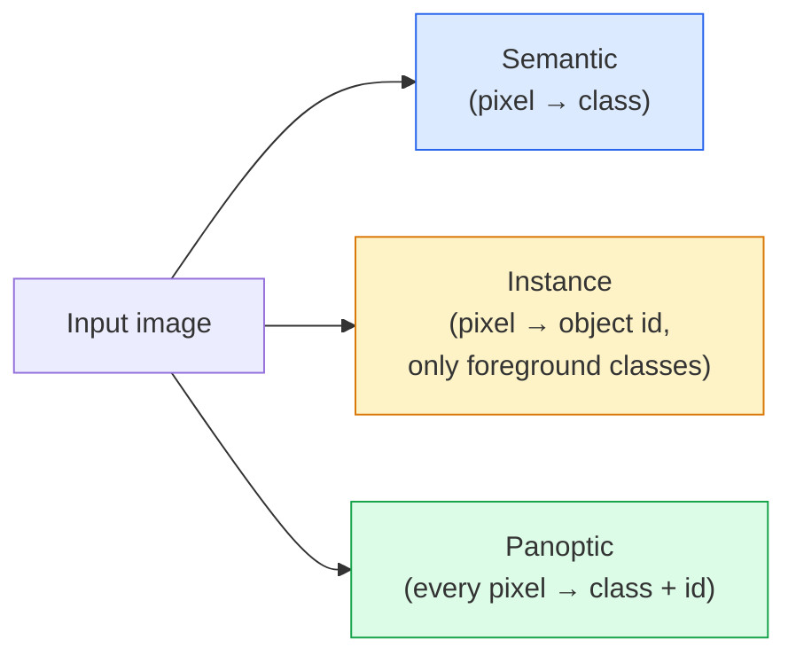
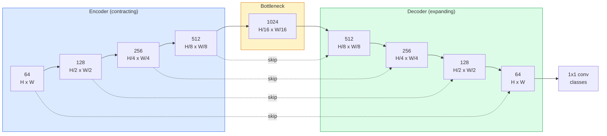

# Semantic Segmentation — U-Net

> Segmentation jest klasyfikacją na poziomie każdego piksela. U-Net sprawia, że działa to poprzez sparowanie downsamplingowego enkodera z upsamplingowym dekoderem i połączenie ich skip connections.

**Typ:** Build
**Języki:** Python
**Wymagania wstępne:** Phase 4 Lesson 03 (CNN-y), Phase 4 Lesson 04 (Image Classification)
**Szacowany czas:** ~75 minut

## Cele uczenia się

- Odróżnić semantic, instance i panoptic segmentation i wybrać właściwe zadanie dla danego problemu
- Zbudować U-Net od zera w PyTorch z encoder blocks, bottleneckem, decoderem z transposed convolutions i skip connections
- Zaimplementować pixel-wise cross-entropy, Dice loss i combined loss, które jest obecnie domyślne w medycynie i przemyśle
- Odczytać metryki IoU i Dice per class i zdiagnozować, czy słaby wynik wynika z małego recall obiektów, dokładności granic czy niezbalansowania klas

## Problem

Classification outputuje jedną etykietę per obraz. Detection outputuje garść bounding boxes per obraz. Segmentation outputuje jedną etykietę per piksel. Dla inputu o rozmiarze `H x W`, output to tensor kształtu `H x W` (semantic) lub `H x W x N_instances` (instance). To miliony predykcji per obraz, nie jedna.

Struktura segmentation jest powodem, dla którego napędza prawie każdy produkt wizyjny dense-prediction: medical imaging (maska guza), autonome driving (droga, pas, przeszkoda), satellite (footprinty budynków, granice upraw), document parsing (strefy layoutu), robotics (regiony chwytalne). Żadne z tych zadań nie może być rozwiązane przez wstawienie bounding boxa wokół obiektu; potrzebują dokładnego sylwetki.

Problem architektoniczny jest prosty do sformułowania i nieskomplikowany do rozwiązania: sieć musi widzieć jednocześnie globalny kontekst obrazu (jaki to rodzaj sceny) i lokalny detal pikselowy (dokładnie który piksel to droga vs chodnik). Standardowy CNN kompresuje przestrzennie, żeby zyskać kontekst, co wyrzuca detail. U-Net był designem, który uzyskał oba.

## Koncepcja

### Semantic vs instance vs panoptic



- **Semantic** mówi "ten piksel to droga, tamten piksel to samochód." Dwa samochody obok siebie zlewają się w jeden blob.
- **Instance** mówi "ten piksel to samochód #3, tamten piksel to samochód #5." Ignoruje background stuff ("stuff" = niebo, droga, trawa).
- **Panoptic** ujednolica oba: każdy piksel dostaje etykietę klasy, każda instancja dostaje unikalne id, stuff i things oba segmentowane.

Ta lekcja obejmuje semantic. Następna lekcja (Mask R-CNN) obejmuje instance.

### Kształt U-Net



Encoder zmniejsza rozdzielczość przestrzenną cztery razy i podwaja kanały. Decoder odwraca: podwaja rozdzielczość przestrzenną cztery razy i zmniejsza kanały o połowę. Skip connections konkatenują pasujące encoder features z decoder features na każdej rozdzielczości. Ostateczna 1x1 conv mapuje `64 -> num_classes` w pełnej rozdzielczości.

Dlaczego skip connections są konieczne: decoder widział tylko małe feature mapy w momencie, gdy próbuje outputować predykcje na poziomie pikseli. Bez skips nie może dokładnie lokalizować krawędzi, bo ta informacja została skompresowana w encoderze. Skip connections przekazują mu high-resolution feature mapy, które encoder obliczył podczas schodzenia w dół.

### Transposed vs bilinear upsample

Decoder musi rozszerzać wymiary przestrzenne. Dwie opcje:

- **Transposed convolution** (`nn.ConvTranspose2d`) — learnable upsample. Historyczny U-Net default. Może produkować checkerboard artifacts, jeśli stride i kernel size nie dzielą się równo.
- **Bilinear upsample + 3x3 conv** — smooth upsample followed by conv. Mniej artifacts, mniej parametrów, teraz nowoczesny default.

Obie pojawiają się w praktyce. Dla pierwszego U-Neta, bilinear jest bezpieczniejszy.

### Cross-entropy na siatce pikseli

Dla semantic segmentation z C klasami, model output to `(N, C, H, W)`. Target to `(N, H, W)` z integer class IDs. Cross-entropy jest identyczny jak w przypadku klasyfikacji, tylko applied at every spatial position:

```
Loss = mean over (n, h, w) of -log( softmax(logits[n, :, h, w])[target[n, h, w]] )
```

`F.cross_entropy` w PyTorch obsługuje ten kształt natywnie. Nie trzeba reshape.

### Dice loss i dlaczego go potrzebujesz

Cross-entropy traktuje każdy piksel równo. To jest błędne, gdy jedna klasa dominuje w kadrze (medical imaging: 99% background, 1% guz). Sieć może uzyskać 99% accuracy predykując background wszędzie i nadal być bezużyteczna.

Dice loss rozwiązuje to poprzez bezpośrednią optymalizację overlap między predicted i true mask:

```
Dice(p, y) = 2 * sum(p * y) / (sum(p) + sum(y) + epsilon)
Dice_loss = 1 - Dice
```

gdzie `p` to sigmoid/softmax probability map dla klasy, a `y` to binary ground-truth mask. Loss jest zero tylko gdy overlap jest perfect. Ponieważ jest ratio-based, class imbalance nie ma znaczenia.

W praktyce używaj **combined loss**:

```
L = L_cross_entropy + lambda * L_dice       (lambda ~ 1)
```

Cross-entropy daje stabilne gradienty early w treningu; Dice koncentruje się na końcu treningu na faktycznym dopasowaniu kształtu maski. Ta kombinacja jest domyślna w medical imaging i trudna do pobicia na każdym class-imbalanced dataset.

### Metryki ewaluacyjne

- **Pixel accuracy** — procent pikseli predicted correctly. Tania. Zepsuta na imbalanced data z tego samego powodu co accuracy w klasyfikacji.
- **IoU per class** — intersection over union dla maski każdej klasy; średnia across classes = mIoU.
- **Dice (F1 on pixels)** — podobne do IoU; `Dice = 2 * IoU / (1 + IoU)`. Medical imaging woli Dice, driving community woli IoU; są monotonicznie powiązane.
- **Boundary F1** — mierzy jak blisko predicted boundaries są do ground-truth boundaries, karząc nawet małe przesunięcia. Ważne dla high-precision tasks jak semiconductor inspection.

Raportuj IoU per class, nie tylko mIoU. Mean IoU ukrywa klasę na 15%, gdy dziewięć innych jest na 85%.

### Input resolution trade-off

U-Net encoder zmniejsza rozdzielczość cztery razy, więc input musi być podzielny przez 16. Medical images są często 512x512 lub 1024x1024. Autonomous-driving crops to 2048x1024. Koszt pamięci U-Neta skaluje się z `H * W * C_max`, a przy 1024x1024 z 1024 bottleneck channels, forward pass już używa gigabajtów VRAM.

Dwa standardowe obejścia:
1. Tile the input — process 256x256 tiles with overlap i stitch.
2. Zastąp bottleneck dilated convolutions, które utrzymują wyższą rozdzielczość przestrzenną, ale poszerzają receptive field (rodzina DeepLab).

Dla pierwszego modelu, input 256x256 z base-64-channel U-Net trenuje komfortowo na 8 GB VRAM.

## Zbuduj to

### Krok 1: Encoder block

Dwa 3x3 convs z batch norm i ReLU. Pierwszy conv zmienia channel count; drugi zachowuje go.

```python
import torch
import torch.nn as nn
import torch.nn.functional as F

class DoubleConv(nn.Module):
    def __init__(self, in_c, out_c):
        super().__init__()
        self.net = nn.Sequential(
            nn.Conv2d(in_c, out_c, kernel_size=3, padding=1, bias=False),
            nn.BatchNorm2d(out_c),
            nn.ReLU(inplace=True),
            nn.Conv2d(out_c, out_c, kernel_size=3, padding=1, bias=False),
            nn.BatchNorm2d(out_c),
            nn.ReLU(inplace=True),
        )

    def forward(self, x):
        return self.net(x)
```

Ten block jest reused throughout. `bias=False` ponieważ BN's beta obsługuje bias.

### Krok 2: Down i up blocks

```python
class Down(nn.Module):
    def __init__(self, in_c, out_c):
        super().__init__()
        self.net = nn.Sequential(
            nn.MaxPool2d(2),
            DoubleConv(in_c, out_c),
        )

    def forward(self, x):
        return self.net(x)


class Up(nn.Module):
    def __init__(self, in_c, out_c):
        super().__init__()
        self.up = nn.Upsample(scale_factor=2, mode="bilinear", align_corners=False)
        self.conv = DoubleConv(in_c, out_c)

    def forward(self, x, skip):
        x = self.up(x)
        if x.shape[-2:] != skip.shape[-2:]:
            x = F.interpolate(x, size=skip.shape[-2:], mode="bilinear", align_corners=False)
        x = torch.cat([skip, x], dim=1)
        return self.conv(x)
```

Spatial-only shape check (`shape[-2:]`) obsługuje inputy, których wymiary nie są podzielne przez 16; bezpieczny `F.interpolate` wyrównuje tensor przed konkatenacją. Porównanie pełnego kształtu również wywołałoby błąd na różnicach w channel count, co powinno być głośnym błędem, nie cichym interpolate.

### Krok 3: U-Net

```python
class UNet(nn.Module):
    def __init__(self, in_channels=3, num_classes=2, base=64):
        super().__init__()
        self.inc = DoubleConv(in_channels, base)
        self.d1 = Down(base, base * 2)
        self.d2 = Down(base * 2, base * 4)
        self.d3 = Down(base * 4, base * 8)
        self.d4 = Down(base * 8, base * 16)
        self.u1 = Up(base * 16 + base * 8, base * 8)
        self.u2 = Up(base * 8 + base * 4, base * 4)
        self.u3 = Up(base * 4 + base * 2, base * 2)
        self.u4 = Up(base * 2 + base, base)
        self.outc = nn.Conv2d(base, num_classes, kernel_size=1)

    def forward(self, x):
        x1 = self.inc(x)
        x2 = self.d1(x1)
        x3 = self.d2(x2)
        x4 = self.d3(x3)
        x5 = self.d4(x4)
        x = self.u1(x5, x4)
        x = self.u2(x, x3)
        x = self.u3(x, x2)
        x = self.u4(x, x1)
        return self.outc(x)

net = UNet(in_channels=3, num_classes=2, base=32)
x = torch.randn(1, 3, 256, 256)
print(f"output: {net(x).shape}")
print(f"params: {sum(p.numel() for p in net.parameters()):,}")
```

Output shape `(1, 2, 256, 256)` — ten sam rozmiar przestrzenny co input, `num_classes` kanałów. Około 7.7M parametrów przy `base=32`.

### Krok 4: Losses

```python
def dice_loss(logits, targets, num_classes, eps=1e-6):
    probs = F.softmax(logits, dim=1)
    targets_one_hot = F.one_hot(targets, num_classes).permute(0, 3, 1, 2).float()
    dims = (0, 2, 3)
    intersection = (probs * targets_one_hot).sum(dim=dims)
    denom = probs.sum(dim=dims) + targets_one_hot.sum(dim=dims)
    dice = (2 * intersection + eps) / (denom + eps)
    return 1 - dice.mean()


def combined_loss(logits, targets, num_classes, lam=1.0):
    ce = F.cross_entropy(logits, targets)
    dc = dice_loss(logits, targets, num_classes)
    return ce + lam * dc, {"ce": ce.item(), "dice": dc.item()}
```

Dice jest obliczany per class następnie averaged (macro Dice). `eps` zapobiega dzieleniu przez zero na klasach nieobecnych w batchu.

### Krok 5: IoU metric

```python
@torch.no_grad()
def iou_per_class(logits, targets, num_classes):
    preds = logits.argmax(dim=1)
    ious = torch.zeros(num_classes)
    for c in range(num_classes):
        pred_c = (preds == c)
        true_c = (targets == c)
        inter = (pred_c & true_c).sum().float()
        union = (pred_c | true_c).sum().float()
        ious[c] = (inter / union) if union > 0 else torch.tensor(float("nan"))
    return ious
```

Zwraca wektor długości C. `nan` oznacza klasy nieobecne w batchu — nie uśredniaj nad nimi przy obliczaniu mIoU.

### Krok 6: Synthetic dataset do end-to-end verification

Generuj kształty na kolorowych tłach, żeby sieć musiała nauczyć się kształtu, nie koloru pikseli.

```python
import numpy as np
from torch.utils.data import Dataset, DataLoader

def synthetic_segmentation(num_samples=200, size=64, seed=0):
    rng = np.random.default_rng(seed)
    images = np.zeros((num_samples, size, size, 3), dtype=np.float32)
    masks = np.zeros((num_samples, size, size), dtype=np.int64)
    for i in range(num_samples):
        bg = rng.uniform(0, 1, (3,))
        images[i] = bg
        masks[i] = 0
        num_shapes = rng.integers(1, 4)
        for _ in range(num_shapes):
            cls = int(rng.integers(1, 3))
            color = rng.uniform(0, 1, (3,))
            cx, cy = rng.integers(10, size - 10, size=2)
            r = int(rng.integers(4, 12))
            yy, xx = np.meshgrid(np.arange(size), np.arange(size), indexing="ij")
            if cls == 1:
                mask = (xx - cx) ** 2 + (yy - cy) ** 2 < r ** 2
            else:
                mask = (np.abs(xx - cx) < r) & (np.abs(yy - cy) < r)
            images[i][mask] = color
            masks[i][mask] = cls
        images[i] += rng.normal(0, 0.02, images[i].shape)
        images[i] = np.clip(images[i], 0, 1)
    return images, masks


class SegDataset(Dataset):
    def __init__(self, images, masks):
        self.images = images
        self.masks = masks

    def __len__(self):
        return len(self.images)

    def __getitem__(self, i):
        img = torch.from_numpy(self.images[i]).permute(2, 0, 1).float()
        mask = torch.from_numpy(self.masks[i]).long()
        return img, mask
```

Trzy klasy: background (0), круги (1), квадрати (2). Sieć musi nauczyć się rozróżniać kształt.

### Krok 7: Training loop

```python
def train_one_epoch(model, loader, optimizer, device, num_classes):
    model.train()
    loss_sum, total = 0.0, 0
    iou_sum = torch.zeros(num_classes)
    for x, y in loader:
        x, y = x.to(device), y.to(device)
        logits = model(x)
        loss, _ = combined_loss(logits, y, num_classes)
        optimizer.zero_grad()
        loss.backward()
        optimizer.step()
        loss_sum += loss.item() * x.size(0)
        total += x.size(0)
        iou_sum += iou_per_class(logits, y, num_classes).nan_to_num(0)
    return loss_sum / total, iou_sum / len(loader)
```

Uruchom to przez 10-30 epochs na synthetic dataset i obserwuj mIoU rosnące powyżej 0.9 dla klas kształtów. Zauważ `nan_to_num(0)` traktuje klasy nieobecne w batchu jako zero; dla dokładnego per-class IoU, mask by presence i użyj `torch.nanmean` across batches w czasie ewaluacji, nie uśredniaj tutaj.

## Użyj to

Do produkcji, `segmentation_models_pytorch` ("smp") owija każdą standardową architekturę segmentation z dowolnym torchvision lub timm backbone. Trzy linie:

```python
import segmentation_models_pytorch as smp

model = smp.Unet(
    encoder_name="resnet34",
    encoder_weights="imagenet",
    in_channels=3,
    classes=3,
)
```

Warto też wiedzieć do prawdziwej pracy:

- **DeepLabV3+** zastępuje max-pool-based downsampling dilated convs, żeby bottleneck utrzymywał rozdzielczość; szybsze granice na satellite i driving data.
- **SegFormer** zamienia conv encoder na hierarchical transformer; current SOTA na wielu benchmarkach.
- **Mask2Former** / **OneFormer** ujednolica semantic, instance i panoptic segmentation w jednej architekturze.

Wszystkie trzy są drop-in replacements w `smp` lub `transformers` z tym samym data loaderem.

## Wyślij to

Ta lekcja produkuje:

- `outputs/prompt-segmentation-task-picker.md` — prompt, który wybiera między semantic, instance i panoptic segmentation i nazywa architekturę dla danego zadania.
- `outputs/skill-segmentation-mask-inspector.md` — skill, który raportuje rozkład klas, predicted-mask statistics i klasy, które są under-predicted lub boundary-blurred.

## Ćwiczenia

1. **(Łatwe)** Zaimplementuj `bce_dice_loss` dla binary segmentation task (foreground vs background). Zweryfikuj na synthetic two-class dataset, że combined loss zbiega szybciej niż samo BCE, gdy foreground to 5% pikseli.
2. **(Średnie)** Zastąp `nn.Upsample + conv` up-block `nn.ConvTranspose2d` up-blockiem. Trenuj oba na synthetic dataset i porównaj mIoU. Obserwuj gdzie checkerboard artifacts pojawiają się w wersji z transposed conv.
3. **(Trudne)** Weź real segmentation dataset (Oxford-IIIT Pets, Cityscapes mini split lub medical subset) i trenuj U-Net do wartości w granicach 2 punktów IoU od `smp.Unet` reference. Raportuj per-class IoU i zidentyfikuj, które klasy najbardziej korzystają z dodania Dice do loss.

## Kluczowe terminy

| Termin | Co ludzie mówią | Co to faktycznie oznacza |
|--------|----------------|-------------------------|
| Semantic segmentation | "Label every pixel" | Per-pixel classification into C classes; instances of the same class merge |
| Instance segmentation | "Label every object" | Separates distinct instances of the same class; foreground-only |
| Panoptic segmentation | "Semantic + instance" | Every pixel gets a class; every thing instance also gets a unique id |
| Skip connection | "U-Net bridge" | Concatenation of encoder features into matching-resolution decoder features; preserves high-frequency detail |
| Transposed conv | "Deconvolution" | Learnable upsampling; can produce checkerboard artifacts |
| Dice loss | "Overlap loss" | 1 - 2|A ∩ B| / (|A| + |B|); optimises mask overlap directly and is robust to class imbalance |
| mIoU | "Mean intersection over union" | Average IoU across classes; the community-standard metric for segmentation |
| Boundary F1 | "Boundary accuracy" | F1 score computed on boundary pixels only; matters for precision-critical tasks |