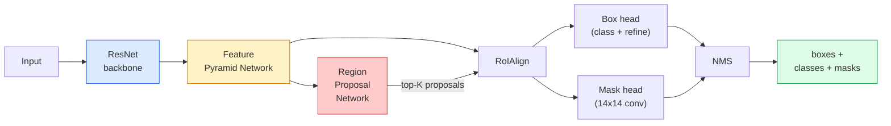

# Instance Segmentation — Mask R-CNN

> Dodaj maleńką gałąź maski do detektora Faster R-CNN i masz instance segmentation. Najtrudniejsze jest RoIAlign i jest trudniejsze, niż się wydaje.

**Typ:** Build + Learn
**Języki:** Python
**Wymagania wstępne:** Phase 4 Lesson 06 (YOLO), Phase 4 Lesson 07 (U-Net)
**Szacowany czas:** ~75 minut

## Cele uczenia się

- Prześledź architekturę Mask R-CNN od końca do końca: backbone, FPN, RPN, RoIAlign, box head, mask head
- Zaimplementuj RoIAlign od zera i wyjaśnij, dlaczego RoIPool nie jest już używany
- Użyj pretrained modelu `maskrcnn_resnet50_fpn_v2` z torchvision do produkcyjnej jakości masek instancyjnych i prawidłowo odczytuj jego format wyjściowy
- Dostrój Mask R-CNN na małym własnym zbiorze danych poprzez wymianę box i mask heads przy zamrożonym backbone'u

## Problem

Semantic segmentation daje ci jedną maskę na klasę. Instance segmentation daje ci jedną maskę na obiekt, nawet gdy dwa obiekty należą do tej samej klasy. Zliczanie osobników, śledzenie między klatkami i mierzenie rzeczy (bounding box każdej cegły w ścianie, każdej komórki na obrazie mikroskopowym) wymaga instance segmentation.

Mask R-CNN (He et al., 2017) rozwiązał to, przekształcając instance segmentation w detekcję-plus-maska. Projekt był tak czysty, że przez następne pięć lat niemal każdy artykuł o instance segmentation był wariantem Mask R-CNN, a implementacja torchvision jest nadal produkcyjnym domyślny dla małych i średnich zbiorów danych.

Trudnym problemem inżynieryjnym jest próbkowanie: jak przyciąć region cech o stałym rozmiarze z proposal box, którego rogi nie są wyrównane z granicami pikseli? Źle to zrobisz, a stracisz dziesiąte części punktu mAP wszędzie. RoIAlign jest odpowiedzią.

## Koncepcja

### Architektura



Pięć elementów do zrozumienia:

1. **Backbone** — ResNet-50 lub ResNet-101 trenowany na ImageNet. Produkuje hierarchię feature map przy stride 4, 8, 16, 32.
2. **FPN (Feature Pyramid Network)** — połączenia top-down + lateral, które nadają każdemu poziomowi C kanałów semantycznie bogatych cech. Detection wysyła zapytanie do poziomu FPN dopasowanego do rozmiaru obiektu.
3. **RPN (Region Proposal Network)** — mała głowica conv, która na każdej pozycji anchor przewiduje "czy jest tutaj obiekt?" i "jak udoskonalić bounding box?". Produkuje ~1000 proposal na obraz.
4. **RoIAlign** — próbkuje stały rozmiar (np. 7x7) patch cech z dowolnego box na dowolnym poziomie FPN. Bilinearne próbkowanie, brak kwantyzacji.
5. **Heads** — dwuwarstwowy box head, który udoskonala box i wybiera klasę, plus mała głowica conv, która wyprowadza `28x28` binary mask dla każdego proposal.

### Dlaczego RoIAlign, a nie RoIPool

Oryginalny Fast R-CNN używał RoIPool, który dzieli proposal box na siatkę, bierze maksymalną cechę w każdej komórce i zaokrągla wszystkie współrzędne do liczb całkowitych. To zaokrąglenie powoduje rozstrojenie feature mapy od współrzędnych pikseli wejściowych nawet o pełny piksel mapy cech — małe na obrazie 224x224, katastrofalne gdy feature mapa ma stride 32.

```
RoIPool:
  box (34.7, 51.3, 98.2, 142.9)
  round -> (34, 51, 98, 142)
  split grid -> round each cell boundary
  misalignment accumulates at every step

RoIAlign:
  box (34.7, 51.3, 98.2, 142.9)
  sample at exact float coordinates using bilinear interpolation
  no rounding anywhere
```

RoIAlign zwiększa mask AP o 3-4 punkty na COCO za darmo. Każdy detektor, który dba o lokalizację, teraz go używa — YOLOv7 seg, RT-DETR, Mask2Former alike.

### RPN w jednym akapicie

Na każdej pozycji feature mapy umieść K anchor boxes różnych rozmiarów i kształtów. Przewiduj wynik objectness dla każdego anchor i offset regresji, aby przekształcić anchor w lepiej dopasowany box. Zachowaj top ~1000 boxes według wyniku, zastosuj NMS przy IoU 0.7 i przekaż ocalałe do heads. RPN jest trenowany z własnym mini-loss — ta sama struktura co loss z YOLO z Lesson 6, tylko z dwoma klasami (object / no object).

### Mask head

Dla każdego proposal (po RoIAlign) mask head jest małym FCN: cztery konwolucje 3x3, dekonwolucja 2x, końcowa konwolucja 1x1, która produkuje `num_classes` kanałów wyjściowych w rozdzielczości `28x28`. Tylko kanał odpowiadający przewidzianej klasie jest zachowany; pozostałe są ignorowane. To oddziela predykcję maski od klasyfikacji.

Przeskaluj maskę 28x28 do oryginalnego rozmiaru piksela proposal, aby wyprodukować końcową binary mask.

### Losses

Mask R-CNN ma cztery losses dodawane razem:

```
L = L_rpn_cls + L_rpn_box + L_box_cls + L_box_reg + L_mask
```

- `L_rpn_cls`, `L_rpn_box` — objectness + box regression dla RPN proposals.
- `L_box_cls` — cross-entropy ponad (C+1) klasami (w tym tło) na klasyfikatorze head.
- `L_box_reg` — smooth L1 na udoskonaleniu box head.
- `L_mask` — per-pixel binary cross-entropy na wyjściu maski 28x28.

Każdy loss ma swoją własną domyślną wagę; implementacja torchvision wystawia je jako argumenty konstruktora.

### Format wyjściowy

`torchvision.models.detection.maskrcnn_resnet50_fpn_v2` zwraca listę dicts, jeden na obraz:

```
{
    "boxes":  (N, 4) w (x1, y1, x2, y2) współrzędne pikseli,
    "labels": (N,) class IDs, 0 = tło, więc indeksy są 1-based,
    "scores": (N,) confidence scores,
    "masks":  (N, 1, H, W) float masks w [0, 1] — threshold przy 0.5 dla binary,
}
```

Maska jest już w pełnej rozdzielczości obrazu. Wyjście 28x28 head zostało przeskalowane wewnętrznie.

## Zbuduj to

### Krok 1: RoIAlign od zera

To jest ten jeden komponent Mask R-CNN, który jest prostszy do zrozumienia jako kod niż jako proza.

```python
import torch
import torch.nn.functional as F

def roi_align_single(feature, box, output_size=7, spatial_scale=1 / 16.0):
    """
    feature: (C, H, W) single-image feature map
    box: (x1, y1, x2, y2) in original image pixel coordinates
    output_size: side of the output grid (7 for box head, 14 for mask head)
    spatial_scale: reciprocal of the feature map stride
    """
    C, H, W = feature.shape
    x1, y1, x2, y2 = [c * spatial_scale - 0.5 for c in box]
    bin_w = (x2 - x1) / output_size
    bin_h = (y2 - y1) / output_size

    grid_y = torch.linspace(y1 + bin_h / 2, y2 - bin_h / 2, output_size)
    grid_x = torch.linspace(x1 + bin_w / 2, x2 - bin_w / 2, output_size)
    yy, xx = torch.meshgrid(grid_y, grid_x, indexing="ij")

    gx = 2 * (xx + 0.5) / W - 1
    gy = 2 * (yy + 0.5) / H - 1
    grid = torch.stack([gx, gy], dim=-1).unsqueeze(0)
    sampled = F.grid_sample(feature.unsqueeze(0), grid, mode="bilinear",
                            align_corners=False)
    return sampled.squeeze(0)
```

Każda liczba znajduje się w pozycji bilinearnie próbkowanej. Żadnego zaokrąglania, żadnej kwantyzacji, żadnych upuszczonych gradientów.

### Krok 2: Porównaj z RoIAlign torchvision

```python
from torchvision.ops import roi_align

feature = torch.randn(1, 16, 50, 50)
boxes = torch.tensor([[0, 10, 20, 100, 90]], dtype=torch.float32)  # (batch_idx, x1, y1, x2, y2)

ours = roi_align_single(feature[0], boxes[0, 1:].tolist(), output_size=7, spatial_scale=1/4)
theirs = roi_align(feature, boxes, output_size=(7, 7), spatial_scale=1/4, sampling_ratio=1, aligned=True)[0]

print(f"shape ours:   {tuple(ours.shape)}")
print(f"shape theirs: {tuple(theirs.shape)}")
print(f"max|diff|:    {(ours - theirs).abs().max().item():.3e}")
```

Z `sampling_ratio=1` i `aligned=True`, oba pasują do siebie w granicach `1e-5`.

### Krok 3: Wczytaj pretrained Mask R-CNN

```python
import torch
from torchvision.models.detection import maskrcnn_resnet50_fpn_v2, MaskRCNN_ResNet50_FPN_V2_Weights

model = maskrcnn_resnet50_fpn_v2(weights=MaskRCNN_ResNet50_FPN_V2_Weights.DEFAULT)
model.eval()
print(f"params: {sum(p.numel() for p in model.parameters()):,}")
print(f"classes (including background): {len(model.roi_heads.box_predictor.cls_score.out_features * [0])}")
```

46M parametrów, 91 klas (COCO). Pierwsza klasa (id 0) to tło; wszystko, co model faktycznie wykrywa, zaczyna się od id 1.

### Krok 4: Uruchom inferencję

```python
with torch.no_grad():
    x = torch.randn(3, 400, 600)
    predictions = model([x])
p = predictions[0]
print(f"boxes:  {tuple(p['boxes'].shape)}")
print(f"labels: {tuple(p['labels'].shape)}")
print(f"scores: {tuple(p['scores'].shape)}")
print(f"masks:  {tuple(p['masks'].shape)}")
```

Tensor maski ma kształt `(N, 1, H, W)`. Próg przy 0.5, aby uzyskać binary mask per object:

```python
binary_masks = (p['masks'] > 0.5).squeeze(1)  # (N, H, W) boolean
```

### Krok 5: Wymień heads dla niestandardowej liczby klas

Common fine-tuning recipe: reuse backbone, FPN i RPN; wymień dwa klasyfikatory heads.

```python
from torchvision.models.detection.faster_rcnn import FastRCNNPredictor
from torchvision.models.detection.mask_rcnn import MaskRCNNPredictor

def build_custom_maskrcnn(num_classes):
    model = maskrcnn_resnet50_fpn_v2(weights=MaskRCNN_ResNet50_FPN_V2_Weights.DEFAULT)
    in_features = model.roi_heads.box_predictor.cls_score.in_features
    model.roi_heads.box_predictor = FastRCNNPredictor(in_features, num_classes)
    in_features_mask = model.roi_heads.mask_predictor.conv5_mask.in_channels
    hidden_layer = 256
    model.roi_heads.mask_predictor = MaskRCNNPredictor(in_features_mask, hidden_layer, num_classes)
    return model

custom = build_custom_maskrcnn(num_classes=5)
print(f"custom cls_score.out_features: {custom.roi_heads.box_predictor.cls_score.out_features}")
```

`num_classes` musi zawierać klasę tła, więc zbiór danych z 4 klasami obiektów używa `num_classes=5`.

### Krok 6: Zamroź to, co nie potrzebuje trenowania

Na małych zbiorach danych zamroź backbone i FPN. Tylko RPN objectness + regression i dwa heads się uczą.

```python
def freeze_backbone_and_fpn(model):
    # torchvision Mask R-CNN pakuje FPN inside `model.backbone` (as
    # `model.backbone.fpn`), więc iterowanie `model.backbone.parameters()` obejmuje
    # zarówno ResNet feature layers jak i FPN lateral/output convs.
    for p in model.backbone.parameters():
        p.requires_grad = False
    return model

custom = freeze_backbone_and_fpn(custom)
trainable = sum(p.numel() for p in custom.parameters() if p.requires_grad)
print(f"trainable after freeze: {trainable:,}")
```

Na zbiorach danych 500-obrazowych to jest różnica między konwergencją a overfittingiem.

## Użyj tego

Pełna pętla treningowa dla Mask R-CNN w torchvision to 40 linii i nie zmienia się znacząco między zadaniami — zamień zbiory danych i działaj.

```python
def train_step(model, images, targets, optimizer):
    model.train()
    loss_dict = model(images, targets)
    losses = sum(loss for loss in loss_dict.values())
    optimizer.zero_grad()
    losses.backward()
    optimizer.step()
    return {k: v.item() for k, v in loss_dict.items()}
```

Lista `targets` musi zawierać per-image dicts z `boxes`, `labels` i `masks` (jako `(num_instances, H, W)` binary tensors). Model zwraca dict czterech losses podczas treningu i listę predictions podczas eval, określane przez `model.training`.

Ewaluator `pycocotools` produkuje mAP@IoU=0.5:0.95 zarówno dla boxes jak i dla masks; potrzebujesz obu liczb, aby wiedzieć, czy box head czy mask head jest wąskim gardłem.

## Wyślij to

Ta lekcja produkuje:

- `outputs/prompt-instance-vs-semantic-router.md` — prompt, który zadaje trzy pytania i wybiera instance vs semantic vs panoptic plus dokładny model, od którego zacząć.
- `outputs/skill-mask-rcnn-head-swapper.md` — skill, który generuje 10 linii kodu do zamiany heads na dowolnym torchvision detection model, przy podanej nowej `num_classes`.

## Ćwiczenia

1. **(Łatwe)** Zweryfikuj swoje RoIAlign przeciwko `torchvision.ops.roi_align` na 100 losowych boxes. Zgłoś maksymalną bezwzględną różnicę. Uruchom też RoIPool (zachowanie sprzed 2017) i pokaż, że diverguje o ~1-2 piksele mapy cech na boxes blisko granicy.
2. **(Średnie)** Dostrój `maskrcnn_resnet50_fpn_v2` na 50-obrazowym niestandardowym zbiorze danych (dowolne dwie klasy: balony, ryby, dziury, loga). Zamroź backbone, trenuj przez 20 epok, zgłoś mask AP@0.5.
3. **(Trudne)** Zastąp mask head Mask R-CNN takim, który przewiduje w 56x56 zamiast 28x28. Zmierz mAP@IoU=0.75 przed i po. Wyjaśnij, dlaczego zysk (lub jego brak) odpowiada oczekiwanemu kompromisowi między precyzją granicy a pamięcią.

## Kluczowe terminy

| Termin | Co ludzie mówią | Co to faktycznie oznacza |
|--------|----------------|----------------------|
| Mask R-CNN | "Detekcja plus maski" | Faster R-CNN + mały FCN head, który przewiduje maskę 28x28 per proposal per class |
| FPN | "Feature pyramid" | Połączenia top-down + lateral, które nadają każdemu poziomowi stride C kanałów semantycznie bogatych cech |
| RPN | "Region proposer" | Mała głowica conv, która produkuje ~1000 object/no-object proposals per image |
| RoIAlign | "Przycięcie bez zaokrąglania" | Bilinearnie próbkuje stały rozmiar feature grid z dowolnego float-coordinate box |
| RoIPool | "Przycięcie sprzed 2017" | Ten sam cel co RoIAlign, ale zaokrągla współrzędne box; przestarzałe |
| Mask AP | "Instance mAP" | Average precision obliczana z mask IoU zamiast box IoU; metryka COCO instance segmentation |
| Binary mask head | "Per-class mask" | Przewiduje jedną binary mask per class dla każdego proposal; tylko kanał przewidzianej klasy jest zachowany |
| Background class | "Klasa 0" | Catch-all "no object" class; indeksy dla prawdziwych klas zaczynają się od 1 |

## Dalsze czytanie

- [Mask R-CNN (He et al., 2017)](https://arxiv.org/abs/1703.06870) — artykuł; sekcja 3 o RoIAlign to krytyczna lektura
- [FPN: Feature Pyramid Networks (Lin et al., 2017)](https://arxiv.org/abs/1612.03144) — artykuł o FPN; każdy nowoczesny detektor go używa
- [torchvision Mask R-CNN tutorial](https://pytorch.org/tutorials/intermediate/torchvision_tutorial.html) — referencja dla pętli fine-tuning
- [Detectron2 model zoo](https://github.com/facebookresearch/detectron2/blob/main/MODEL_ZOO.md) — produkcyjne implementacje z wytrenowanymi wagami dla niemal każdego wariantu detection i segmentation