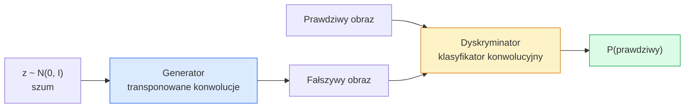
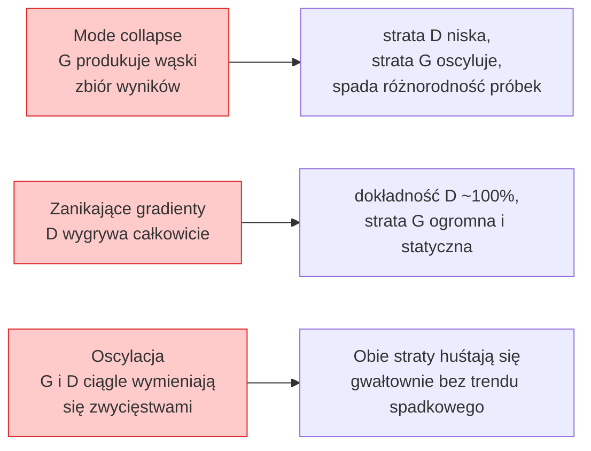

# Generowanie obrazów — GANy

> GAN to dwie sieci neuronowe w ustalonej grze. Jedna rysuje, druga krytykuje. Razem stają się coraz lepsze, aż rysunki oszukują krytyka.

**Typ:** Build
**Języki:** Python
**Wymagania wstępne:** Lekcja 03 z Faz 4 (CNN), Lekcja 06 z Faz 3 (Optymizatory), Lekcja 07 z Faz 3 (Regularizacja)
**Szacowany czas:** ~75 minut

## Cele uczenia się

- Wyjaśnić grę minimax między generatorem a dyskryminatorem i dlaczego równowaga odpowiada p_model = p_data
- Zaimplementować DCGAN w PyTorch i sprawić, by generowała spójne syntetyczne obrazy 32x32 w niecałych 60 liniach
- Ustabilizować trening GAN za pomocą trzech standardowych sztuczek: non-saturating loss, spectral norm, TTUR (two-timescale update rule)
- Odczytywać krzywe treningowe pozwalające odróżnić zdrową konwergencję od mode collapse, oscylacji i całkowitej wygranej dyskryminatora

## Problem

Klasyfikacja uczy sieć mapowania obrazów na etykiety. Generowanie odwraca problem: próbkowanie nowych obrazów wyglądających tak, jakby pochodziły z tej samej dystrybucji. Nie ma "poprawnego" wyniku, z którym można porównywać; jest tylko dystrybucja, którą chcesz naśladować.

Standardowe funkcje strat (MSE, cross-entropy) nie mogą mierzyć "czy ta próbka pochodzi z prawdziwej dystrybucji." Minimalizacja błędu per-pixel wytwarza rozmyte średnie, a nie realistyczne próbki. Przełomem było nauczenie straty: trenowanie drugiej sieci, której zadaniem jest odróżnianie prawdziwego od fałszywego, i wykorzystanie jej osądu do popchnięcia generatora.

GANy (Goodfellow i in., 2014) zdefiniowały ten framework. Do 2018 StyleGAN produkował twarze 1024x1024 nie do odróżnienia od fotografii. Modele dyfuzyjne odebrały im tron pod względem jakości i kontroli, ale każda sztuczka, która sprawia, że dyfuzja jest praktyczna — wybory normalizacji, przestrzenie latentne, straty na cechach — została najpierw zrozumiana na GANach.

## Koncepcja

### Dwie sieci



**Generator** G pobiera wektor szumu `z` i generuje obraz. **Dyskryminator** D pobiera obraz i generuje pojedynczą wartość skalarną: prawdopodobieństwo, że obraz jest prawdziwy.

### Gra

G chce, żeby D się myliło. D chce mieć rację. Formalnie:

```
min_G max_D  E_x[log D(x)] + E_z[log(1 - D(G(z)))]
```

Czytaj od prawej do lewej: D maksymalizuje dokładność na prawdziwych (`log D(real)`) i fałszywych (`log (1 - D(fake))`) obrazach. G minimalizuje dokładność D na fałszywych — chce, żeby `D(G(z))` było wysokie.

Goodfellow udowodnił, że ten minimax ma globalną równowagę, gdzie `p_G = p_data`, D generuje 0.5 wszędzie, a dywergencja Jensen-Shannon między generowaną a prawdziwą dystrybucją wynosi zero. Trudna część to dojście do niej.

### Non-saturating loss

Forma powyżej jest numerycznie niestabilna. Na początku treningu `D(G(z))` jest bliskie zero dla każdego fałszywego obrazu, więc `log(1 - D(G(z)))` ma zanikające gradienty względem G. Poprawka: odwróć stratę G.

```
L_D = -E_x[log D(x)] - E_z[log(1 - D(G(z)))]
L_G = -E_z[log D(G(z))]                          # non-saturating
```

Teraz, gdy `D(G(z))` jest bliskie zero, strata G jest duża, a jej gradient jest informacyjny. Każdy nowoczesny GAN trenuje z tą wariantem.

### Zasady architektury DCGAN

Radford, Metz, Chintala (2015) podsumowali lata nieudanych eksperymentów w pięć zasad, które sprawiają, że trening GAN jest stabilny:

1. Zastąp pooling strided convs (obie sieci).
2. Używaj batch norm w generatorze i dyskryminatorze, z wyjątkiem wyjścia G i wejścia D.
3. Usuń w pełni połączone warstwy w głębszych architekturach.
4. G używa ReLU na wszystkich warstwach z wyjątkiem wyjścia (tanh dla wyjścia w [-1, 1]).
5. D używa LeakyReLU (negative_slope=0.2) na wszystkich warstwach.

Każdy nowoczesny GAN oparty na konwolucjach (StyleGAN, BigGAN, GigaGAN) nadal startuje od tych zasad i wymienia elementy jeden po drugim.

### Tryby awarii i ich sygnatury



- **Mode collapse**: G znajduje jeden obraz, który oszukuje D, i produkuje tylko ten. Poprawka: dodaj minibatch discrimination, spectral norm lub label-conditioning.
- **Dyskryminator wygrywa**: D staje się zbyt silny zbyt szybko, gradienty G zanikają. Poprawka: mniejsze D, niższy learning rate dla D, lub zastosuj label smoothing na prawdziwych etykietach.
- **Oscylacja**: dwie sieci wymieniają się zwycięstwami bez nigdy zbliżenia się do równowagi. Poprawka: TTUR (D uczy się szybciej niż G o czynnik 2-4), lub przełącz na Wasserstein loss.

### Ewaluacja

GANy nie mają ground truth, więc skąd wiesz, że działają?

- **Inspekcja próbek** — po prostu spójrz na 64 próbki na końcu każdej epoki. Nie do negocjacji.
- **FID (Fréchet Inception Distance)** — odległość między dystrybucjami cech Inception-v3 prawdziwych i generowanych zbiorów. Niższy jest lepszy. Standard społeczności.
- **Inception Score** — starszy, bardziej kruchy; wolisz FID.
- **Precision/Recall dla modeli generatywnych** — mierzy jakość (precision) i pokrycie (recall) osobno. Bardziej informacyjny niż sam FID.

Dla małego przebiegu na syntetycznych danych inspekcja próbek jest wystarczająca.

## Zbuduj to

### Krok 1: Generator

Mały generator DCGAN, który pobiera szum 64-wymiarowy i generuje obraz 32x32.

```python
import torch
import torch.nn as nn

class Generator(nn.Module):
    def __init__(self, z_dim=64, img_channels=3, feat=64):
        super().__init__()
        self.net = nn.Sequential(
            nn.ConvTranspose2d(z_dim, feat * 4, kernel_size=4, stride=1, padding=0, bias=False),
            nn.BatchNorm2d(feat * 4),
            nn.ReLU(inplace=True),
            nn.ConvTranspose2d(feat * 4, feat * 2, kernel_size=4, stride=2, padding=1, bias=False),
            nn.BatchNorm2d(feat * 2),
            nn.ReLU(inplace=True),
            nn.ConvTranspose2d(feat * 2, feat, kernel_size=4, stride=2, padding=1, bias=False),
            nn.BatchNorm2d(feat),
            nn.ReLU(inplace=True),
            nn.ConvTranspose2d(feat, img_channels, kernel_size=4, stride=2, padding=1, bias=False),
            nn.Tanh(),
        )

    def forward(self, z):
        return self.net(z.view(z.size(0), -1, 1, 1))
```

Cztery transponowane konwolucje, każda z `kernel_size=4, stride=2, padding=1`, więc czysto podwajają rozmiar przestrzenny. Wyjściowe aktywacje w [-1, 1] przez tanh.

### Krok 2: Dyskryminator

Lustrzane odbicie generatora. LeakyReLU, strided convs, kończy skalarnym logitem.

```python
class Discriminator(nn.Module):
    def __init__(self, img_channels=3, feat=64):
        super().__init__()
        self.net = nn.Sequential(
            nn.Conv2d(img_channels, feat, kernel_size=4, stride=2, padding=1),
            nn.LeakyReLU(0.2, inplace=True),
            nn.Conv2d(feat, feat * 2, kernel_size=4, stride=2, padding=1, bias=False),
            nn.BatchNorm2d(feat * 2),
            nn.LeakyReLU(0.2, inplace=True),
            nn.Conv2d(feat * 2, feat * 4, kernel_size=4, stride=2, padding=1, bias=False),
            nn.BatchNorm2d(feat * 4),
            nn.LeakyReLU(0.2, inplace=True),
            nn.Conv2d(feat * 4, 1, kernel_size=4, stride=1, padding=0),
        )

    def forward(self, x):
        return self.net(x).view(-1)
```

Ostatnia konwolucja redukuje mapę cech 4x4 do 1x1. Wyjście to pojedyncza wartość skalarna na obraz; sigmoid stosuj tylko podczas obliczania straty.

### Krok 3: Krok treningowy

Naprzemiennie: aktualizuj D raz, potem G raz, co batch.

```python
import torch.nn.functional as F

def train_step(G, D, real, z, opt_g, opt_d, device):
    real = real.to(device)
    bs = real.size(0)

    # D step
    opt_d.zero_grad()
    d_real = D(real)
    d_fake = D(G(z).detach())
    loss_d = (F.binary_cross_entropy_with_logits(d_real, torch.ones_like(d_real))
              + F.binary_cross_entropy_with_logits(d_fake, torch.zeros_like(d_fake)))
    loss_d.backward()
    opt_d.step()

    # G step
    opt_g.zero_grad()
    d_fake = D(G(z))
    loss_g = F.binary_cross_entropy_with_logits(d_fake, torch.ones_like(d_fake))
    loss_g.backward()
    opt_g.step()

    return loss_d.item(), loss_g.item()
```

`G(z).detach()` w kroku D jest kluczowe: nie chcemy, żeby gradienty przepływały do G podczas jego aktualizacji. Zapomnienie o tym to klasyczny błąd początkującego.

### Krok 4: Pełna pętla treningowa na syntetycznych kształtach

```python
from torch.utils.data import DataLoader, TensorDataset
import numpy as np

def synthetic_images(num=2000, size=32, seed=0):
    rng = np.random.default_rng(seed)
    imgs = np.zeros((num, 3, size, size), dtype=np.float32) - 1.0
    for i in range(num):
        r = rng.uniform(6, 12)
        cx, cy = rng.uniform(r, size - r, size=2)
        yy, xx = np.meshgrid(np.arange(size), np.arange(size), indexing="ij")
        mask = (xx - cx) ** 2 + (yy - cy) ** 2 < r ** 2
        color = rng.uniform(-0.5, 1.0, size=3)
        for c in range(3):
            imgs[i, c][mask] = color[c]
    return torch.from_numpy(imgs)

device = "cuda" if torch.cuda.is_available() else "cpu"
data = synthetic_images()
loader = DataLoader(TensorDataset(data), batch_size=64, shuffle=True)

G = Generator(z_dim=64, img_channels=3, feat=32).to(device)
D = Discriminator(img_channels=3, feat=32).to(device)
opt_g = torch.optim.Adam(G.parameters(), lr=2e-4, betas=(0.5, 0.999))
opt_d = torch.optim.Adam(D.parameters(), lr=2e-4, betas=(0.5, 0.999))

for epoch in range(10):
    for (batch,) in loader:
        z = torch.randn(batch.size(0), 64, device=device)
        ld, lg = train_step(G, D, batch, z, opt_g, opt_d, device)
    print(f"epoch {epoch}  D {ld:.3f}  G {lg:.3f}")
```

`Adam(lr=2e-4, betas=(0.5, 0.999))` to domyślne DCGAN — niskie beta1 sprawia, że człon momentum nie stabilizuje gry adwersarialnej zbyt mocno.

### Krok 5: Próbkowanie

```python
@torch.no_grad()
def sample(G, n=16, z_dim=64, device="cpu"):
    G.eval()
    z = torch.randn(n, z_dim, device=device)
    imgs = G(z)
    imgs = (imgs + 1) / 2
    return imgs.clamp(0, 1)
```

Zawsze przełączaj na tryb eval przed próbkowaniem. Dla DCGAN to ma znaczenie, bo używane są running stats z batch norm zamiast statystyk z bieżącego batcha.

### Krok 6: Spectral normalisation

Zamiennik BN w dyskryminatorze, który gwarantuje, że sieć jest 1-Lipschitz. Naprawia większość awarii "D wygrywa za mocno".

```python
from torch.nn.utils import spectral_norm

def build_sn_discriminator(img_channels=3, feat=64):
    return nn.Sequential(
        spectral_norm(nn.Conv2d(img_channels, feat, 4, 2, 1)),
        nn.LeakyReLU(0.2, inplace=True),
        spectral_norm(nn.Conv2d(feat, feat * 2, 4, 2, 1)),
        nn.LeakyReLU(0.2, inplace=True),
        spectral_norm(nn.Conv2d(feat * 2, feat * 4, 4, 2, 1)),
        nn.LeakyReLU(0.2, inplace=True),
        spectral_norm(nn.Conv2d(feat * 4, 1, 4, 1, 0)),
    )
```

Zamień `Discriminator` na `build_sn_discriminator()` i często nie potrzebujesz sztuczki TTUR. Spectral norm to najłatwiejsza pojedyncza poprawa stabilności, którą możesz zastosować.

## Użyj tego

Do poważnego generowania użyj pretrained wag lub przełącz na dyfuzję. Dwie standardowe biblioteki:

- `torch_fidelity` oblicza FID / IS na twoim generatorze bez pisania własnego kodu ewaluacyjnego.
- `pytorch-gan-zoo` (legacy) i `StudioGAN` dostarczają przetestowane implementacje DCGAN, WGAN-GP, SN-GAN, StyleGAN i BigGAN.

W 2026 GANy są nadal najlepszym wyborem dla: generowania obrazów w czasie rzeczywistym (latency <10 ms), transferu stylu, translacji obraz-do-obrazu z precyzyjną kontrolą (Pix2Pix, CycleGAN). Dyfuzja wygrywa pod względem fotorealizmu i warunkowania tekstem.

## Wyślij to

Ta lekcja tworzy:

- `outputs/prompt-gan-training-triage.md` — prompt, który czyta opis krzywej treningowej i wybiera tryb awarii (mode collapse, D-wins, oscylacja) plus jedyną zalecaną poprawkę.
- `outputs/skill-dcgan-scaffold.md` — skill, który pisze szkielet DCGAN z `z_dim`, docelowym `image_size` i `num_channels`, włącznie z pętlą treningową i zapisem próbek.

## Ćwiczenia

1. **(Łatwe)** Trenuj DCGAN powyżej na syntetycznym zbiorze danych z kołami i zapisuj siatkę 16 próbek na końcu każdej epoki. W której epoce generowane koła stają się wyraźnie okrągłe?
2. **(Średnie)** Zastąp batch norm dyskryminatora spectral norm. Trenuj obie wersje równolegle. Która zbiega się szybciej? Która ma niższą wariancję między trzema seedami?
3. **(Trudne)** Zaimplementuj conditional DCGAN: wprowadź etykietę klasy do G i D (concat one-hot do szumu w G, concat kanał embeddingu klasy w D). Trenuj na syntetycznym zbiorze danych "koła vs kwadraty" z lekcji 7 i pokaż, że warunkowanie klasowe działa, próbkując z określonymi etykietami.

## Kluczowe terminy

| Termin | Co ludzie mówią | Co to faktycznie oznacza |
|--------|----------------|--------------------------|
| Generator (G) | "Sieć co rysuje" | Mapuje szum na obrazy; trenowana, żeby oszukać dyskryminator |
| Dyskryminator (D) | "Krytyk" | Binarny klasyfikator; trenowany, żeby odróżniać prawdziwe od generowanych obrazów |
| Minimax | "Gra" | min po G, max po D adversarial loss; równowaga to p_G = p_data |
| Non-saturating loss | "Numerycznie rozsądna wersja" | Strata G to -log(D(G(z))) zamiast log(1 - D(G(z))) żeby uniknąć zanikających gradientów na początku treningu |
| Mode collapse | "Generator robi jedną rzecz" | G produkuje tylko mały podzbiór dystrybucji danych; poprawka: SN, minibatch discrimination lub większy batch |
| TTUR | "Dwa learning rates" | D uczy się szybciej niż G, typowo o czynnik 2-4; stabilizuje trening |
| Spectral norm | "Warstwa 1-Lipschitz" | Normalizacja wag, która ogranicza stałą Lipschitza każdej warstwy; powstrzymuje D przed staniem się arbitralnie strome |
| FID | "Fréchet Inception Distance" | Odległość między dystrybucjami cech Inception-v3 prawdziwych i generowanych zbiorów; standardowa metryka ewaluacyjna |

## Dalsza lektura

- [Generative Adversarial Networks (Goodfellow i in., 2014)](https://arxiv.org/abs/1406.2661) — papier, który to wszystko zaczął
- [DCGAN (Radford, Metz, Chintala, 2015)](https://arxiv.org/abs/1511.06434) — zasady architektoniczne, które uczyniły GANy trenowalnymi
- [Spectral Normalization for GANs (Miyato i in., 2018)](https://arxiv.org/abs/1802.05957) — najbardziej użyteczna pojedyncza sztuczka stabilizacyjna
- [StyleGAN3 (Karras i in., 2021)](https://arxiv.org/abs/2106.12423) — SOTA GAN; czyta się jak greatest-hits album każdej sztuczki z ostatniej dekady