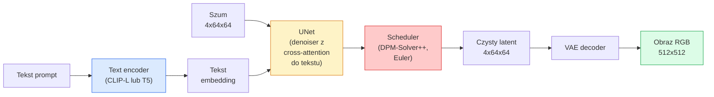

# Stable Diffusion — Architektura i Fine-Tuning

> Stable Diffusion to DDPM, który działa w przestrzeni latentnej wstępnie wytrenowanego VAE, warunkowany tekstem poprzez cross-attention, próbkowany za pomocą szybkiego deterministycznego solvera ODE i sterowany przez classifier-free guidance.

**Typ:** Nauka + Zastosowanie
**Języki:** Python
**Wymagania wstępne:** Faza 4 Lekcja 10 (Diffusion), Faza 7 Lekcja 02 (Self-Attention)
**Szacowany czas:** ~75 minut

## Cele uczenia się

- Prześledzić pięć elementów pipeline'u Stable Diffusion: VAE, text encoder, U-Net, scheduler, safety checker — oraz co każdy z nich faktycznie robi
- Wyjaśnić latent diffusion i dlaczego trenowanie w przestrzeni latentnej 4x64x64 (zamiast 3x512x512 obrazu) redukuje obliczenia 48-krotnie bez utraty jakości
- Użyć `diffusers` do generowania obrazów, uruchamiania image-to-image, inpainting i ControlNet-guided generation
- Dostroić Stable Diffusion za pomocą LoRA na małym własnym zbiorze danych i załadować adapter LoRA w czasie inferencji

## Problem

Trenowanie DDPM bezpośrednio na obrazach 512x512 RGB jest kosztowne. Każdy krok treningowy backpropuje przez U-Net, który widzi 3x512x512 = 786 432 wartości wejściowe, a próbkowanie wymaga 50+ forward passów przez ten sam U-Net. Na poziomie jakości Stable Diffusion 1.5 (wydanym w 2022), pixel-space diffusion wymagałby około 256 GPU-miesięcy treningu i 10-30 sekund na obraz na konsumenckim GPU.

Sztuczka, która uczyniła open-weight text-to-image praktycznym, to **latent diffusion** (Rombach et al., CVPR 2022). Trenujemy VAE, który mapuje obraz 3x512x512 na tensor latentny 4x64x64 iz powrotem, a następnie wykonujemy diffusion w tej przestrzeni latentnej. Obliczenia spadają `(3*512*512)/(4*64*64) = 48x`. Próbkowanie spada z dziesięciu sekund do poniżej dwóch sekund na tym samym GPU.

Prawie każdy nowoczesny model generowania obrazów — SDXL, SD3, FLUX, HunyuanDiT, Wan-Video — to latent diffusion model z wariacjami autoenkodera, denoisera (U-Net lub DiT) i warunkowania tekstowego. Naucz się Stable Diffusion, a nauczysz się szablonu.

## Koncepcja

### Pipeline



- **VAE** — zamrożony autoenkoder. Encoder przekształca obraz w latenty (używany do img2img i treningu). Decoder przekształca latenty z powrotem w obraz.
- **Text encoder** — CLIP text encoder (SD 1.x/2.x), CLIP-L + CLIP-G (SDXL), lub T5-XXL (SD3/FLUX). Produkuje sekwencję token embeddings.
- **U-Net** — denoiser. Ma warstwy cross-attention, które uczą się od latentów do text embedding na każdym poziomie rozdzielczości.
- **Scheduler** — algorytm próbkowania (DDIM, Euler, DPM-Solver++). Wybiera sigmy, miesza przewidywany szum z powrotem w latent.
- **Safety checker** — opcjonalny filtr treści NSFW / nielegalnych na wyjściu obrazu.

### Classifier-free guidance (CFG)

Zwykłe text conditioning uczy `epsilon_theta(x_t, t, c)` dla każdego promptu `c`. CFG trenuje tę samą sieć z `c` porzuconym 10% czasu ( zastąpionym przez pusty embedding), dając pojedynczy model, który przewiduje zarówno conditional, jak i unconditional noise. W czasie inferencji:

```
eps = eps_uncond + w * (eps_cond - eps_uncond)
```

`w` to guidance scale. `w=0` to unconditional, `w=1` to plain conditional, `w>1` popycha wyjście ku byciu "bardziej conditioned na prompt" kosztem różnorodności. SD domyślnie to `w=7.5`.

CFG to powód, dla którego text-to-image działa w jakości produkcyjnej. Bez niego prompty słabo biasują wyjście; z nim dominują.

### Geometria przestrzeni latentnej

Latent VAE o 4 kanałach to nie tylko skompresowany obraz. To manifold, gdzie arytmetyka mniej więcej odpowiada semantycznym edycjom (prompt engineering + interpolacja obie tu żyją), i gdzie diffusion U-Net został wytrenowany, by wydać cały swój budżet modelowania na nim. Dekodowanie losowego 4x64x64 latent nie produkuje losowo-wyglądającego obrazu — produkuje śmieci, bo tylko specyficzny submanifold latentów dekoduje się do prawidłowych obrazów.

Dwie konsekwencje:

1. **Img2img** = encode obrazu do latent, dodaj częściowy szum, uruchom denoiser, decode. Struktura obrazu przetrwa, bo encoding jest bliski invertowalności; treść zmienia się na podstawie promptu.
2. **Inpainting** = tak jak img2img, ale denoiser aktualizuje tylko zamaskowane regiony; niezamaskowane regiony są trzymane w encoded latent.

### Architektura U-Net

SD U-Net to duża wersja TinyUNet z Lekcji 10 z trzema dodatkami:

- **Bloki transformer** na każdej rozdzielczości przestrzennej, zawierające self-attention + cross-attention do text embedding.
- **Time embedding** przez MLP na sinusoidal encoding.
- **Skip connections** między encoderem a decoderem na pasujących rozdzielczościach.

Całkowita liczba parametrów w SD 1.5: ~860M. SDXL: ~2.6B. FLUX: ~12B. Skok w parametrach jest głównie w warstwach attention.

### LoRA fine-tuning

Pełny fine-tuning Stable Diffusion wymaga 20+ GB VRAM i aktualizuje 860M parametrów. LoRA (Low-Rank Adaptation) trzyma bazowy model zamrożony i wstrzykuje małe macierze rank-decomposition do warstw attention. Adapter LoRA dla SD waży typowo 10-50 MB, trenuje w 10-60 minut na pojedynczym konsumenckim GPU i ładuje się w czasie inferencji jako drop-in modification.

```
Original: W_q : (d_in, d_out)   frozen
LoRA:     W_q + alpha * (A @ B)   gdzie A : (d_in, r), B : (r, d_out)

r to typowo 4-32.
```

LoRA to sposób, w jaki dystrybuowana jest prawie każda community fine-tune. CivitAI i Hugging Face hostują miliony z nich.

### Schedulery, które zobaczysz

- **DDIM** — deterministyczny, ~50 kroków, prosty.
- **Euler ancestral** — stochastyczny, 30-50 kroków, trochę bardziej kreatywne sample'y.
- **DPM-Solver++ 2M Karras** — deterministyczny, 20-30 kroków, produkcyjny domyślny.
- **LCM / TCD / Turbo** — consistency models i distilled variants; 1-4 kroki kosztem części jakości.

Zamiana schedulerów to jednoliniowa zmiana w `diffusers` i czasem naprawia problemy z samplingiem bez żadnego retrainingu.

## Zbuduj to

Ta lekcja używa `diffusers` end-to-end zamiast odbudowywać Stable Diffusion od zera. Elementy, które musiałbyś odbudować (VAE, text encoder, U-Net, scheduler) to tematy własnych lekcji; tutaj celem jest płynność w produkcyjnym API.

### Krok 1: Text-to-image

```python
import torch
from diffusers import StableDiffusionPipeline

pipe = StableDiffusionPipeline.from_pretrained(
    "runwayml/stable-diffusion-v1-5",
    torch_dtype=torch.float16,
).to("cuda")

image = pipe(
    prompt="a dog riding a skateboard in tokyo, studio ghibli style",
    guidance_scale=7.5,
    num_inference_steps=25,
    generator=torch.Generator("cuda").manual_seed(42),
).images[0]
image.save("dog.png")
```

`float16` zmniejsza VRAM o połowę bez widocznej utraty jakości. `num_inference_steps=25` z domyślnym DPM-Solver++ odpowiada `num_inference_steps=50` z DDIM.

### Krok 2: Zamiana schedulera

```python
from diffusers import DPMSolverMultistepScheduler, EulerAncestralDiscreteScheduler

pipe.scheduler = DPMSolverMultistepScheduler.from_config(pipe.scheduler.config)
pipe.scheduler = EulerAncestralDiscreteScheduler.from_config(pipe.scheduler.config)
```

Stan schedulera jest odłączony od wag U-Net. Możesz trenować na DDPM i próbkować z dowolnym schedulerem.

### Krok 3: Image-to-image

```python
from diffusers import StableDiffusionImg2ImgPipeline
from PIL import Image

img2img = StableDiffusionImg2ImgPipeline.from_pretrained(
    "runwayml/stable-diffusion-v1-5",
    torch_dtype=torch.float16,
).to("cuda")

init_image = Image.open("dog.png").convert("RGB").resize((512, 512))
out = img2img(
    prompt="a dog riding a skateboard, oil painting",
    image=init_image,
    strength=0.6,
    guidance_scale=7.5,
).images[0]
```

`strength` to ile szumu dodać przed denoising (0.0 = bez zmian, 1.0 = pełna regeneracja). 0.5-0.7 to standardowy zakres dla style transfer.

### Krok 4: Inpainting

```python
from diffusers import StableDiffusionInpaintPipeline

inpaint = StableDiffusionInpaintPipeline.from_pretrained(
    "runwayml/stable-diffusion-inpainting",
    torch_dtype=torch.float16,
).to("cuda")

image = Image.open("dog.png").convert("RGB").resize((512, 512))
mask = Image.open("dog_mask.png").convert("L").resize((512, 512))

out = inpaint(
    prompt="a cat",
    image=image,
    mask_image=mask,
    guidance_scale=7.5,
).images[0]
```

Białe piksele w masce to obszar do zregenerowania. Czarne piksele są zachowane.

### Krok 5: Ładowanie LoRA

```python
pipe.load_lora_weights("sayakpaul/sd-lora-ghibli")
pipe.fuse_lora(lora_scale=0.8)

image = pipe(prompt="a village square in ghibli style").images[0]
```

`lora_scale` kontroluje siłę; 0.0 = brak efektu, 1.0 = pełny efekt. `fuse_lora` łączy adapter w wagach w miejscu dla szybkości, ale uniemożliwia podmianę. Wywołaj `pipe.unfuse_lora()` przed załadowaniem innego adaptera.

### Krok 6: Trening LoRA (szkic)

Prawdziwy trening LoRA żyje w `peft` lub `diffusers.training`. Zarys:

```python
# Pseudocode
for step, batch in enumerate(dataloader):
    images, prompts = batch
    latents = vae.encode(images).latent_dist.sample() * 0.18215

    t = torch.randint(0, num_train_timesteps, (batch_size,))
    noise = torch.randn_like(latents)
    noisy_latents = scheduler.add_noise(latents, noise, t)

    text_emb = text_encoder(tokenizer(prompts))

    pred_noise = unet(noisy_latents, t, text_emb)  # LoRA weights injected here

    loss = F.mse_loss(pred_noise, noise)
    loss.backward()
    optimizer.step()
```

Tylko macierze LoRA otrzymują gradient; bazowy U-Net, VAE i text encoder są zamrożone. Z batch size 1 i gradient checkpointing mieści się w 8 GB VRAM.

## Użyj to

W produkcji decyzje, które faktycznie podejmujesz:

- **Rodzina modeli**: SD 1.5 dla open-source community fine-tunes, SDXL dla wyższej wierności, SD3 / FLUX dla stanu techniki i rygorystycznych wymagań licencyjnych.
- **Scheduler**: DPM-Solver++ 2M Karras dla 20-30 kroków, LCM-LoRA gdy latency jest poniżej 1s.
- **Precyzja**: `float16` na 4080/4090, `bfloat16` na A100 i nowszych, `int8` (via `bitsandbytes` lub `compel`) gdy VRAM jest ograniczony.
- **Conditioning**: plain text działa; dla silniejszej kontroli, dodaj ControlNet (canny, depth, pose) na bazowy pipeline.

Dla batch generation, `AUTO1111` / `ComfyUI` to community tools; dla produkcyjnych API, `diffusers` + `accelerate` lub `optimum-nvidia` z kompilacją TensorRT.

## Wyślij to

Ta lekcja produkuje:

- `outputs/prompt-sd-pipeline-planner.md` — prompt, który wybiera SD 1.5 / SDXL / SD3 / FLUX plus scheduler i precyzję przy danym budżecie latency, celu wierności i ograniczeniu licencyjnym.
- `outputs/skill-lora-training-setup.md` — skill, który pisze pełną konfigurację treningu LoRA dla własnego zbioru danych włączając podpisy, rank, batch size i learning rate.

## Ćwiczenia

1. **(Łatwe)** Wygeneruj ten sam prompt z `guidance_scale` w `[1, 3, 5, 7.5, 10, 15]`. Opisz jak obraz się zmienia. Przy jakiej wartości guidance pojawiają się artefakty?
2. **(Średnie)** Weź dowolne zdjęcie, przepuść je przez `StableDiffusionImg2ImgPipeline` z `strength` w `[0.2, 0.4, 0.6, 0.8, 1.0]`. Która wartość strength zachowuje kompozycję zmieniając styl? Dlaczego 1.0 ignoruje całkowicie input?
3. **(Trudne)** Wytrenuj LoRA na 10-20 obrazach pojedynczego subjectu (zwierzak, logo, postać) i generuj nowe sceny z tym subjectem w nich. Zgłoś rank LoRA i kroki treningu, które dały najlepsze zachowanie tożsamości bez overfittingu na obrazy wejściowe.

## Kluczowe Terminy

| Termin | Co ludzie mówią | Co to faktycznie oznacza |
|--------|----------------|----------------------|
| Latent diffusion | "Diffuse in latents" | Uruchom cały DDPM w przestrzeni latentnej VAE (4x64x64) zamiast przestrzeni pikseli (3x512x512); 48x oszczędność obliczeń |
| VAE scale factor | "0.18215" | Stała, która przeskaluje raw latent VAE do mniej więcej jednostkowej wariancji; hardcoded w każdym SD pipeline |
| Classifier-free guidance | "CFG" | Mieszaj conditional i unconditional noise predictions; najbardziej wpływowa dźwignia inferencji |
| Scheduler | "Sampler" | Algorytm, który zamienia szum + predictions modelu w trajektorię zdenoisowanego latent |
| LoRA | "Low-rank adapter" | Małe macierze rank-decomposition, które fine-tuneją warstwy attention bez dotykania bazowych wag |
| Cross-attention | "Text-image attention" | Attention od tokenów latent do tokenów tekstu; wstrzykuje informację z promptu na każdym poziomie U-Net |
| ControlNet | "Structure conditioning" | Oddzielnie trenowany adapter, który steruje SD z dodatkowym inputem (canny, depth, pose, segmentation) |
| DPM-Solver++ | "The default scheduler" | Deterministyczny solver ODE drugiego rzędu; najlepsza jakość przy niskich liczbach kroków (20-30) w 2026 |

## Dalsza lektura

- [High-Resolution Image Synthesis with Latent Diffusion (Rombach et al., 2022)](https://arxiv.org/abs/2112.10752) — papier Stable Diffusion; zawiera każde ablation, które uzasadnia design
- [Classifier-Free Diffusion Guidance (Ho & Salimans, 2022)](https://arxiv.org/abs/2207.12598) — papier CFG
- [LoRA: Low-Rank Adaptation of Large Language Models (Hu et al., 2021)](https://arxiv.org/abs/2106.09685) — LoRA było najpierw NLP; przeniosło się do SD prawie bez zmian
- [diffusers documentation](https://huggingface.co/docs/diffusers) — referencja dla każdego SD / SDXL / SD3 / FLUX pipeline