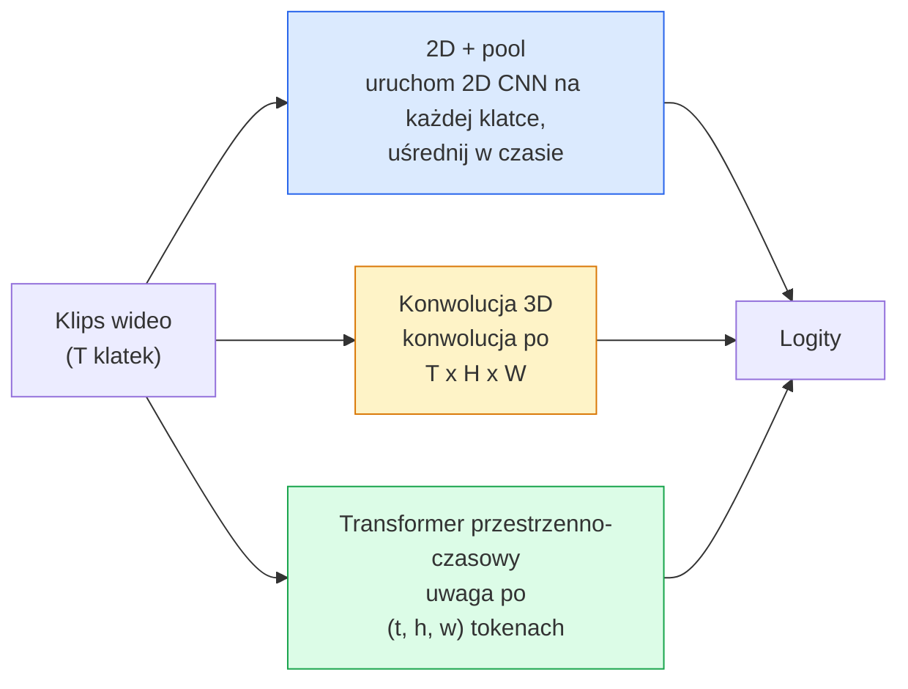

# Rozumienie wideo — modelowanie czasowe

> Wideo to sekwencja obrazów plus fizyka, która je łączy. Każdy model wideo traktuje czas albo jako dodatkową oś (konwolucje 3D), albo jako sekwencję, po której można się uwagać (transformer), albo jako cechę, którą raz się wydobywa i puluje (2D+pool).

**Typ:** Nauka + Budowanie
**Języki:** Python
**Wymagania wstępne:** Lekcja 03 z Fazy 4 (CNN), Lekcja 04 z Fazy 4 (Klasyfikacja obrazów)
**Szacowany czas:** ~45 minut

## Cele uczenia się

- Rozróżnić trzy główne podejścia do modelowania wideo (2D+pool, konwolucje 3D, transformer przestrzenno-czasowy) oraz przewidzieć ich tradeoff kosztu i dokładności
- Zaimplementować próbkowanie klatek, pulowanie czasowe oraz bazowy klasyfikator 2D+pool w PyTorch
- Wyjaśnić, dlaczego jądra 3D "napompowane" I3D dobrze transferują się z wag ImageNet oraz czym różni się konwolucja sfactoryzowana (2+1)D
- Odczytać standardowe zbiory danych i metryki rozpoznawania akcji: Kinetics-400/600, UCF101, Something-Something V2; top-1 accuracy na poziomie klipów i wideo

## Problem

30-sekundowe wideo przy 30 fps to 900 obrazów. Naiwnie, klasyfikacja wideo to klasyfikacja obrazów uruchomiona 900 razy, po której następuje pewnego rodzaju agregacja. To działa, gdy akcja jest widoczna w prawie każdej klatce (sport, gotowanie, ćwiczenia), a zawodzi, gdy akcja jest zdefiniowana przez sam ruch: "przesuwanie czegoś z lewej na prawo" wygląda jak dwa nieruchome obiekty w każdej pojedynczej klatce.

Kluczowe pytanie dla każdej architektury wideo brzmi: kiedy struktura czasowa jest modelowana i jak? Odpowiedź determinuje wszystko inne — koszt obliczeniowy, strategię pretrainingu, czy można ponownie wykorzystać wagi ImageNet, na jakich zbiorach danych model się uczy.

Ta lekcja jest celowo krótsza niż lekcje o statycznych obrazach. Podstawowa mechanika obrazów jest już na miejscu, a rozumienie wideo dotyczy głównie opowieści czasowej: próbkowania, modelowania i agregacji.

## Koncepcja

### Trzy rodziny architektoniczne



### 2D + pool

Weź 2D CNN (ResNet, EfficientNet, ViT). Uruchom ją niezależnie na każdej próbkowanej klatce. Uśrednij (lub max-pool, lub attention-pool) osadzenia per-frame. Przekaż spulowany wektor do klasyfikatora.

Zalety:
- Pretraining ImageNet transferuje się bezpośrednio.
- Najprostsza implementacja.
- Tanie: T klatek * koszt inferencji jednego obrazu.

Wady:
- Nie może modelować ruchu. Akcja = agregat wyglądów.
- Pulowanie czasowe jest niezależne od kolejności; "otwórz drzwi" i "zamknij drzwi" wyglądają tak samo.

Kiedy używać: zadania związane z wyglądem, transfer learning na małych zbiorach wideo, początkowe baseline'y.

### Konwolucje 3D

Zastąp 2D (H, W) jądra 3D (T, H, W) jądrami. Sieć konwoluuje zarówno w przestrzeni, jak i w czasie. Wczesna rodzina: C3D, I3D, SlowFast.

Sztuczka I3D: weź pretrained 2D model ImageNet, "napompuj" każde 2D jądro kopiując je wzdłuż nowej osi czasowej. Konwolucja 2D 3x3 staje się konwolucją 3D 3x3x3. To daje modelowi 3D silne pretrained wagi zamiast trenowania od zera.

Zalety:
- Bezpośrednio modeluje ruch.
- Inflacja I3D daje darmowy transfer learning.

Wady:
- T/8 więcej FLOPów niż odpowiednik 2D (dla jądra czasowego 3 ułożonych 3 razy).
- Jądra czasowe są małe; dalekozasięgowy ruch wymaga piramidy lub podejścia dual-stream.

Kiedy używać: rozpoznawanie akcji, gdzie ruch jest sygnałem (Something-Something V2, Kinetics z klasami intensywnymi ruchowo).

### Transformery przestrzenno-czasowe

Tokenizuj wideo na siatkę łat przestrzenno-czasowych i uwaga się po wszystkich. TimeSformer, ViViT, Video Swin, VideoMAE.

Wzorce uwagi, które mają znaczenie:
- **Joint** — jedna duża uwaga po (t, h, w). Kwadratowa w `T*H*W`; kosztowna.
- **Divided** — dwie uwagi na blok: jedna po czasie, jedna po przestrzeni. Skalowanie mniej więcej liniowe.
- **Factorised** — uwaga czasowa przeplata się z przestrzenną w blokach.

Zalety:
- Najwyższa dokładność SOTA na każdym głównym benchmarku.
- Transferuje się z transformerów obrazowych (ViT) poprzez inflację łat.
- Obsługuje długie konteksty wideo przez rzadką uwagę.

Wady:
- Kosztowna obliczeniowo.
- Wymaga starannego doboru wzorca uwagi lub runtime rośnie.

Kiedy używać: duże zbiory danych, wysokiej wierności rozumienie wideo, zadania wielomodalne wideo+tekst.

### Próbkowanie klatek

10-sekundowy klip przy 30 fps to 300 klatek; podawanie wszystkich 300 do dowolnego modelu jest marnotrawstwem. Standardowe strategie:

- **Próbkowanie równomierne** — wybierz T klatek równomiernie wzdłuż klipu. Domyślne dla 2D+pool.
- **Próbkowanie gęste** — losowe ciągłe T-klatkowe okno. Typowe dla konwolucji 3D, ponieważ ruch wymaga sąsiednich klatek.
- **Multi-clip** — próbkuj wiele T-klatkowych okien z tego samego wideo, klasyfikuj każde, uśredniaj predykcje w czasie testu.

T to zwykle 8, 16, 32 lub 64. Wyższe T = więcej sygnału czasowego przy większym koszcie obliczeniowym.

### Ewaluacja

Dwa poziomy:
- **Accuracy na poziomie klipów** — model widzi jeden T-klatkowy klip, raportuje top-k.
- **Accuracy na poziomie wideo** — uśredniaj predykcje z klipów w obrębie wielu klipów per wideo; wyższe i bardziej stabilne.

Zawsze raportuj oba. Model z wynikiem 78% klip / 82% wideo mocno polega na uśrednianiu w czasie testu; taki z 80% / 81% jest bardziej odporny per-klip.

### Zbiory danych, które napotkasz

- **Kinetics-400 / 600 / 700** — uniwersalny zbiór danych akcji. 400k klipów; linki YouTube (wiele już niedziałających).
- **Something-Something V2** — akcje zdefiniowane przez ruch ("przesuwanie X z lewej na prawo"). Nie można rozwiązać przez 2D+pool.
- **UCF-101**, **HMDB-51** — starsze, mniejsze, nadal raportowane.
- **AVA** — lokalizacja akcji w przestrzeni i czasie; trudniejsze niż klasyfikacja.

## Zbuduj to

### Krok 1: Próbkownik klatek

Próbkowniki równomierny i gęsty, które działają na liście klatek (lub tensorze wideo).

```python
import numpy as np

def sample_uniform(num_frames_total, T):
    if num_frames_total <= T:
        return list(range(num_frames_total)) + [num_frames_total - 1] * (T - num_frames_total)
    step = num_frames_total / T
    return [int(i * step) for i in range(T)]


def sample_dense(num_frames_total, T, rng=None):
    rng = rng or np.random.default_rng()
    if num_frames_total <= T:
        return list(range(num_frames_total)) + [num_frames_total - 1] * (T - num_frames_total)
    start = int(rng.integers(0, num_frames_total - T + 1))
    return list(range(start, start + T))
```

Oba zwracają T indeksów, których używasz do wycinania tensora wideo.

### Krok 2: Bazowy 2D+pool

Uruchom ResNet-18 2D na każdej klatce, average-pool cechy, klasyfikuj.

```python
import torch
import torch.nn as nn
from torchvision.models import resnet18, ResNet18_Weights

class FramePool(nn.Module):
    def __init__(self, num_classes=400, pretrained=True):
        super().__init__()
        weights = ResNet18_Weights.IMAGENET1K_V1 if pretrained else None
        backbone = resnet18(weights=weights)
        self.features = nn.Sequential(*(list(backbone.children())[:-1]))  # global avg pool kept
        self.head = nn.Linear(512, num_classes)

    def forward(self, x):
        # x: (N, T, 3, H, W)
        N, T = x.shape[:2]
        x = x.view(N * T, *x.shape[2:])
        feats = self.features(x).view(N, T, -1)
        pooled = feats.mean(dim=1)
        return self.head(pooled)

model = FramePool(num_classes=10)
x = torch.randn(2, 8, 3, 224, 224)
print(f"output: {model(x).shape}")
print(f"params: {sum(p.numel() for p in model.parameters()):,}")
```

Jedenaście milionów parametrów, pretrained ImageNet, działa per-frame, uśrednia, klasyfikuje. Ten baseline jest często w obrębie 5-10 punktów od właściwych modeli 3D na zadaniach intensywnych w wyglądzie — czasami lepszy, bo ponownie wykorzystuje silniejszy backbone ImageNet.

### Krok 3: Napompowana konwolucja 3D w stylu I3D

Przekształć pojedynczą konwolucję 2D w 3D powtarzając wagi wzdłuż nowej osi czasowej.

```python
def inflate_2d_to_3d(conv2d, time_kernel=3):
    out_c, in_c, kh, kw = conv2d.weight.shape
    weight_3d = conv2d.weight.data.unsqueeze(2)  # (out, in, 1, kh, kw)
    weight_3d = weight_3d.repeat(1, 1, time_kernel, 1, 1) / time_kernel
    conv3d = nn.Conv3d(in_c, out_c, kernel_size=(time_kernel, kh, kw),
                        padding=(time_kernel // 2, conv2d.padding[0], conv2d.padding[1]),
                        stride=(1, conv2d.stride[0], conv2d.stride[1]),
                        bias=False)
    conv3d.weight.data = weight_3d
    return conv3d

conv2d = nn.Conv2d(3, 64, kernel_size=3, padding=1, bias=False)
conv3d = inflate_2d_to_3d(conv2d, time_kernel=3)
print(f"2D weight shape:  {tuple(conv2d.weight.shape)}")
print(f"3D weight shape:  {tuple(conv3d.weight.shape)}")
x = torch.randn(1, 3, 8, 56, 56)
print(f"3D output shape:  {tuple(conv3d(x).shape)}")
```

Dzielenie przez `time_kernel` utrzymuje wartości aktywacji mniej więcej stałe — ważne dla niepsucia statystyk batch-norm przy pierwszym przejściu.

### Krok 4: Sfactoryzowana konwolucja (2+1)D

Rozdziel konwolucję 3D na 2D (przestrzenną) i 1D (czasową). To samo pole recepcyjne, mniej parametrów, czasami lepsza dokładność.

```python
class Conv2Plus1D(nn.Module):
    def __init__(self, in_c, out_c, kernel_size=3):
        super().__init__()
        mid_c = (in_c * out_c * kernel_size * kernel_size * kernel_size) \
                // (in_c * kernel_size * kernel_size + out_c * kernel_size)
        self.spatial = nn.Conv3d(in_c, mid_c, kernel_size=(1, kernel_size, kernel_size),
                                 padding=(0, kernel_size // 2, kernel_size // 2), bias=False)
        self.bn = nn.BatchNorm3d(mid_c)
        self.act = nn.ReLU(inplace=True)
        self.temporal = nn.Conv3d(mid_c, out_c, kernel_size=(kernel_size, 1, 1),
                                  padding=(kernel_size // 2, 0, 0), bias=False)

    def forward(self, x):
        return self.temporal(self.act(self.bn(self.spatial(x))))

c = Conv2Plus1D(3, 64)
x = torch.randn(1, 3, 8, 56, 56)
print(f"(2+1)D output: {tuple(c(x).shape)}")
```

Pełna sieć R(2+1)D to to samo co ResNet-18 z każdą konwolucją 3x3 zastąpioną przez `Conv2Plus1D`.

## Użyj tego

Dwie biblioteki obejmują produkcyjne wideo:

- `torchvision.models.video` — R(2+1)D, MViT, Swin3D z pretrained wagami Kinetics. Ten sam interfejs co modele obrazowe.
- `pytorchvideo` (Meta) — model zoo, loadery danych dla Kinetics / SSv2 / AVA, standardowe transformacje.

Dla modeli wideo Vision-Language (captioning wideo, video QA), użyj `transformers` (`VideoMAE`, `VideoLLaMA`, `InternVideo`).

## Wyślij to

Ta lekcja tworzy:

- `outputs/prompt-video-architecture-picker.md` — prompt, który wybiera 2D+pool / I3D / (2+1)D / transformer na podstawie wyglądu vs ruch, rozmiaru zbioru danych i budżetu obliczeniowego.
- `outputs/skill-frame-sampler-auditor.md` — skill, który sprawdza próbkownik w pipeline wideo i flaguje common bugs: off-by-one index, nierównomierne próbkowanie gdy `num_frames < T`, brak aspect-preserving crop itd.

## Ćwiczenia

1. **(Łatwe)** Oblicz FLOPy (przybliżone) dla FramePool z T=8 vs stylu I3D 3D ResNet z T=8. Uzasadnij, dlaczego 2D+pool jest 3-5x tańsze.
2. **(Średnie)** Wygeneruj syntetyczny zbiór danych wideo: losowe kulki poruszające się w losowych kierunkach, oznaczone kierunkiem ruchu ("lewa-prawa", "prawa-lewa", "ukośnie-w-górę"). Wytrenuj FramePool na nim. Pokaż, że osiąga dokładność bliską losowej, co dowodzi, że sam wygląd nie wystarczy dla zadań ruchowych.
3. **(Trudne)** Zbuduj R(2+1)D-18 zastępując każdy Conv2d w ResNet-18 przez `Conv2Plus1D`. Napompuj wagi pierwszej konwolucji z pretrained ResNet-18 ImageNet. Wytrenuj na zbiorze danych ruchowych z ćwiczenia 2 i pokonaj FramePool.

## Kluczowe terminy

| Termin | Co ludzie mówią | Co to faktycznie oznacza |
|--------|----------------|----------------------|
| 2D + pool | "Klasyfikator per-frame" | Uruchom 2D CNN na każdej próbkowanej klatce, average-pool cechy w czasie, klasyfikuj |
| Konwolucja 3D | "Jądro przestrzenno-czasowe" | Jądro konwolujące po (T, H, W); może natywnie modelować ruch |
| Inflacja | "Przenieś wagi 2D do 3D" | Inicjalizuj wagi konwolucji 3D powtarzając wagi konwolucji 2D wzdłuż nowej osi czasowej, następnie podziel przez kernel_T żeby zachować skalę aktywacji |
| (2+1)D | "Sfactoryzowana konwolucja" | Podziel 3D na 2D przestrzenną + 1D czasową; mniej parametrów, dodatkowa nieliniowość pomiędzy |
| Divided attention | "Najpierw czas, potem przestrzeń" | Blok transformera z dwoma uwagami na warstwę: jedna po tokenach w tej samej klatce, jedna po tokenach na tej samej pozycji |
| Klip | "T-klatkowe okno" | Próbkowana podsekwencja T klatek; jednostka konsumowana przez model wideo |
| Clip vs video accuracy | "Dwa ustawienia ewaluacji" | Clip = jedna próbka per wideo, video = uśrednienie przez wiele próbkowanych klipów |
| Kinetics | "ImageNet wideo" | 400-700 klas akcji, 300k+ klipów YouTube, standardowy korpus pretrainingu wideo |

## Dalsza lektura

- [I3D: Quo Vadis, Action Recognition (Carreira & Zisserman, 2017)](https://arxiv.org/abs/1705.07750) — wprowadza inflację i zbiór danych Kinetics
- [R(2+1)D: A Closer Look at Spatiotemporal Convolutions (Tran et al., 2018)](https://arxiv.org/abs/1711.11248) — sfactoryzowana konwolucja, nadal silny baseline
- [TimeSformer: Is Space-Time Attention All You Need? (Bertasius et al., 2021)](https://arxiv.org/abs/2102.05095) — pierwszy silny transformer wideo
- [VideoMAE (Tong et al., 2022)](https://arxiv.org/abs/2203.12602) — masked autoencoder pretraining dla wideo; obecny dominujący przepis na pretraining