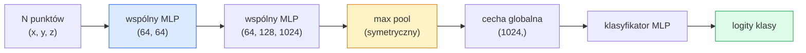

# Wizja 3D — Chmury punktów i NeRF-y

> Wizja 3D występuje w dwóch odmianach. Chmury punktów to surowy output czujnika. NeRF-y to wyuczone pola objętościowe. Oba odpowiadają na pytanie „co jest gdzie w przestrzeni".

**Typ:** Nauka + Budowanie
**Języki:** Python
**Wymagania wstępne:** Lekcja 03 z Fazy 4 (CNN-y), Lekcja 12 z Fazy 1 (Operacje na tensorach)
**Szacowany czas:** około 45 minut

## Cele uczenia się

- Rozróżniać jawne (chmura punktów, siatka, woksel) i niejawne (pole odległości ze znakiem, NeRF) reprezentacje 3D oraz wiedzieć, kiedy każda z nich jest używana
- Zrozumieć sztuczkę z funkcją symetryczną w PointNet, która sprawia, że sieć neuronowa jest niezmienna względem permutacji nieuporządkowanego zbioru punktów
- Prześledzić forward pass NeRF-a: rzutowanie promieni, renderowanie objętościowe, kodowanie pozycyjne, MLP z głową gęstości i koloru
- Użyć `nerfstudio` lub `instant-ngp` do wstępnie wytrenowanej rekonstrukcji 3D z niewielkiego zbioru zdjęć z pozycjami

## Problem

Kamera produkuje obraz 2D. LIDAR produkuje zbiór punktów 3D bez ustalonego porządku. Potok structure-from-motion produkuje rzadką chmurę kluczowych punktów 3D. NeRF rekonstruuje całą scenę 3D z kilku zdjęć z pozycjami. Wszystkie te przypadki to „vision", ale żaden z nich nie wygląda jak gęsty tensor, którego oczekuje CNN.

Wizja 3D ma znaczenie, ponieważ prawie każde wysokowartościowe zadanie robota odbywa się w 3D: chwytanie, unikanie przeszkód, nawigacja, okluzja AR, przechwytywanie zawartości 3D. Inżynier wizji, który rozumie tylko obrazy 2D, jest wykluczony z najszybciej rosnącego segmentu dziedziny (treści AR/VR, robotyka, stosy jazdy autonomicznej, rekonstrukcja 3D oparta na NeRF-ach dla nieruchomości lub budownictwa).

Te dwie reprezentacje dominują z różnych powodów. Chmury punktów to to, co czujniki dają ci za darmo. NeRF-y i ich następcy (3D Gaussian splatting, neural SDF) to to, co otrzymujesz, gdy prosisz sieć neuronową o nauczenie się sceny.

## Koncepcja

### Chmury punktów

Chmura punktów to nieuporządkowany zbiór N punktów w R^3, opcjonalnie każdy z cechami (kolor, intensywność, normalna).

```
cloud = [
  (x1, y1, z1, r1, g1, b1),
  (x2, y2, z2, r2, g2, b2),
  ...
  (xN, yN, zN, rN, gN, bN),
]
```

Brak siatki, brak łączności. Dwie właściwości sprawiają, że jest to trudne dla sieci neuronowych:

- **Niezmienniczość względem permutacji** — output nie może zależeć od kolejności punktów.
- **Zmienna N** — pojedynczy model musi obsługiwać chmury o różnych rozmiarach.

PointNet (Qi et al., 2017) rozwiązał oba problemy jednym pomysłem: zastosuj wspólny MLP do każdego punktu, a następnie agreguj za pomocą funkcji symetrycznej (max pool). Wynikiem jest wektor o stałym rozmiarze, który nie zależy od porządku.

```
f(P) = max_{p in P} MLP(p)
```

To jest cały rdzeń PointNet. Głębsze warianty (PointNet++, Point Transformer) dodają hierarchiczne próbkowanie i lokalną agregację, ale sztuczka z funkcją symetryczną pozostaje niezmieniona.

### Architektura PointNet



„Wspólny MLP" oznacza, że ten sam MLP działa na każdym punkcie niezależnie. Implementowany jako konwolucja 1x1 przez wymiar punktów dla efektywności.

### Neural Radiance Fields (NeRF-y)

NeRF-y (Mildenhall et al., 2020) postawiły pytanie „czy możemy zrekonstruować scenę 3D z N zdjęć?" i odpowiedziały siecią neuronową, która jest sceną. Sieć odwzorowuje `(x, y, z, viewing_direction)` na `(density, colour)`. Renderowanie nowego widoku to pętla rzutowania promieni przez tę sieć.

```
NeRF MLP:  (x, y, z, theta, phi) -> (sigma, r, g, b)

Aby wyrenderować piksel (u, v) nowego widoku:
  1. Rzuć promień od kamery przez piksel (u, v)
  2. Próbkuj punkty wzdłuż promienia w odległościach t_1, t_2, ..., t_N
  3. Zadaj zapytanie do MLP w każdym punkcie
  4. Komponuj kolory ważone przez (1 - exp(-sigma * dt))
  5. Suma to wyrenderowany kolor piksela
```

Loss porównuje wyrenderowany piksel z pikselem ground-truth na zdjęciach treningowych. Backprop przez krok renderowania aktualizuje MLP. Brak ground truth 3D, brak jawnej geometrii — scena jest przechowywana w wagach MLP.

### Kodowanie pozycyjne w NeRF

Zwykły MLP na `(x, y, z)` nie może reprezentować szczegółów wysokiej częstotliwości, ponieważ MLP są spektralnie obciążone ku niskim częstotliwościom. NeRF naprawia to, kodując każdą współrzędną w wektor cech Fouriera przed MLP:

```
gamma(p) = (sin(2^0 pi p), cos(2^0 pi p), sin(2^1 pi p), cos(2^1 pi p), ...)
```

Do L=10 poziomów częstotliwości. To ta sama sztuczka, której transformery używają dla pozycji, i pojawia się ponownie w warunkowaniu czasowym dyfuzji (Lekcja 10). Bez niej NeRF-y wyglądają rozmazane.

### Renderowanie objętościowe

```
C(r) = sum_i T_i * (1 - exp(-sigma_i * delta_i)) * c_i

T_i  = exp(- sum_{j<i} sigma_j * delta_j)
delta_i = t_{i+1} - t_i
```

`T_i` to transmitancja — ile światła dociera do punktu i. `(1 - exp(-sigma_i * delta_i))` to krycie w punkcie i. `c_i` to kolor. Końcowy piksel to ważona suma wzdłuż promienia.

### Co zastąpiło NeRF-y

Czyste NeRF-y są wolne w treningu (godziny) i wolne w renderowaniu (sekundy na obraz). Linia rozwoju od:

- **Instant-NGP** (2022) — kodowanie hash-grid zastępuje pozycyjne wejście MLP; trening w sekundach.
- **Mip-NeRF 360** — obsługuje nieskończone sceny i anty-aliasing.
- **3D Gaussian Splatting** (2023) — zastępuje pole objętościowe milionami Gaussian 3D; trening w minutach, renderowanie w czasie rzeczywistym. Obecny produkcyjny standard.

Prawie każdy prawdziwy produkt NeRF w 2026 to w istocie 3D Gaussian splatting. Model mentalny to nadal NeRF.

### Zbiory danych i benchmarki

- **ShapeNet** — klasyfikacja i segmentacja modeli CAD 3D jako chmur punktów.
- **ScanNet** — rzeczywiste skany wnętrz do segmentacji.
- **KITTI** — zewnętrzne chmury punktów LIDAR do jazdy autonomicznej.
- **NeRF Synthetic** / **Blended MVS** — zbiory danych zdjęć z pozycjami do syntezy widoku.
- **Zbiór danych Mip-NeRF 360** — nieskończone rzeczywiste sceny.

## Zbuduj to

### Krok 1: Klasyfikator PointNet

```python
import torch
import torch.nn as nn

class PointNet(nn.Module):
    def __init__(self, num_classes=10):
        super().__init__()
        self.mlp1 = nn.Sequential(
            nn.Conv1d(3, 64, 1),    nn.BatchNorm1d(64),   nn.ReLU(inplace=True),
            nn.Conv1d(64, 64, 1),   nn.BatchNorm1d(64),   nn.ReLU(inplace=True),
        )
        self.mlp2 = nn.Sequential(
            nn.Conv1d(64, 128, 1),  nn.BatchNorm1d(128),  nn.ReLU(inplace=True),
            nn.Conv1d(128, 1024, 1), nn.BatchNorm1d(1024), nn.ReLU(inplace=True),
        )
        self.head = nn.Sequential(
            nn.Linear(1024, 512),   nn.BatchNorm1d(512),  nn.ReLU(inplace=True),
            nn.Dropout(0.3),
            nn.Linear(512, 256),    nn.BatchNorm1d(256),  nn.ReLU(inplace=True),
            nn.Dropout(0.3),
            nn.Linear(256, num_classes),
        )

    def forward(self, x):
        # x: (N, 3, num_points) — transponowane dla Conv1d
        x = self.mlp1(x)
        x = self.mlp2(x)
        x = torch.max(x, dim=-1)[0]       # (N, 1024)
        return self.head(x)

pts = torch.randn(4, 3, 1024)
net = PointNet(num_classes=10)
print(f"output: {net(pts).shape}")
print(f"params: {sum(p.numel() for p in net.parameters()):,}")
```

Około 1,6M parametrów. Działa na 1024 punktach na chmurę.

### Krok 2: Kodowanie pozycyjne

```python
def positional_encoding(x, L=10):
    """
    x: (..., D) -> (..., D * 2 * L)
    """
    freqs = 2.0 ** torch.arange(L, dtype=x.dtype, device=x.device)
    args = x.unsqueeze(-1) * freqs * 3.141592653589793
    sinc = torch.cat([args.sin(), args.cos()], dim=-1)
    return sinc.reshape(*x.shape[:-1], -1)

x = torch.randn(5, 3)
y = positional_encoding(x, L=10)
print(f"input:  {x.shape}")
print(f"encoded: {y.shape}     # (5, 60)")
```

Mnożenie przez `2^l * pi` daje progresywnie wyższe częstotliwości.

### Krok 3: Mały NeRF MLP

```python
class TinyNeRF(nn.Module):
    def __init__(self, L_pos=10, L_dir=4, hidden=128):
        super().__init__()
        self.L_pos = L_pos
        self.L_dir = L_dir
        pos_dim = 3 * 2 * L_pos
        dir_dim = 3 * 2 * L_dir
        self.trunk = nn.Sequential(
            nn.Linear(pos_dim, hidden), nn.ReLU(inplace=True),
            nn.Linear(hidden, hidden),  nn.ReLU(inplace=True),
            nn.Linear(hidden, hidden),  nn.ReLU(inplace=True),
            nn.Linear(hidden, hidden),  nn.ReLU(inplace=True),
        )
        self.sigma = nn.Linear(hidden, 1)
        self.color = nn.Sequential(
            nn.Linear(hidden + dir_dim, hidden // 2), nn.ReLU(inplace=True),
            nn.Linear(hidden // 2, 3), nn.Sigmoid(),
        )

    def forward(self, x, d):
        x_enc = positional_encoding(x, self.L_pos)
        d_enc = positional_encoding(d, self.L_dir)
        h = self.trunk(x_enc)
        sigma = torch.relu(self.sigma(h)).squeeze(-1)
        rgb = self.color(torch.cat([h, d_enc], dim=-1))
        return sigma, rgb

nerf = TinyNeRF()
x = torch.randn(128, 3)
d = torch.randn(128, 3)
s, c = nerf(x, d)
print(f"sigma: {s.shape}   rgb: {c.shape}")
```

Mały w porównaniu do oryginalnego NeRF (który ma 2 trunks MLP o głębokości 8). Wystarczy, żeby zademonstrować architekturę.

### Krok 4: Renderowanie objętościowe wzdłuż promienia

```python
def volumetric_render(sigma, rgb, t_vals):
    """
    sigma: (..., N_samples)
    rgb:   (..., N_samples, 3)
    t_vals: (N_samples,) odległości wzdłuż promienia
    """
    delta = torch.cat([t_vals[1:] - t_vals[:-1], torch.full_like(t_vals[:1], 1e10)])
    alpha = 1.0 - torch.exp(-sigma * delta)
    trans = torch.cumprod(torch.cat([torch.ones_like(alpha[..., :1]), 1.0 - alpha + 1e-10], dim=-1), dim=-1)[..., :-1]
    weights = alpha * trans
    rendered = (weights.unsqueeze(-1) * rgb).sum(dim=-2)
    depth = (weights * t_vals).sum(dim=-1)
    return rendered, depth, weights


N = 64
t_vals = torch.linspace(2.0, 6.0, N)
sigma = torch.rand(N) * 0.5
rgb = torch.rand(N, 3)
rendered, depth, weights = volumetric_render(sigma, rgb, t_vals)
print(f"rendered colour: {rendered.tolist()}")
print(f"depth:           {depth.item():.2f}")
```

Jeden promień, 64 próbek, kompozyt do pojedynczego piksela RGB i głębi.

## Użyj tego

Do prawdziwej pracy:

- `nerfstudio` (Tancik et al.) — obecna biblioteka referencyjna dla NeRF / Instant-NGP / Gaussian Splatting. Linia poleceń plus przeglądarka webowa.
- `pytorch3d` (Meta) — różniczkowalne renderowanie, narzędzia do chmur punktów, operacje na siatkach.
- `open3d` — przetwarzanie chmur punktów, rejestracja, wizualizacja.

Do wdrożenia, 3D Gaussian splatting w dużej mierze zastąpił czyste NeRF-y, bo renderuje 100x szybciej. Jakość rekonstrukcji jest porównywalna.

## Wyślij to

Ta lekcja tworzy:

- `outputs/prompt-3d-task-router.md` — prompt, który kieruje do właściwej reprezentacji 3D (chmura punktów, siatka, woksel, NeRF, Gaussian splatting) na podstawie zadania i danych wejściowych.
- `outputs/skill-point-cloud-loader.md` — skill, który pisze PyTorch `Dataset` dla plików .ply / .pcd / .xyz z prawidłową normalizacją, centrowaniem i próbkowaniem punktów.

## Ćwiczenia

1. **(Łatwe)** Pokaż, że PointNet jest niezmienniczy względem permutacji: przepuść tę samą chmurę dwa razy, raz z punktami shuffle'owanymi. Zweryfikuj, że outputs są identyczne do tolerancji szumu zmiennoprzecinkowego.
2. **(Średnie)** Zaimplementuj minimalną funkcję generowania promieni, która przy danych wewnętrznych parametrach kamery i pozie produkuje początki i kierunki promieni dla każdego piksela obrazu H x W.
3. **(Trudne)** Wytrenuj TinyNeRF na syntetycznym zbiorze danych wyrenderowanych widoków kolorowego sześcianu (wygenerowanych przez różniczkowalne renderowanie lub prosty ray tracer). Podaj rendering loss w epoce 1, 10 i 100. W której epoce model produkuje rozpoznawalne widoki?

## Kluczowe terminy

| Termin | Co ludzie mówią | Co to faktycznie oznacza |
|--------|----------------|----------------------|
| Point cloud | „Punkty 3D z LIDAR" | Nieuporządkowany zbiór (x, y, z) + opcjonalne cechy na punkt |
| PointNet | „Pierwsza sieć neuronowa na chmurach punktów" | Wspólny MLP na punkt + symetryczny (max) pool; niezmienniczy względem permutacji z definicji |
| NeRF | „MLP, który jest sceną" | Sieć odwzorowująca (x, y, z, dir) na (gęstość, kolor); renderowana przez rzutowanie promieni |
| Kodowanie pozycyjne | „Cechy Fouriera" | Koduj każdą współrzędną w sin/cos przy wielu częstotliwościach, żeby przezwyciężyć obciążenie MLP ku niskim częstotliwościom |
| Renderowanie objętościowe | „Całkowanie promienia" | Komponuj próbki wzdłuż promienia w pojedynczy piksel używając transmitancji i alpha |
| Instant-NGP | „NeRF z hash-grid" | Zastępuje współrzędną MLP NeRF multi-resolution hash grid; 100-1000x szybszy |
| 3D Gaussian splatting | „Miliony Gaussian" | Scena = kolekcja Gaussian 3D; renderuje w czasie rzeczywistym, trenuje w minutach |
| SDF | „Pole odległości ze znakiem" | Funkcja zwracająca podpisaną odległość do najbliższej powierzchni; kolejna niejawna reprezentacja |

## Dalsza lektura

- [PointNet (Qi et al., 2017)](https://arxiv.org/abs/1612.00593) — klasyfikator niezmienniczy względem permutacji
- [NeRF (Mildenhall et al., 2020)](https://arxiv.org/abs/2003.08934) — artykuł, który uczynił rekonstrukcję 3D ze zdjęć problemem sieci neuronowych
- [Instant-NGP (Müller et al., 2022)](https://arxiv.org/abs/2201.05989) — hash grids, 1000x przyspieszenie
- [3D Gaussian Splatting (Kerbl et al., 2023)](https://arxiv.org/abs/2308.04079) — architektura, która zastąpiła NeRF-y w produkcji