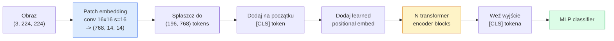

# Vision Transformers (ViT)

> Przytnij obraz na fragmenty, traktuj każdy fragment jak słowo, uruchom standardowy transformer. Nie oglądaj się wstecz.

**Typ:** Build
**Języki:** Python
**Wymagania wstępne:** Lekcja 02 z Fazy 7 (Self-Attention), Lekcja 04 z Fazy 4 (Image Classification)
**Szacowany czas:** ~45 minut

## Cele uczenia się

- Zaimplementuj patch embedding, learned positional embedding, token klasowy i bloki enkodera transformer od zera, aby zbudować minimalny ViT
- Wyjaśnij, dlaczego ViT uważano za potrzebujący ogromnych danych pretrainingowych, aż DeiT i MAE udowodniły inaczej
- Porównaj ViT, Swin i ConvNeXt pod kątem ich architektonicznych prior (brak, lokalna uwaga okienna, konwolucyjny backbone)
- Dostrój pretrained ViT na małym zbiorze danych używając `timm` i standardowego przepisu linear-probe / fine-tune

## Problem

Przez dekadę konwolucja była synonimem widzenia komputerowego. CNN-y miały silne inductive biases — lokalność, translation equivariance — których nikt nie myślał, że można zastąpić. Następnie Dosovitskiy i in. (2020) pokazali, że zwykły transformer applied to flattened image patches, bez żadnego konwolucyjnego mechanizmu, może dorównać lub pokonać najlepsze CNN-y przy skali.

Catch polegał na tym, że "przy skali." ViT na ImageNet-1k przegrywał z ResNet. ViT pretrained na ImageNet-21k lub JFT-300M, a następnie fine-tuned na ImageNet-1k go pokonywał. Wniosek był taki, że transformers brakowało użytecznych prior, ale mogły je nauczyć z wystarczającej ilości danych. Późniejsze prace (DeiT, MAE, DINO) pokazały, że z odpowiednimi przepisami trainingowymi — silną augmentacją, self-supervised pretraining, distillation — ViTy trenują dobrze również na małych danych.

W 2026 roku czyste CNN-y są nadal konkurencyjne na urządzeniach edge (ConvNeXt jest najsilniejszy), ale transformers dominują wszystko inne: segmentację (Mask2Former, SegFormer), detekcję (DETR, RT-DETR), multimodalne (CLIP, SigLIP), wideo (VideoMAE, VJEPA). Struktura bloku ViT to ta, którą warto znać.

## Koncepcja

### Pipeline



Siedem kroków. Patches -> tokens -> attention -> classifier. Każdy wariant (DeiT, Swin, ConvNeXt, MAE pretraining) zmienia jeden lub dwa z siedmiu i zostawia resztę w spokoju.

### Patch embedding

Pierwsza konwolucja to sekret. Rozmiar kernelu 16, stride 16, więc obraz 224x224 staje się siatką 14x14 fragmentów 16x16, każdy projektowany na embedding wymiaru 768. Ta jedna conv jednocześnie patchifikuje i linearnie projektuje.

```
Input:  (3, 224, 224)
Conv (3 -> 768, k=16, s=16, no padding):
Output: (768, 14, 14)
Flatten spatial: (196, 768)
```

196 patches = 196 tokens. Każdy token ma wymiar cechy 768 (ViT-B), 1024 (ViT-L) lub 1280 (ViT-H).

### Token klasowy

Pojedynczy nauczony wektor dodany na początku sekwencji:

```
tokens = [CLS; patch_1; patch_2; ...; patch_196]   kształt (197, 768)
```

Po N blokach transformer, wyjście `[CLS]` jest globalną reprezentacją obrazu. Głowa klasyfikacyjna czyta tylko ten jeden wektor.

### Positional embedding

Transformers nie mają wbudowanego pojęcia pozycji przestrzennej. Dodaj nauczony wektor do każdego tokena:

```
tokens = tokens + learned_pos_embedding   (również kształt (197, 768))
```

Embedding jest parametrem modelu; gradient-based training adaptuje go do struktury 2D obrazu. Sinusoidalne 2D alternatywy istnieją, ale rzadko są używane w praktyce.

### Transformer encoder block

Standard. Multi-head self-attention, MLP, residual connections, pre-LayerNorm.

```
x = x + MSA(LN(x))
x = x + MLP(LN(x))

MLP is two-layer with GELU: Linear(d -> 4d) -> GELU -> Linear(4d -> d)
```

ViT-B/16 stackuje 12 takich bloków, każdy z 12 heads uwagi, w sumie 86M parametrów.

### Dlaczego pre-LN

Wczesne transformers używały post-LN (`x = LN(x + sublayer(x))`) i miały problemy z trenowaniem powyżej 6-8 warstw bez warmup. Pre-LN (`x = x + sublayer(LN(x))`) trenuje głębsze sieci stabilnie bez warmup. Każdy ViT i każdy nowoczesny LLM używa pre-LN.

### Trade-off rozmiaru patchy

- Patches 16x16 -> 196 tokens, standard.
- Patches 32x32 -> 49 tokens, szybsze ale niższa rozdzielczość.
- Patches 8x8 -> 784 tokens, drobniejsze ale koszt O(n^2) attention skaluje się źle.

Większe patches = mniej tokens = szybciej, ale mniej detali przestrzennych. SwinV2 używa patches 4x4 w hierarchicznych oknach.

### Przepis DeiT na trenowanie ViT na ImageNet-1k

Oryginalny ViT potrzebował JFT-300M, żeby pokonać CNN-y. DeiT (Touvron i in., 2020) trenował ViT-B do 81.8% top-1 na ImageNet-1k samym z czterema zmianami:

1. Ciężka augmentacja: RandAugment, Mixup, CutMix, Random Erasing.
2. Stochastic depth (usuń całe bloki losowo podczas training).
3. Repeated augmentation (ten sam obraz próbkowany 3 razy na batch).
4. Distillation z CNN teachera (opcjonalne, podnosi accuracy dalej).

Każdy nowoczesny przepis treningowy ViT wywodzi się od DeiT.

### Swin vs ConvNeXt

- **Swin** (Liu i in., 2021) — window-based attention. Każdy block attending within a local window; naprzemienne bloki przesuwają okno, żeby mieszać informacje między oknami. Przywraca CNN-like locality prior, jednocześnie keeping the attention operator.
- **ConvNeXt** (Liu i in., 2022) — przeprojektowany CNN, który matches Swin's architecture choices (depthwise convs, LayerNorm, GELU, inverted bottleneck). Pokazało, że gap nie jest "attention vs convolution" ale "modern training recipe + architecture."

W 2026 roku ConvNeXt-V2 i Swin-V2 są oba production-grade; właściwy wybór zależy od twojego stacka inferencyjnego (ConvNeXt compiles better for edge) i korpusu pretrainingowego.

### MAE pretraining

Masked Autoencoder (He i in., 2022): maskuj 75% patches losowo, trenuj encoder, żeby przetwarzał tylko widoczne 25%, trenuj mały decoder, żeby reconstruct masked patches z wyjścia encodera. Po pretraining, wyrzuć decoder i fine-tune encoder.

MAE sprawia, że ViT jest trenowalny na samym ImageNet-1k, osiąga SOTA i jest obecnie domyślnym self-supervised przepisem.

## Zbuduj to

### Krok 1: Patch embedding

```python
import torch
import torch.nn as nn

class PatchEmbedding(nn.Module):
    def __init__(self, in_channels=3, patch_size=16, dim=192, image_size=64):
        super().__init__()
        assert image_size % patch_size == 0
        self.proj = nn.Conv2d(in_channels, dim, kernel_size=patch_size, stride=patch_size)
        num_patches = (image_size // patch_size) ** 2
        self.num_patches = num_patches

    def forward(self, x):
        x = self.proj(x)
        return x.flatten(2).transpose(1, 2)
```

Jedna conv, jeden flatten, jeden transpose. To jest cały krok image-to-tokens.

### Krok 2: Transformer block

Pre-LN, multi-head self-attention, MLP with GELU, residual connections.

```python
class Block(nn.Module):
    def __init__(self, dim, num_heads, mlp_ratio=4, dropout=0.0):
        super().__init__()
        self.ln1 = nn.LayerNorm(dim)
        self.attn = nn.MultiheadAttention(dim, num_heads, dropout=dropout, batch_first=True)
        self.ln2 = nn.LayerNorm(dim)
        self.mlp = nn.Sequential(
            nn.Linear(dim, dim * mlp_ratio),
            nn.GELU(),
            nn.Dropout(dropout),
            nn.Linear(dim * mlp_ratio, dim),
            nn.Dropout(dropout),
        )

    def forward(self, x):
        a, _ = self.attn(self.ln1(x), self.ln1(x), self.ln1(x), need_weights=False)
        x = x + a
        x = x + self.mlp(self.ln2(x))
        return x
```

`nn.MultiheadAttention` obsługuje splitting into heads, scaled dot-product i output projection. `batch_first=True` więc kształty to `(N, seq, dim)`.

### Krok 3: ViT

```python
class ViT(nn.Module):
    def __init__(self, image_size=64, patch_size=16, in_channels=3,
                 num_classes=10, dim=192, depth=6, num_heads=3, mlp_ratio=4):
        super().__init__()
        self.patch = PatchEmbedding(in_channels, patch_size, dim, image_size)
        num_patches = self.patch.num_patches
        self.cls_token = nn.Parameter(torch.zeros(1, 1, dim))
        self.pos_embed = nn.Parameter(torch.zeros(1, num_patches + 1, dim))
        self.blocks = nn.ModuleList([
            Block(dim, num_heads, mlp_ratio) for _ in range(depth)
        ])
        self.ln = nn.LayerNorm(dim)
        self.head = nn.Linear(dim, num_classes)
        nn.init.trunc_normal_(self.pos_embed, std=0.02)
        nn.init.trunc_normal_(self.cls_token, std=0.02)

    def forward(self, x):
        x = self.patch(x)
        cls = self.cls_token.expand(x.size(0), -1, -1)
        x = torch.cat([cls, x], dim=1)
        x = x + self.pos_embed
        for blk in self.blocks:
            x = blk(x)
        x = self.ln(x[:, 0])
        return self.head(x)

vit = ViT(image_size=64, patch_size=16, num_classes=10, dim=192, depth=6, num_heads=3)
x = torch.randn(2, 3, 64, 64)
print(f"output: {vit(x).shape}")
print(f"params: {sum(p.numel() for p in vit.parameters()):,}")
```

Około 2.8M parametrów — mały ViT tractable na CPU. Prawdziwy ViT-B to 86M; ta sama definicja klasy z `dim=768, depth=12, num_heads=12`.

### Krok 4: Sanity check — single image inference

```python
logits = vit(torch.randn(1, 3, 64, 64))
print(f"logits: {logits}")
print(f"probs:  {logits.softmax(-1)}")
```

Powinno działać bez błędów. Prawdopodobieństwa sumują się do 1.

## Użyj tego

`timm` dostarcza każdy wariant ViT z ImageNet pretrained weights. Jedna linia:

```python
import timm

model = timm.create_model("vit_base_patch16_224", pretrained=True, num_classes=10)
```

`timm` jest produkcyjnym standardem dla vision transformers w 2026. Obsługuje ViT, DeiT, Swin, Swin-V2, ConvNeXt, ConvNeXt-V2, MaxViT, MViT, EfficientFormer i dziesiątki innych pod tą samą API.

Dla pracy multimodalnej (obraz + tekst), `transformers` dostarcza CLIP, SigLIP, BLIP-2, LLaVA. Image encoder we wszystkich tych jest wariantem ViT.

## Wyślij to

Ta lekcja tworzy:

- `outputs/prompt-vit-vs-cnn-picker.md` — prompt, który wybiera między ViT, ConvNeXt lub Swin na podstawie rozmiaru datasetu, compute i stacka inferencyjnego.
- `outputs/skill-vit-patch-and-pos-embed-inspector.md` — skill, który weryfikuje, czy patch embedding i positional embedding ViT pasują do oczekiwanej długości sekwencji modelu, catchując najczęstsze błędy portowania.

## Ćwiczenia

1. **(Łatwe)** Wydrukuj kształty każdego pośredniego tensora dla forward passa przez tiny ViT powyżej. Potwierdź: input `(N, 3, 64, 64)` -> patches `(N, 16, 192)` -> z CLS `(N, 17, 192)` -> classifier input `(N, 192)` -> output `(N, num_classes)`.
2. **(Średnie)** Dostrój pretrained `timm` ViT-S/16 na synthetic-CIFAR dataset z Lekcji 4. Porównaj z dostrojeniem ResNet-18 na tych samych danych. Raportuj czas treningu i końcową accuracy.
3. **(Trudne)** Zaimplementuj MAE pretraining dla tiny ViT: maskuj 75% patches, trenuj encoder + mały decoder, żeby reconstruct masked patches. Oceń linear-probe accuracy na synthetic data przed i po pretraining.

## Kluczowe terminy

| Termin | Co ludzie mówią | Co to faktycznie oznacza |
|--------|---------------|------------------------|
| Patch embedding | "The first conv" | Conv z rozmiarem kernelu = stride = rozmiarem patcha; zamienia obraz na siatkę token embeddings |
| Token klasowy | "[CLS]" | Nauczony wektor dodany na początku sekwencji tokenów; jego finalne wyjście to globalna reprezentacja obrazu |
| Positional embedding | "Learned pos" | Nauczony wektor dodany do każdego tokena, żeby transformer wiedział skąd każdy patch pochodzi |
| Pre-LN | "LayerNorm przed sublayer" | Stabilny wariant transformera: `x + sublayer(LN(x))` zamiast `LN(x + sublayer(x))` |
| Multi-head attention | "Parallel attention" | Standard transformer attention split into num_heads niezależnych subspace, konkatenowane potem |
| ViT-B/16 | "Base, patch 16" | Kanonikonalny rozmiar: dim=768, depth=12, heads=12, patch_size=16, image=224; ~86M params |
| DeiT | "Data-efficient ViT" | ViT trenowany na samym ImageNet-1k z silną augmentacją; udowodnił, że duże datasety pretrainingowe nie są ściśle wymagane |
| MAE | "Masked autoencoder" | Self-supervised pretraining: maskuj 75% patches, reconstruct; dominant ViT pretraining recipe |

## Dalsze czytanie

- An Image is Worth 16x16 Words (Dosovitskiy i in., 2020) — paper ViT
- DeiT: Data-efficient Image Transformers (Touvron i in., 2020) — jak trenować ViT na samym ImageNet-1k
- Masked Autoencoders are Scalable Vision Learners (He i in., 2022) — MAE pretraining
- timm documentation — referencja dla każdego vision transformer, którego będziesz używać w produkcji