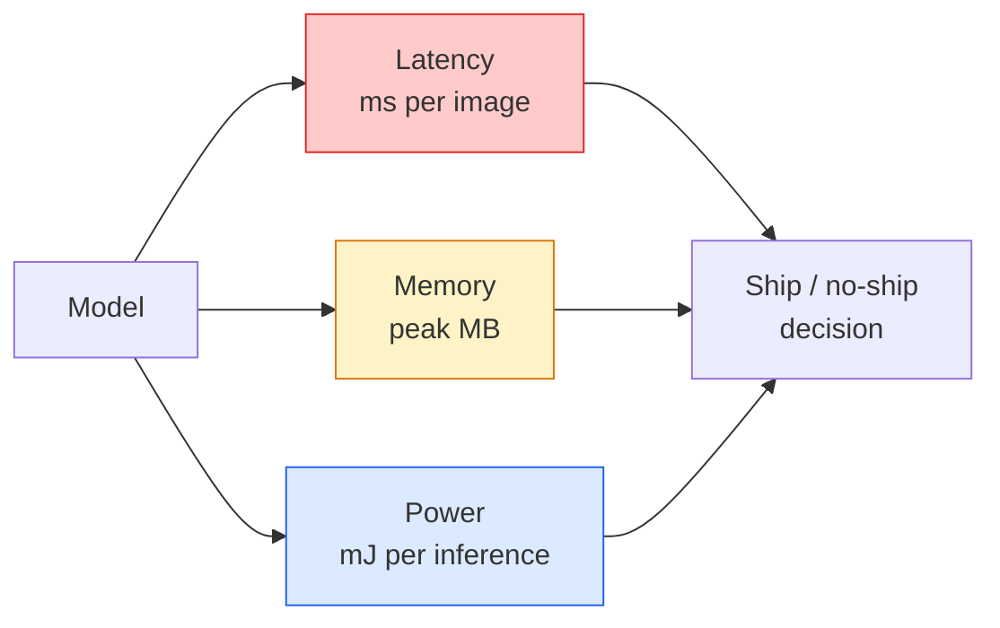

# Wizja w czasie rzeczywistym — wdrożenie na edge

> Edge inference to dyscyplina polegająca na zmuszeniu modelu o dokładności 90% do pracy z szybkością 30 fps na urządzeniu z 2 GB RAM. Każdy punkt procentowy dokładności jest wymieniany na milisekundy opóźnienia.

**Typ:** Nauka + Budowanie
**Języki:** Python
**Wymagania wstępne:** Lekcja z fazy 4 nr 04 (Klasyfikacja obrazów), Lekcja z fazy 10 nr 11 (Kwantyzacja)
**Szacowany czas:** ~75 minut

## Cele uczenia się

- Zmierzyć latency, szczytową pamięć i throughput dla dowolnego modelu PyTorch oraz odczytać trade-off FLOPs / params / latency
- Skwantyzować model wizyjny do INT8 przy użyciu post-training quantization PyTorch i zweryfikować utratę dokładności < 1%
- Wyeksportować do ONNX i skompilować z ONNX Runtime lub TensorRT; wymienić trzy najczęstsze błędy eksportu i ich naprawy
- Wyjaśnić, kiedy wybrać MobileNetV3, EfficientNet-Lite, ConvNeXt-Tiny lub MobileViT przy ograniczeniach edge

## Problem

Model wizyjny z czasów treningu to floating-point potwór. 100M parametrów, 10 GFLOPs na forward pass, 2 GB VRAM. Nic z tego nie zmieści się na telefonie, samochodowym systemie infotainment, przemysłowej kamerze czy dronie. Wysłanie systemu wizyjnego oznacza dopasowanie tych samych predykcji do budżetu, który jest 100x mniejszy.

Trzy pokrętła wykonują większość pracy: wybór modelu (mniejsza architektura z tym samym przepisem), kwantyzacja (INT8 zamiast FP32) i runtime inferencyjny (ONNX Runtime, TensorRT, Core ML, TFLite). Poprawne ich ustawienie to różnica między demo działającym na stacji roboczej a produktem wysyłanym na moduł kamery za 30 dolarów.

Ta lekcja najpierw ustawia dyscyplinę pomiarową (nie można optymalizować tego, czego nie można zmierzyć), a następnie przechodzi przez trzy pokrętła. Celem nie jest nauczenie się każdego edge runtime, lecz poznanie dostępnych dźwigni i sposobu weryfikacji każdej z nich.

## Koncepcja

### Trzy budżety



- **Latency**: p50, p95, p99. Uśrednianie tylko p50 ukrywa zachowanie w ogonie, które ma znaczenie dla systemów real-time.
- **Szczytowa pamięć**: maksimum, jakie urządzenie kiedykolwiek widzi, nie średnia w stanie ustalonym. Ma znaczenie, bo OOM-y są fatalne na celach embedded.
- **Moc / energia**: milidżule na inferencję na urządzeniu zasilanym bateryjnie. Często aproksymowana przez wykorzystanie CPU/GPU * czas.

Tabela (model, latency, pamięć, dokładność) to to, z czego podejmuje się decyzję edge. Każda komórka jest mierzona na docelowym urządzeniu, nie na stacji roboczej.

### Dyscyplina pomiarowa

Trzy zasady, których należy przestrzegać przy każdym profilowaniu edge:

1. **Rozgrzej** model 5-10 dummy forward passes przed pomiarem. Zimne cache'y i kompilacja JIT produkują niereprezentatywne pierwsze liczby.
2. **Zsynchronizuj** obciążenia GPU z `torch.cuda.synchronize()` przed i po bloku czasowanym. Bez tego mierzysz dispatch kernela, nie wykonanie kernela.
3. **Ustal rozmiar wejścia** na rozdzielczość produkcyjną. Latency na 224x224 to nie latency na 512x512.

### FLOPs jako proxy

FLOPs (floating-point operations per inference) to tanie, niezależne od urządzenia proxy dla latency. Przydatne do porównywania architektur, mylące jako bezwzględny zegar ścienny. Model z 10% więcej FLOPs może być 2x szybszy w praktyce, bo używa operacji przyjaznych sprzętowo (depthwise conwy kompilują się dobrze, duże 7x7 conwy nie).

Zasada: używaj FLOPs do wyszukiwania architektury, używaj latency na urządzeniu do decyzji wdrożeniowych.

### Kwantyzacja w jednym akapicie

Zamień wagi i aktywacje FP32 na INT8. Rozmiar modelu spada 4x, пропускная способность pamięci spada 4x, obliczenia spadają 2-4x na sprzęcie z kernelami INT8 (każdy nowoczesny mobilny SoC, każdy GPU NVIDIA z Tensor Cores). Utrata dokładności na zadaniach wizyjnych to typowo 0.1-1 punktów procentowych przy post-training static quantization.

Typy:

- **Dynamic** — kwantyzuj wagi do INT8, aktywacje obliczane w FP. Łatwe, małe przyspieszenie.
- **Static (post-training)** — kwantyzuj wagi + kalibruj zakresy aktywacji na małym zbiorze kalibracyjnym. Znacznie szybsze niż dynamic.
- **Quantisation-aware training (QAT)** — symuluj kwantyzację podczas treningu, żeby model nauczył się wokół niej. Najlepsza dokładność, wymaga oznaczonych danych.

Dla wizji, post-training static quantization daje 95% korzyści przy 5% wysiłku. Używaj QAT tylko gdy utrata dokładności z PTQ jest nieakceptowalna.

### Pruning i distillacja

- **Pruning** — usuń nieważne wagi (na podstawie magnitude) lub kanały (strukturalnie). Działa dobrze na przeinparametryzowanych modelach; mniej użyteczne na już kompaktowych architekturach.
- **Distillation** — trenuj małego studenta, żeby naśladował logity dużego nauczyciela. Często odzyskuje większość utraconej dokładności przez zmniejszenie modelu. Standard dla produkcyjnych modeli edge.

### Runtimy inferencyjne

- **PyTorch eager** — wolny, nie do wdrożenia. Używaj tylko do developmentu.
- **TorchScript** — legacy. Wyparty przez `torch.compile` i eksport ONNX.
- **ONNX Runtime** — neutralny runtime. CPU, CUDA, CoreML, TensorRT, OpenVINO mają wszystkie providery ONNX. Zaczynaj stąd.
- **TensorRT** — kompilator NVIDIA. Najlepsze latency na GPU NVIDIA (stacja robocza i Jetson). Integruje się z ONNX Runtime lub standalone.
- **Core ML** — runtime Apple dla iOS/macOS. Potrzebuje `.mlmodel` lub `.mlpackage`.
- **TFLite** — runtime Google dla Android/ARM. Potrzebuje `.tflite`.
- **OpenVINO** — runtime Intel dla CPU/VPU. Potrzebuje `.xml` + `.bin`.

W praktyce: eksportuj PyTorch -> ONNX -> wybierz runtime dla celu. ONNX to lingua franca.

### Picker architektury edge

| Budżet | Model | Dlaczego |
|--------|-------|----------|
| < 3M params | MobileNetV3-Small | Kompiluje się wszędzie, dobry baseline |
| 3-10M | EfficientNet-Lite-B0 | Najlepsza dokładność na param na TFLite |
| 10-20M | ConvNeXt-Tiny | Najlepsza dokładność-na-param, przyjazny CPU |
| 20-30M | MobileViT-S lub EfficientViT | Transformer z dokładnością ImageNet |
| 30-80M | Swin-V2-Tiny | Jeśli stack obsługuje window attention |

Kwantyzuj wszystkie do INT8, chyba że masz konkretny powód, żeby tego nie robić.

## Zbuduj to

### Krok 1: Mierz latency poprawnie

```python
import time
import torch

def measure_latency(model, input_shape, device="cpu", warmup=10, iters=50):
    model = model.to(device).eval()
    x = torch.randn(input_shape, device=device)
    with torch.no_grad():
        for _ in range(warmup):
            model(x)
        if device == "cuda":
            torch.cuda.synchronize()
        times = []
        for _ in range(iters):
            if device == "cuda":
                torch.cuda.synchronize()
            t0 = time.perf_counter()
            model(x)
            if device == "cuda":
                torch.cuda.synchronize()
            times.append((time.perf_counter() - t0) * 1000)
    times.sort()
    return {
        "p50_ms": times[len(times) // 2],
        "p95_ms": times[int(len(times) * 0.95)],
        "p99_ms": times[int(len(times) * 0.99)],
        "mean_ms": sum(times) / len(times),
    }
```

Rozgrzewka, synchronizacja, używaj `time.perf_counter()`. Raportuj percentyle, nie tylko średnią.

### Krok 2: Liczba parametrów i FLOPs

```python
def parameter_count(model):
    return sum(p.numel() for p in model.parameters())

def flops_estimate(model, input_shape):
    """
    Rough FLOP count for a conv/linear-only model. For production use `fvcore` or `ptflops`.
    """
    total = 0
    def conv_hook(m, inp, out):
        nonlocal total
        c_out, c_in, kh, kw = m.weight.shape
        h, w = out.shape[-2:]
        total += 2 * c_in * c_out * kh * kw * h * w
    def linear_hook(m, inp, out):
        nonlocal total
        total += 2 * m.in_features * m.out_features
    hooks = []
    for m in model.modules():
        if isinstance(m, torch.nn.Conv2d):
            hooks.append(m.register_forward_hook(conv_hook))
        elif isinstance(m, torch.nn.Linear):
            hooks.append(m.register_forward_hook(linear_hook))
    model.eval()
    with torch.no_grad():
        model(torch.randn(input_shape))
    for h in hooks:
        h.remove()
    return total
```

Dla prawdziwych projektów używaj `fvcore.nn.FlopCountAnalysis` lub `ptflops`; obsługują poprawnie każdy typ modułu.

### Krok 3: Post-training static quantization

```python
def quantise_ptq(model, calibration_loader, backend="x86"):
    import torch.ao.quantization as tq
    model = model.eval().cpu()
    model.qconfig = tq.get_default_qconfig(backend)
    tq.prepare(model, inplace=True)
    with torch.no_grad():
        for x, _ in calibration_loader:
            model(x)
    tq.convert(model, inplace=True)
    return model
```

Trzy kroki: skonfiguruj, przygotuj (wstaw observatorów), kalibruj z realnymi danymi, konwertuj (fuse + quantize). Wymaga, żeby model był sfuzowany (`Conv -> BN -> ReLU` -> `ConvBnReLU`), co obsługuje `torch.ao.quantization.fuse_modules`.

### Krok 4: Eksport do ONNX

```python
def export_onnx(model, sample_input, path="model.onnx"):
    model = model.eval()
    torch.onnx.export(
        model,
        sample_input,
        path,
        input_names=["input"],
        output_names=["output"],
        dynamic_axes={"input": {0: "batch"}, "output": {0: "batch"}},
        opset_version=17,
    )
    return path
```

`opset_version=17` to bezpieczny default w 2026. `dynamic_axes` pozwala uruchamiać model ONNX z dowolnym batchem.

### Krok 5: Benchmark i porównanie reżimów

```python
import torch.nn as nn
from torchvision.models import mobilenet_v3_small

def compare_regimes():
    model = mobilenet_v3_small(weights=None, num_classes=10)
    params = parameter_count(model)
    flops = flops_estimate(model, (1, 3, 224, 224))
    lat_fp32 = measure_latency(model, (1, 3, 224, 224), device="cpu")
    print(f"FP32 MobileNetV3-Small: {params:,} params  {flops/1e9:.2f} GFLOPs  "
          f"p50={lat_fp32['p50_ms']:.2f}ms  p95={lat_fp32['p95_ms']:.2f}ms")
```

Uruchom tę samą funkcję dla `resnet50`, `efficientnet_v2_s` i `convnext_tiny` i masz tabelę porównawczą potrzebną do decyzji wdrożeniowej.

## Użyj tego

Produkcyjne stacki zbiegają się do jednej z trzech ścieżek:

- **Web / serverless**: PyTorch -> ONNX -> ONNX Runtime (provider CPU lub CUDA). Najłatwiejsze, wystarczające dla większości.
- **NVIDIA edge (Jetson, serwer GPU)**: PyTorch -> ONNX -> TensorRT. Najlepsze latency, największy wysiłek inżynieryjny.
- **Mobile**: PyTorch -> ONNX -> Core ML (iOS) lub TFLite (Android). Kwantyzuj przed eksportem.

Do pomiarów `torch-tb-profiler`, `nvprof` / `nsys` i Instruments na macOS dają rozbicia warstwa po warstwie. `benchmark_app` (OpenVINO) i `trtexec` (TensorRT) dają standalone'owe liczby CLI.

## Wyślij to

Ta lekcja produkuje:

- `outputs/prompt-edge-deployment-planner.md` — prompt, który wybiera backbone, strategię kwantyzacji i runtime przy danym docelowym urządzeniu i SLA latency.
- `outputs/skill-latency-profiler.md` — skill, który pisze kompletny skrypt benchmarku latency z rozgrzewką, synchronizacją, percentylami i śledzeniem pamięci.

## Ćwiczenia

1. **(Łatwe)** Zmierz p50 latency dla `resnet18`, `mobilenet_v3_small`, `efficientnet_v2_s` i `convnext_tiny` przy 224x224 na CPU. Zgłoś tabelę i zidentyfikuj, która architektura ma najlepszą dokładność na ms.
2. **(Średnie)** Zastosuj post-training static quantization do `mobilenet_v3_small`. Zgłoś FP32 vs INT8 latency i utratę dokładności na held-out subset CIFAR-10 lub podobnym.
3. **(Trudne)** Wyeksportuj `convnext_tiny` do ONNX, uruchom przez `onnxruntime` z `CPUExecutionProvider` i porównaj latency do PyTorch eager baseline. Zidentyfikuj pierwszą warstwę, gdzie ONNX Runtime jest szybszy i wyjaśnij dlaczego.

## Kluczowe terminy

| Termin | Co ludzie mówią | Co to faktycznie oznacza |
|--------|----------------|-------------------------|
| Latency | "Jak szybko" | Czas od wejścia do wyjścia; percentyle p50/p95/p99, nie średnia |
| FLOPs | "Rozmiar modelu" | Floating-point ops na forward pass; rough proxy dla kosztu obliczeniowego |
| INT8 quantisation | "8-bit" | Zamiana wag/aktywacji FP32 na 8-bitowe integery; ~4x mniejszy, 2-4x szybszy |
| PTQ | "Post-training quantisation" | Kwantyzacja wytrenowanego modelu bez retrainingu; łatwe, zwykle wystarczające |
| QAT | "Quantisation-aware training" | Symulacja kwantyzacji podczas treningu; najlepsza dokładność, wymaga oznaczonych danych |
| ONNX | "The neutral format" | Format wymiany modeli wspierany przez każdy mainstreamowy runtime inferencyjny |
| TensorRT | "Kompilator NVIDIA" | Kompiluje ONNX w zoptymalizowany engine dla GPU NVIDIA |
| Distillation | "Teacher -> student" | Trenowanie małego modelu, żeby naśladował logity dużego; odzyskuje większość utraconej dokładności |