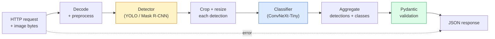

# Budowanie kompletnego potoku wizyjnego — Capstone

> Produkcjny system wizyjny to łańcuch modeli i reguł połączonych z kontraktami danych. Elementy są już w tej fazie; capstone łączy je end-to-end.

**Typ:** Budowanie
**Języki:** Python
**Wymagania wstępne:** Lekcje 01-15 fazy 4
**Szacowany czas:** ~120 minut

## Cele uczenia się

- Zaprojektować produkcyjny potok wizyjny, który wykrywa obiekty, klasyfikuje je i emituje ustrukturyzowany JSON — z obsługą każdej ścieżki błędu
- Podłączyć detektor (Mask R-CNN lub YOLO), klasyfikator (ConvNeXt-Tiny) i kontrakt danych (Pydantic) do jednej usługi
- Zbenchmarkować potok end-to-end i zidentyfikować pierwsze wąskie gardło (zazwyczaj preprocessing, potem detektor)
- Dostarczyć minimalną usługę FastAPI, która przyjmuje upload obrazu, uruchamia potok i zwraca wykrycia z klasyfikacjami

## Problem

Pojedyncze modele wizyjne są użyteczne; produkty wizyjne to łańcuchy takich modeli. Audyt regału sklepowego to detektor plus klasyfikator produktów plus pipeline OCR ceny. Jazda autonomiczna to detektor 2D plus detektor 3D plus segmenter plus tracker plus planner. Medical pre-screen to segmenter plus klasyfikator regionów plus interfejs klinicysty.

Łączenie tych łańcuchów to część, która oddziela prototyp ML od produktu. Każdy interfejs między modelami to nowe miejsce na błędy. Każda transformacja współrzędnych, każda normalizacja, każde przeskalowanie maski to kandydat na cichy błąd. Potok jest tak silny, jak jego najsłabszy interfejs.

Ten capstone ustawia minimalny działający potok: detection + classification + structured output + warstwa serwowania. Wszystko inne w fazie 4 pasuje do tego szkieletu: zamień Mask R-CNN na YOLOv8, dodaj głowicę OCR, dodaj gałąź segmentacji, dodaj tracker. Architektura jest stabilna; elementy są wymienne.

## Koncepcja

### Potok



Siedem etapów. Dwa etapy z modelami są kosztowne; pięć pozostałych to miejsca, gdzie bytują błędy.

### Kontrakty danych z Pydantic

Każda granica modelu staje się obiektem typizowanym. Zamienia to ciche błędy na głośne.

```
Detection(
    box: tuple[float, float, float, float],   # (x1, y1, x2, y2), absolute pixels
    score: float,                              # [0, 1]
    class_id: int,                             # from detector's label map
    mask: Optional[list[list[int]]],           # RLE-encoded if present
)

PipelineResult(
    image_id: str,
    detections: list[Detection],
    classifications: list[Classification],
    inference_ms: float,
)
```

Gdy detektor zwraca boxy w formacie `(cx, cy, w, h)` zamiast `(x1, y1, x2, y2)`, walidacja Pydantic kończy się niepowodzeniem na granicy i dowiadujesz się o tym natychmiast, zamiast debugować downstream crop, który cicho zwraca puste regiony.

### Gdzie idzie latency

Trzy prawdy obowiązują w prawie każdym potoku wizyjnym:

1. **Preprocessing jest często największym pojedynczym blokiem.** Dekodowanie JPEG, konwersja przestrzeni kolorów, skalowanie — te operacje są CPU-bound i łatwe do przeoczenia.
2. **Detektor dominuje czas GPU.** 70-90% czasu GPU to forward pass detekcji.
3. **Postprocessing (NMS, RLE encode/decode) jest tani na GPU, drogi na CPU.** Zawsze profiluj z rzeczywistym celem.

Znajomość rozkładu zamienia optymalizację w uporządkowaną listę.

### Tryby awarii

- **Puste wykrycia** — zwróć pustą listę, nie crashuj. Loguj.
- **Boxy poza granicami** — clampuj do rozmiaru obrazu przed croppingiem.
- **Mikroskopijne cropy** — pomijaj klasyfikację dla boxów mniejszych niż minimum wejściowe klasyfikatora.
- **Uszkodzony upload** — odpowiedź 400 ze specyficznym kodem błędu, nie 500.
- **Błąd ładowania modelu** — awaria przy starcie usługi, nie przy pierwszym requescie.

Produkcyjny potok obsługuje każde z tych bez pisania generycznych `try/except`, które ukrywają błąd. Każdy błąd dostaje nazwany kod i odpowiedź.

### Batching

Produkcyjna usługa obsługuje wielu klientów. Batchowanie wykryć i klasyfikacji między requestami mnoży throughput. Kompromis: dodatkowe latency z oczekiwania na zapełnienie batcha. Typowa konfiguracja: zbieraj requesty przez maksymalnie 20 ms, batchuj razem, przetwarzaj, dystrybuuj odpowiedzi. `torchserve` i `triton` robią to natywnie; małe usługi z przewidywalnym obciążeniem robią własny micro-batcher.

## Buduj To

### Krok 1: Kontrakty danych

```python
from pydantic import BaseModel, Field
from typing import List, Optional, Tuple

class Detection(BaseModel):
    box: Tuple[float, float, float, float]
    score: float = Field(ge=0, le=1)
    class_id: int = Field(ge=0)
    mask_rle: Optional[str] = None


class Classification(BaseModel):
    detection_index: int
    class_id: int
    class_name: str
    score: float = Field(ge=0, le=1)


class PipelineResult(BaseModel):
    image_id: str
    detections: List[Detection]
    classifications: List[Classification]
    inference_ms: float
```

Pięć sekund kodu oszczędza godzinę debugowania w każdym poważnym potoku.

### Krok 2: Minimalna klasa Pipeline

```python
import time
import numpy as np
import torch
from PIL import Image

class VisionPipeline:
    def __init__(self, detector, classifier, class_names,
                 device="cpu", min_crop=32):
        self.detector = detector.to(device).eval()
        self.classifier = classifier.to(device).eval()
        self.class_names = class_names
        self.device = device
        self.min_crop = min_crop

    def preprocess(self, image):
        """
        image: PIL.Image or np.ndarray (H, W, 3) uint8
        returns: CHW float tensor on device
        """
        if isinstance(image, Image.Image):
            image = np.asarray(image.convert("RGB"))
        tensor = torch.from_numpy(image).permute(2, 0, 1).float() / 255.0
        return tensor.to(self.device)

    @torch.no_grad()
    def detect(self, image_tensor):
        return self.detector([image_tensor])[0]

    @torch.no_grad()
    def classify(self, crops):
        if len(crops) == 0:
            return []
        batch = torch.stack(crops).to(self.device)
        logits = self.classifier(batch)
        probs = logits.softmax(-1)
        scores, cls = probs.max(-1)
        return list(zip(cls.tolist(), scores.tolist()))

    def run(self, image, image_id="anonymous"):
        t0 = time.perf_counter()
        tensor = self.preprocess(image)
        det = self.detect(tensor)

        crops = []
        detections = []
        valid_indices = []
        for i, (box, score, cls) in enumerate(zip(det["boxes"], det["scores"], det["labels"])):
            x1, y1, x2, y2 = [max(0, int(b)) for b in box.tolist()]
            x2 = min(x2, tensor.shape[-1])
            y2 = min(y2, tensor.shape[-2])
            detections.append(Detection(
                box=(x1, y1, x2, y2),
                score=float(score),
                class_id=int(cls),
            ))
            if (x2 - x1) < self.min_crop or (y2 - y1) < self.min_crop:
                continue
            crop = tensor[:, y1:y2, x1:x2]
            crop = torch.nn.functional.interpolate(
                crop.unsqueeze(0),
                size=(224, 224),
                mode="bilinear",
                align_corners=False,
            )[0]
            crops.append(crop)
            valid_indices.append(i)

        class_preds = self.classify(crops)

        classifications = []
        for valid_idx, (cls_id, cls_score) in zip(valid_indices, class_preds):
            classifications.append(Classification(
                detection_index=valid_idx,
                class_id=int(cls_id),
                class_name=self.class_names[cls_id],
                score=float(cls_score),
            ))

        return PipelineResult(
            image_id=image_id,
            detections=detections,
            classifications=classifications,
            inference_ms=(time.perf_counter() - t0) * 1000,
        )
```

Każdy interfejs jest typizowany. Każda ścieżka błędu ma specyficzną decyzję obsługi.

### Krok 3: Podłącz detektor i klasyfikator

```python
from torchvision.models.detection import maskrcnn_resnet50_fpn_v2
from torchvision.models import convnext_tiny

# Use ImageNet-pretrained weights for a realistic pipeline without training
detector = maskrcnn_resnet50_fpn_v2(weights="DEFAULT")
classifier = convnext_tiny(weights="DEFAULT")
class_names = [f"imagenet_class_{i}" for i in range(1000)]

pipe = VisionPipeline(detector, classifier, class_names)

# Smoke test with a synthetic image
test_image = (np.random.rand(400, 600, 3) * 255).astype(np.uint8)
result = pipe.run(test_image, image_id="demo")
print(result.model_dump_json(indent=2)[:500])
```

### Krok 4: Usługa FastAPI

```python
from fastapi import FastAPI, UploadFile, HTTPException
from io import BytesIO

app = FastAPI()
pipe = None  # initialised on startup

@app.on_event("startup")
def load():
    global pipe
    detector = maskrcnn_resnet50_fpn_v2(weights="DEFAULT").eval()
    classifier = convnext_tiny(weights="DEFAULT").eval()
    pipe = VisionPipeline(detector, classifier, class_names=[f"c{i}" for i in range(1000)])

@app.post("/detect")
async def detect_endpoint(file: UploadFile):
    if file.content_type not in {"image/jpeg", "image/png", "image/webp"}:
        raise HTTPException(status_code=400, detail="unsupported image type")
    data = await file.read()
    try:
        img = Image.open(BytesIO(data)).convert("RGB")
    except Exception:
        raise HTTPException(status_code=400, detail="cannot decode image")
    result = pipe.run(img, image_id=file.filename or "upload")
    return result.model_dump()
```

Uruchom z `uvicorn main:app --host 0.0.0.0 --port 8000`. Testuj z `curl -F 'file=@dog.jpg' http://localhost:8000/detect`.

### Krok 5: Benchmark potoku

```python
import time

def benchmark(pipe, num_runs=20, image_size=(400, 600)):
    img = (np.random.rand(*image_size, 3) * 255).astype(np.uint8)
    pipe.run(img)  # warm up

    stages = {"preprocess": [], "detect": [], "classify": [], "total": []}
    for _ in range(num_runs):
        t0 = time.perf_counter()
        tensor = pipe.preprocess(img)
        t1 = time.perf_counter()
        det = pipe.detect(tensor)
        t2 = time.perf_counter()
        crops = []
        for box in det["boxes"]:
            x1, y1, x2, y2 = [max(0, int(b)) for b in box.tolist()]
            x2 = min(x2, tensor.shape[-1])
            y2 = min(y2, tensor.shape[-2])
            if (x2 - x1) >= pipe.min_crop and (y2 - y1) >= pipe.min_crop:
                crop = tensor[:, y1:y2, x1:x2]
                crop = torch.nn.functional.interpolate(
                    crop.unsqueeze(0), size=(224, 224), mode="bilinear", align_corners=False
                )[0]
                crops.append(crop)
        pipe.classify(crops)
        t3 = time.perf_counter()
        stages["preprocess"].append((t1 - t0) * 1000)
        stages["detect"].append((t2 - t1) * 1000)
        stages["classify"].append((t3 - t2) * 1000)
        stages["total"].append((t3 - t0) * 1000)

    for stage, times in stages.items():
        times.sort()
        print(f"{stage:12s}  p50={times[len(times)//2]:7.1f} ms  p95={times[int(len(times)*0.95)]:7.1f} ms")
```

Typowy output na CPU: preprocess ~3 ms, detect 300-500 ms, classify 20-40 ms, total 350-550 ms. Na GPU, detect to 20-40 ms i preprocess + classify zaczynają mieć większe znaczenie w relatywnych terminach.

## Używaj To

Produkcyjne szablony zbiegają się do tej samej struktury, plus:

- **Wersjonowanie modelu** — zawsze loguj nazwę modelu i hash wag w odpowiedzi.
- **Trace ID per request** — loguj timing każdego etapu dla każdego requestu, żebyś mógł korelować wolne odpowiedzi z etapami.
- **Fallback path** — jeśli klasyfikator przekroczy timeout, zwróć wykrycia bez klasyfikacji zamiast failować cały request.
- **Filtry bezpieczeństwa** — filtry NSFW/PII działają po klasyfikacji, przed wyjściem odpowiedzi z usługi.
- **Batch endpoint** — `/detect_batch` przyjmujący listę URL obrazów do bulk processingu.

Do produkcyjnego serwowania, `torchserve`, `Triton Inference Server` i `BentoML` obsługują batching, wersjonowanie, metryki i health checks out of the box. Uruchamianie `FastAPI` bezpośrednio jest w porządku dla prototypów i produktów na małą skalę.

## Wyślij To

Ta lekcja tworzy:

- `outputs/prompt-vision-service-shape-reviewer.md` — prompt, który przegląda kod usługi wizyjnej pod kątem naruszeń kontraktu/kształtu odpowiedzi i nazywa pierwszy breaking bug.
- `outputs/skill-pipeline-budget-planner.md` — skill, który przy danym docelowym latency i throughput, przypisuje budżet czasowy do każdego etapu potoku i flaguje, który etap pierwszy przekroczy budżet.

## Ćwiczenia

1. **(Łatwe)** Uruchom potok na 10 obrazach z dowolnego otwartego datasetu. Raportuj średni czas na etap i rozkład liczby wykryć na obraz.
2. **(Średnie)** Dodaj pole wyjściowe maski do `Detection` i zakoduj ją jako RLE. Zweryfikuj, że JSON pozostaje pod 1MB nawet dla obrazu z 10 obiektami.
3. **(Trudne)** Dodaj micro-batcher przed klasyfikatorem: zbieraj cropy przez do 10 ms, klasyfikuj je wszystkie w jednym wywołaniu GPU, zwracaj wyniki per request. Zmierz zysk throughput przy 5 concurrent requestach na sekundę i dodane latency.

## Kluczowe terminy

| Termin | Co ludzie mówią | Co to faktycznie oznacza |
|--------|-----------------|-------------------------|
| Pipeline | "System" | Uporządkowany łańcuch preprocessingu, inferencji i postprocessingu z typizowanym interfejsem między każdą parą |
| Data contract | "Schema" | Definicje Pydantic/dataclass, do których conforms każdy input i output etapu; łapie bugi integracyjne na granicy |
| Preprocessing | "Przed modelem" | Dekodowanie, konwersja kolorów, skalowanie, normalizacja; zwykle największy sink czasu CPU |
| Postprocessing | "Po modelu" | NMS, resize maski, threshold, RLE encode; tani na GPU, drogi na CPU |
| Microbatcher | "Zbierz potem forwarduj" | Agregator, który czeka ustalony kwant na wiele requestów, uruchamia pojedynczy batched forward pass |
| Trace ID | "Request id" | Identyfikator per-request logowany na każdym etapie, żeby wolne requesty można było śledzić end-to-end |
| Failure code | "Named error" | Specyficzny kod błędu per klasa błędu zamiast generycznego 500; umożliwia retry logic po stronie klienta |
| Health check | "Readiness probe" | Tani endpoint, który raportuje, czy usługa może odpowiedzieć; loadbalancery polegają na tym |

## Dalsze czytanie

- [Full Stack Deep Learning — Deploying Models](https://fullstackdeeplearning.com/course/2022/lecture-5-deployment/) — kanoniczny przegląd produkcyjnego deploymentu ML
- [BentoML docs](https://docs.bentoml.com) — framework serwowania z batching, wersjonowaniem i metrykami
- [torchserve docs](https://pytorch.org/serve/) — oficjalna biblioteka serwowania PyTorch
- [NVIDIA Triton Inference Server](https://developer.nvidia.com/triton-inference-server) — serwowanie high-throughput z batching i multi-model support