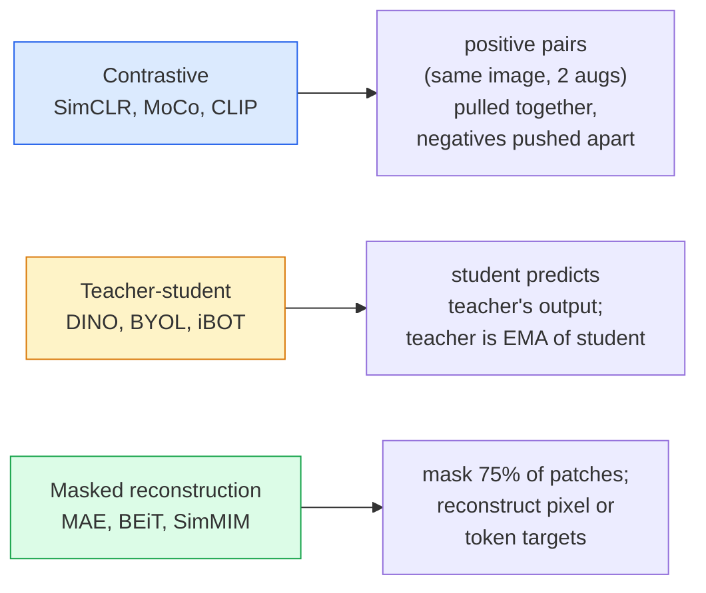

# Self-Supervised Vision — SimCLR, DINO, MAE

> Etykiety są wąskim gardłem nadzorowanego widzenia komputerowego. Pretrening self-supervised je eliminuje: ucz się cech wizualnych z 100M nieoznaczonych obrazów, dostrój na 10k oznaczonych.

**Typ:** Nauka + Budowanie
**Języki:** Python
**Wymagania wstępne:** Faza 4 Lekcja 04 (Klasyfikacja obrazów), Faza 4 Lekcja 14 (ViT)
**Szacowany czas:** ~75 minut

## Cele uczenia się

- Prześledź trzy główne rodziny self-supervised — contrastive (SimCLR), teacher-student (DINO), masked reconstruction (MAE) — i podaj, co każda z nich optymalizuje
- Zaimplementuj InfoNCE loss od zera i wyjaśnij, dlaczego batch size 512 działa, a 32 nie
- Wyjaśnij, dlaczego 75% mask ratio MAE nie jest arbitralne i czym różni się od 15% BERTa dla tekstu
- Użyj punktów kontrolnych DINOv2 lub MAE ImageNet do linear probing i zero-shot retrieval

## Problem

Nadzorowany ImageNet ma 1,3M oznaczonych obrazów, których annotacja kosztuje szacunkowo $10M. Zbiory medyczne i przemysłowe są mniejsze, a ich oznaczanie jeszcze droższe. Każdy zespół zajmujący się widzeniem zadaje sobie pytanie: czy możemy pretrained na tanich nieoznaczonych danych — klatkach YouTube, zrzutach z internetu, obrazach z kamer, skanach satelitarnych — a następnie dostroić na małym zbiorze oznaczonym?

Self-supervised learning jest odpowiedzią. Współczesny self-supervised ViT trenowany na LAION lub JFT osiąga lub przewyższa nadzorowaną dokładność ImageNet po dostrojeniu. Przenosi się też lepiej do downstream tasks (detekcja, segmentacja, głębia) niż nadzorowany pretrening. DINOv2 (Meta, 2023) i MAE (Meta, 2022) to obecne produkcyjne standardy dla transferowalnych cech wizualnych.

Konceptualna zmiana polega na tym, że pretext task — to, do czego model jest trenowany — nie musi być downstream task. Liczy się to, że zmusza model do nauczenia się użytecznych cech. Przewiduj kolor obrazów w skali szarości, obracaj obrazy i pytaj model o klasyfikację rotacji, maskuj patche i rekonstruuj je — wszystkie te podejścia zadziałały. Trzy podejścia, które się skalują, to contrastive learning, teacher-student distillation i masked reconstruction.

## Koncepcja

### Trzy rodziny



### Contrastive learning (SimCLR)

Weź jeden obraz, zastosuj dwie losowe augmentacje, otrzymaj dwa widoki. Przepuść oba przez ten sam encoder plus projection head. Zminimalizuj loss, który mówi „te dwa embeddingi powinny być blisko" i „ten embedding powinien być daleko od każdego innego embeddingu obrazu w batchu."

```
Loss for positive pair (z_i, z_j) among 2N views per batch:

   L_ij = -log( exp(sim(z_i, z_j) / tau) / sum_k in batch \ {i} exp(sim(z_i, z_k) / tau) )

sim = cosine similarity
tau = temperature (0.1 standard)
```

To jest InfoNCE loss. Wymaga wielu negatives per positive, więc batch size ma znaczenie — SimCLR potrzebuje 512-8192. MoCo wprowadził momentum queue z przeszłych batchy, aby odłączyć liczbę negatives od batch size.

### Teacher-student (DINO)

Dwie sieci o tej samej architekturze: student i teacher. Teacher jest exponential moving average (EMA) wag studenta. Oba widzą augmentowane widoki obrazu. Wyjście studenta jest trenowane, aby dopasować wyjście teachera — bez jawnych negatives.

```
loss = CE( student_output(view_1),  teacher_output(view_2) )
     + CE( student_output(view_2),  teacher_output(view_1) )

teacher_weights = m * teacher_weights + (1 - m) * student_weights   (m ≈ 0.996)
```

Dlaczego nie zapada się w „przewidywanie stałej": wyjście teachera jest centrowane (odejmij średnią per wymiar) i ostre (podziel przez małą temperature). Centering zapobiega dominacji jednego wymiaru, a sharpening zapobiega kolapsowi wyjścia do uniform.

DINO to to, co DINOv2 skaluje, na 142M wyselekcjonowanych obrazach. Wynikowe cechy to obecny SOTA dla zero-shot visual retrieval i dense prediction.

### Masked reconstruction (MAE)

Zamaskuj 75% patchy wejścia ViT. Przepuść tylko widoczne 25% przez encoder. Mały decoder otrzymuje wyjście encodera plus mask tokens na zamaskowanych pozycjach i jest trenowany do rekonstrukcji pikseli zamaskowanych patchy.

```
Encoder:  visible 25% of patches -> features
Decoder:  features + mask tokens at masked positions -> reconstructed pixels
Loss:     MSE between reconstructed and original pixels on masked patches only
```

Kluczowe wybory projektowe, które czynią MAE skutecznym:

- **75% mask ratio** — wysokie. Zmusza encoder do nauki semantycznych cech; rekonstrukcja 25% byłaby prawie trywialna (sąsiadujące piksele są tak skorelowane, że CNN by to załatwił).
- **Asymetryczny encoder/decoder** — duży ViT encoder widzi tylko widoczne patche; mały decoder (8-layer, 512-dim) zajmuje się rekonstrukcją. 3x szybszy pretrening niż naiwny BEiT.
- **Pixel-space reconstruction target** — prostsze niż tokenizowany target BEiT i działa lepiej na ViT.

Po pretreningu odrzuć decoder. Encoder jest feature extractorem.

### Dlaczego 75%, a nie 15%

BERT maskuje 15% tokenów. MAE maskuje 75%. Różnica to gęstość informacji.

- Język naturalny ma wysoką entropię per token. Przewidywanie 15% tokenów jest nadal trudne, bo każda zamaskowana pozycja ma wiele prawdopodobnych uzupełnień.
- Patche obrazu mają niską entropię — niezamaskowane sąsiedztwo często determinuje piksele zamaskowanego patcha niemal dokładnie. Aby predykcja wymagała semantycznego zrozumienia, trzeba maskować agresywnie.

75% jest wystarczająco wysokie, że prosta ekstrapolacja przestrzenna nie może rozwiązać zadania; encoder musi reprezentować zawartość obrazu.

### Linear-probe evaluation

Po self-supervised pretreningu standardowa ewaluacja to **linear probe**: zamroź encoder, wytrenuj pojedynczy liniowy klasyfikator na wierzchu na etykietach ImageNet. Raportuje top-1 accuracy.

- SimCLR ResNet-50: ~71% (2020)
- DINO ViT-S/16: ~77% (2021)
- MAE ViT-L/16: ~76% (2022)
- DINOv2 ViT-g/14: ~86% (2023)

Linear probe jest czystą miarą jakości cech; fine-tuning typowo dodaje 2-5 punktów, ale też miesza efekt retreningu głowy.

## Zbuduj to

### Krok 1: Two-view augmentation pipeline

```python
import torch
import torchvision.transforms as T

two_view_train = lambda: T.Compose([
    T.RandomResizedCrop(96, scale=(0.2, 1.0)),
    T.RandomHorizontalFlip(),
    T.ColorJitter(0.4, 0.4, 0.4, 0.1),
    T.RandomGrayscale(p=0.2),
    T.ToTensor(),
])


class TwoViewDataset(torch.utils.data.Dataset):
    def __init__(self, base):
        self.base = base
        self.aug = two_view_train()

    def __len__(self):
        return len(self.base)

    def __getitem__(self, i):
        img, _ = self.base[i]
        v1 = self.aug(img)
        v2 = self.aug(img)
        return v1, v2
```

Każdy __getitem__ zwraca dwa augmentowane widoki tego samego obrazu; etykiety nie są potrzebne.

### Krok 2: InfoNCE loss

```python
import torch.nn.functional as F

def info_nce(z1, z2, tau=0.1):
    """
    z1, z2: (N, D) L2-normalised embeddings of paired views
    """
    N, D = z1.shape
    z = torch.cat([z1, z2], dim=0)  # (2N, D)
    sim = z @ z.T / tau              # (2N, 2N)

    mask = torch.eye(2 * N, dtype=torch.bool, device=z.device)
    sim = sim.masked_fill(mask, float("-inf"))

    targets = torch.cat([torch.arange(N, 2 * N), torch.arange(0, N)]).to(z.device)
    return F.cross_entropy(sim, targets)
```

L2-normalizuj embeddingi przed wywołaniem. `tau=0.1` to SimCLR default; niższa wartość czyni loss ostrzejszym i wymaga więcej negatives.

### Krok 3: Sanity check InfoNCE

```python
z1 = F.normalize(torch.randn(16, 32), dim=-1)
z2 = z1.clone()
loss_same = info_nce(z1, z2, tau=0.1).item()
z2_random = F.normalize(torch.randn(16, 32), dim=-1)
loss_random = info_nce(z1, z2_random, tau=0.1).item()
print(f"InfoNCE with identical pairs:  {loss_same:.3f}")
print(f"InfoNCE with random pairs:     {loss_random:.3f}")
```

Identyczne pary powinny dać niski loss (bliski 0 dla dużego batcha i niskiej temperatury). Losowe pary powinny dać log(2N-1) = ~log(31) = ~3.4 z batchem 16 par.

### Krok 4: MAE-style masking

```python
def random_mask_indices(num_patches, mask_ratio=0.75, seed=0):
    g = torch.Generator().manual_seed(seed)
    n_keep = int(num_patches * (1 - mask_ratio))
    perm = torch.randperm(num_patches, generator=g)
    visible = perm[:n_keep]
    masked = perm[n_keep:]
    return visible.sort().values, masked.sort().values


num_patches = 196
visible, masked = random_mask_indices(num_patches, mask_ratio=0.75)
print(f"visible: {len(visible)} / {num_patches}")
print(f"masked:  {len(masked)} / {num_patches}")
```

Proste, szybkie i deterministyczne dla danego seed. Prawdziwe implementacje MAE przetwarzają to batchowo i trzymają per-sample masks.

## Użyj tego

DINOv2 to produkcyjny standard w 2026:

```python
import torch
from transformers import AutoImageProcessor, AutoModel

processor = AutoImageProcessor.from_pretrained("facebook/dinov2-base")
model = AutoModel.from_pretrained("facebook/dinov2-base")
model.eval()

# Per-image embeddings for zero-shot retrieval
with torch.no_grad():
    inputs = processor(images=[pil_image], return_tensors="pt")
    outputs = model(**inputs)
    embedding = outputs.last_hidden_state[:, 0]  # CLS token
```

Wynikowy 768-wymiarowy embedding jest backbone'em nowoczesnego image retrieval, dense correspondence i zero-shot transfer pipelines. Fine-tuning na downstream task rzadko potrzebuje więcej niż liniowa głowa.

Dla image-text embeddings, SigLIP lub OpenCLIP to odpowiednik; dla MAE-style fine-tuning, repo `timm` zawiera wszystkie checkpointy MAE.

## Wyślij to

Ta lekcja tworzy:

- `outputs/prompt-ssl-pretraining-picker.md` — prompt, który wybiera SimCLR / MAE / DINOv2 na podstawie rozmiaru datasetu, compute i downstream task.
- `outputs/skill-linear-probe-runner.md` — skill, który pisze linear-probe evaluation dla dowolnego zamrożonego encodera + oznaczonego datasetu.

## Ćwiczenia

1. **(Łatwe)** Zweryfikuj, że InfoNCE loss spada, gdy zmniejszasz temperature dla dobrze wyrównanych embeddingów i rośnie, gdy zmniejszasz temperature dla losowych embeddingów. Wyprodukuj wykres `tau in [0.05, 0.1, 0.2, 0.5]` vs loss.
2. **(Średnie)** Zaimplementuj DINO-style centre buffer. Pokaż, że bez centrowania student zapada się do stałego wektora w ciągu kilku epok.
3. **(Trudne)** Wytrenuj MAE na CIFAR-100 używając TinyUNet z Lekcji 10 jako backbone. Zgłoś linear-probe accuracy przy 10, 50 i 200 epokach. Pokaż, że MAE-pretrained linear probe bije supervised linear probe from scratch na tym samym podzbiorze 1,000 obrazów.

## Kluczowe terminy

| Termin | Co ludzie mówią | Co to faktycznie oznacza |
|--------|----------------|--------------------------|
| Self-supervised | „Bez etykiet" | Pretext task, który produkuje użyteczne reprezentacje z nieoznaczonych danych |
| Pretext task | „Fikcyjne zadanie" | Cel używany podczas SSL (rekonstruuj patche, dopasuj widoki); odrzucany po pretreningu |
| Linear probe | „Zamrożony encoder + liniowa głowa" | Standardowa ewaluacja SSL: trenuj tylko liniowy klasyfikator na wierzchu zamrożonych cech |
| InfoNCE | „Contrastive loss" | Softmax na cosine similarities; positive pair to klasa docelowa, wszystkie inne to negatives |
| EMA teacher | „Moving-average teacher" | Teacher, którego wagi to EMA wag studenta; używany przez BYOL, MoCo, DINO |
| Mask ratio | „% zamaskowanych patchy" | Frakcja zamaskowanych patchy podczas MAE; 75% dla wizji, 15% dla tekstu |
| Representation collapse | „Stałe wyjście" | SSL failure, gdzie encoder wyprowadza stały wektor dla wszystkich wejść; zapobiegane przez centring, sharpening lub negatives |
| DINOv2 | „Produkcyjny SSL backbone" | Meta's 2023 self-supervised ViT; najsilniejsze ogólnego przeznaczenia cechy obrazowe w 2026 |

## Dalsza lektura

- [SimCLR (Chen et al., 2020)](https://arxiv.org/abs/2002.05709) — contrastive learning reference
- [DINO (Caron et al., 2021)](https://arxiv.org/abs/2104.14294) — teacher-student with momentum, centring, sharpening
- [MAE (He et al., 2022)](https://arxiv.org/abs/2111.06377) — masked autoencoder pretraining for ViT
- [DINOv2 (Oquab et al., 2023)](https://arxiv.org/abs/2304.07193) — scaling self-supervised ViT to production features