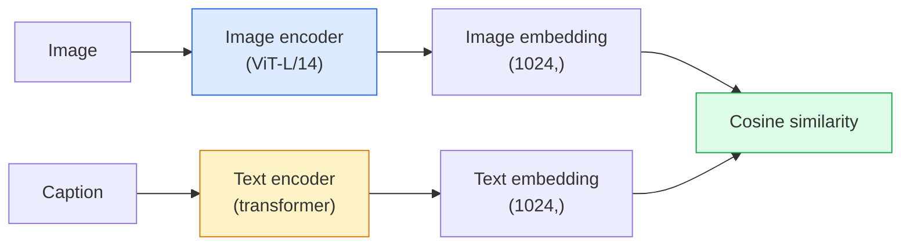

# Open-Vocabulary Vision — CLIP

> Trenuj image encoder i text encoder razem, tak aby pasujące do siebie pary (obraz, podpis) trafiały w to samo miejsce w współdzielonej przestrzeni. To cała sztuczka.

**Typ:** Build + Use
**Języki:** Python
**Wymagania wstępne:** Lesson 14 z Phase 4 (ViT), Lesson 17 z Phase 4 (Self-Supervised)
**Szacowany czas:** ~45 minut

## Cele uczenia się

- Wyjaśnij architekturę two-tower CLIP i kontrastywne cele trenowania
- Używaj pretrained CLIP (lub SigLIP) do zero-shot classification bez żadnego task-specific treningu
- Implementuj zero-shot classification od zera: encode class prompts, oblicz cosine similarity, weź argmax
- Rozróżnij CLIP, SigLIP, OpenCLIP i modele LLaVA/LLaMA-vision — do czego każdy służy w 2026

## Problem

Tradycyjne klasyfikatory mają closed vocabulary: model ImageNet z 1000 klas może przewidywać tylko 1000 etykiet. Każda nowa kategoria wymaga oznaczonych danych i przetrenowanej głowy.

CLIP (Radford et al., OpenAI 2021) pokazał, że trenowanie na 400M par (obraz, podpis) zebranych z internetu daje model, który może klasyfikować do dowolnego zbioru kategorii podczas inferencji, opisanych wyłącznie w języku naturalnym. Nową klasę podajesz mu przez napisanie zdania.

Ta zdolność — zero-shot transfer — sprawia, że każdy nowoczesny system wizyjny zaczyna od checkpointu z rodziny CLIP. Detekcja (Grounding DINO, OWL-ViT), segmentacja (CLIPSeg, SAM), retrieval, moderacja treści, VLM-y i generowanie obrazów z tekstu wszystko buduje na CLIP-style joint embeddings.

## Koncepcja

### Dwie wieże



Oba encodery kończą się liniową projekcją do tego samego wymiaru embeddingu (512 dla CLIP-B/32, 1024 dla CLIP-L/14). L2-normalizuj i oblicz cosine similarity.

### Cel

Mając batch N par (obraz, podpis), buduj macierz podobieństwa NxN. Trenuj oba encodery tak, aby diagonal (pasujące pary) miała wysokie podobieństwo, a off-diagonals (niepasujące) niskie podobieństwo.

```
sim_matrix = image_embeddings @ text_embeddings.T / tau

loss_i2t = cross_entropy(sim_matrix,       targets=arange(N))
loss_t2i = cross_entropy(sim_matrix.T,     targets=arange(N))
loss = (loss_i2t + loss_t2i) / 2
```

Symetryczne, bo zarówno image-to-text jak i text-to-image retrieval powinny działać. `tau` (temperature) jest typowo uczone jako skalarny parametr, zainicjalizowany na 0.07.

### SigLIP: lepszy loss

SigLIP (Zhai et al., 2023) zastąpił softmax per-pair sigmoidą:

```
loss = mean over pairs of log(1 + exp(-y_ij * sim_ij))
y_ij = +1 if matching, -1 otherwise
```

Per-pair loss usuwa batch-level normalizację, której CLIP wymaga. SigLIP trenuje lepiej przy małych batch sizes i dorównuje lub przewyższa CLIP przy równej ilości danych.

### Zero-shot classification

Mając wytrenowany CLIP:

1. Dla każdej klasy, skomponuj prompt: "a photo of a {class}".
2. Encodeuj wszystkie class prompts z text encoderem -> `T` shape (C, d).
3. Encodeuj test image -> `I` shape (1, d).
4. Similarity = `I @ T.T` shape (1, C).
5. Argmax -> predicted class.

Prompt engineering ma znaczenie. OpenAI opublikował 80 szablonów promptów dla ImageNet ("a photo of a {}", "a blurry photo of a {}", "a sketch of a {}", ...). Uśrednij embeddings wszystkich szablonów per klasa dla dodatkowego 1-3% top-1 accuracy.

### Gdzie CLIP-style models są używane w 2026

- **Zero-shot classification** — bezpośrednie użycie.
- **Image retrieval** — encodeuj wszystkie obrazy raz, embed query podczas inferencji.
- **Text-conditioned detection** — Grounding DINO, OWL-ViT owijają CLIP text tower wokół detektora.
- **Text-conditioned segmentation** — CLIPSeg; SAM używa text-prompt inputs przez CLIP.
- **VLM-y** — LLaVA, Qwen-VL, InternVL łączą CLIP-family vision encoder z LLM.
- **Text-to-image gen** — Stable Diffusion, DALL-E 3 warunkują na CLIP text embeddings.

Gdy raz masz współdzieloną przestrzeń embeddingów, każde vision+language task staje się obliczeniem odległości.

## Zbuduj to

### Krok 1: Mały model two-tower

Prawdziwy CLIP to ViT + transformer. Dla tej lekcji wieże to małe MLP-e na pre-extracted features, żeby training signal był widoczny na CPU.

```python
import torch
import torch.nn as nn
import torch.nn.functional as F


class TwoTower(nn.Module):
    def __init__(self, img_in=128, txt_in=64, emb=64):
        super().__init__()
        self.image_proj = nn.Sequential(nn.Linear(img_in, 128), nn.ReLU(), nn.Linear(128, emb))
        self.text_proj = nn.Sequential(nn.Linear(txt_in, 128), nn.ReLU(), nn.Linear(128, emb))
        self.logit_scale = nn.Parameter(torch.ones([]) * 2.6592)  # ln(1/0.07)

    def forward(self, img_feats, txt_feats):
        i = F.normalize(self.image_proj(img_feats), dim=-1)
        t = F.normalize(self.text_proj(txt_feats), dim=-1)
        return i, t, self.logit_scale.exp()
```

Dwie projekcje, shared-dim output, learned temperature. Ten sam kształt co prawdziwe CLIP API.

### Krok 2: Contrastive loss

```python
def clip_loss(image_emb, text_emb, logit_scale):
    N = image_emb.size(0)
    sim = logit_scale * image_emb @ text_emb.T
    targets = torch.arange(N, device=sim.device)
    l_i = F.cross_entropy(sim, targets)
    l_t = F.cross_entropy(sim.T, targets)
    return (l_i + l_t) / 2
```

Symetryczny. Wyższy logit_scale = ostrzejszy softmax = bardziej pewny, ale ryzyko niestabilności.

### Krok 3: Zero-shot classifier

```python
@torch.no_grad()
def zero_shot_classify(model, image_feats, class_text_feats, class_names):
    """
    image_feats:      (N, img_in)
    class_text_feats: (C, txt_in)   one averaged embedding per class
    """
    i = F.normalize(model.image_proj(image_feats), dim=-1)
    t = F.normalize(model.text_proj(class_text_feats), dim=-1)
    sim = i @ t.T
    pred = sim.argmax(dim=-1)
    return [class_names[p] for p in pred.tolist()]
```

Jedna linia na krok. To dokładnie procedura zero-shot używana z produkcyjnym CLIP checkpointem.

### Krok 4: Sanity check

```python
torch.manual_seed(0)
model = TwoTower()

img = torch.randn(8, 128)
txt = torch.randn(8, 64)
i, t, scale = model(img, txt)
loss = clip_loss(i, t, scale)
print(f"batch size: {i.size(0)}   loss: {loss.item():.3f}")
```

Loss powinien być bliski `log(N) = log(8) = 2.08` dla losowo zainicjalizowanego modelu — symmetric cross-entropy target, gdy żadna struktura jeszcze nie jest nauczona.

## Użyj to

OpenCLIP to community default w 2026:

```python
import open_clip
import torch
from PIL import Image

model, _, preprocess = open_clip.create_model_and_transforms("ViT-B-32", pretrained="laion2b_s34b_b79k")
tokenizer = open_clip.get_tokenizer("ViT-B-32")

image = preprocess(Image.open("dog.jpg")).unsqueeze(0)
text = tokenizer(["a photo of a dog", "a photo of a cat", "a photo of a car"])

with torch.no_grad():
    image_features = model.encode_image(image)
    text_features = model.encode_text(text)
    image_features = image_features / image_features.norm(dim=-1, keepdim=True)
    text_features = text_features / text_features.norm(dim=-1, keepdim=True)
    probs = (100.0 * image_features @ text_features.T).softmax(dim=-1)

print(probs)
```

SigLIP jest nowszy, trenuje lepiej na małych skalach i jest preferowany do nowych prac: `google/siglip-base-patch16-224`. Hugging Face dostarcza oba.

## Wyślij to

Ta lekcja produkuje:

- `outputs/prompt-zero-shot-class-picker.md` — prompt, który projektuje class templates dla zero-shot CLIP przy danej liście klas i domenie.
- `outputs/skill-image-text-retriever.md` — skill, który buduje image embedding index z dowolnym CLIP checkpointem, wspiera query-by-text i query-by-image.

## Ćwiczenia

1. **(Łatwe)** Użyj pretrained OpenCLIP ViT-B/32 i zrób zero-shot classification na CIFAR-10 z 80-template prompt set. Raportuj top-1 accuracy; powinno być około 85-90%.
2. **(Średnie)** Porównaj single-template ("a photo of a {}") vs 80-template averaged embeddings na tym samym CIFAR-10 tasku. Zquantyfikuj lukę i wytłumacz, dlaczego templates pomagają.
3. **(Trudne)** Zbuduj zero-shot image retrieval index: embeduj 1000 obrazów z CLIP, zbuduj FAISS index, query z natural language description. Raportuj retrieval recall@5 dla 20 held-out queries, które napiszesz ręcznie.

## Kluczowe terminy

| Termin | Co ludzie mówią | Co to faktycznie oznacza |
|--------|----------------|----------------------|
| Two-tower | "Dual encoder" | Separate image i text encodery kończące się shared-dim projection head |
| Zero-shot | "No task-specific training" | Klasyfikuj do klas opisanych tylko tekstem podczas inferencji; żadne labele nie dotknięte |
| Temperature / logit_scale | "tau" | Nauczony skalarny parametr skalujący similarity matrix przed softmax |
| Prompt template | "A photo of a {}" | Natural-language wrapper wokół class names; uśrednianie wielu templates boostuje zero-shot accuracy |
| CLIP | "Image+text model" | Model OpenAI z 2021; słownik branży w 2026 |
| SigLIP | "Sigmoid CLIP" | Zamienia softmax na per-pair sigmoid; trenuje lepiej przy małych batchach |
| OpenCLIP | "Open reproduction" | Community-trained CLIP variants na LAION; production default dla open-source pipeline'ów |
| VLM | "Vision-language model" | CLIP-family encoder plus LLM, trenowane do odpowiadania na pytania o obrazy |

## Dalsze czytanie

- CLIP: Learning Transferable Visual Models from Natural Language Supervision (Radford et al., 2021)
- SigLIP: Sigmoid Loss for Language-Image Pre-Training (Zhai et al., 2023)
- OpenCLIP — community codebase
- DINOv2 vs CLIP vs MAE: a features comparison — HF guide z side-by-side use cases