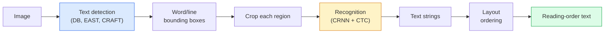

# OCR i rozumienie dokumentów

> OCR to trzyetapowy pipeline — wykrywanie pól tekstowych, rozpoznawanie znaków, a następnie układanie ich w kolejności. Każdy nowoczesny system OCR zmienia kolejność tych etapów lub łączy je.

**Typ:** Nauka + Zastosowanie
**Języki:** Python
**Wymagania wstępne:** Faza 4 Lekcja 06 (Detection), Faza 7 Lekcja 02 (Self-Attention)
**Szacowany czas:** ~45 minut

## Cele uczenia się

- Prześledzić klasyczny pipeline OCR (detect → recognise → layout) oraz nowoczesne alternatywy end-to-end (Donut, Qwen-VL-OCR)
- Zaimplementować funkcję straty CTC (Connectionist Temporal Classification) do trenowania OCR typu sequence-to-sequence
- Użyć PaddleOCR lub EasyOCR do produkcyjnego parsowania dokumentów bez trenowania
- Rozróżnić OCR, parsowanie układu i rozumienie dokumentów — oraz wybrać odpowiednie narzędzie do każdego zadania

## Problem

Obrazy pełne tekstu są wszędzie: paragony, faktury, dowody tożsamości, zdigitalizowane książki, formularze, tablice, znaki, zrzuty ekranu. Ekstrakcja ustrukturyzowanych danych z nich — nie tylko znaków, ale "to jest kwota całkowita" — to jeden z najwyżej wartych problemów applied vision.

Dziedzina ta dzieli się na trzy warstwy umiejętności:

1. **OCR właściwe**: zamiana pikseli na tekst.
2. **Parsowanie układu**: grupowanie wyników OCR w regiony (tytuł, treść, tabela, nagłówek).
3. **Rozumienie dokumentów**: ekstrakcja ustrukturyzowanych pól ("invoice_total = $42.50") z układu.

Każda warstwa ma klasyczne i nowoczesne podejścia, a luka między "chcę tekst z obrazu" a "potrzebuję kwoty z tego paragonu" jest większa, niż większość zespołów sobie uświadamia.

## Koncepcja

### Klasyczny pipeline



- **Wykrywanie tekstu** produkuje czworokąty dla każdej linii lub słowa.
- **Rozpoznawanie** przycina każdy region do ustalonej wysokości, uruchamia CNN + BiLSTM + CTC, aby wyprodukować sekwencję znaków.
- **Układ** odbudowuje kolejność czytania (z góry na dół, z lewej na prawo dla alfabetu łacińskiego; inaczej dla arabskiego, japońskiego).

### CTC w jednym akapicie

Rozpoznawanie OCR produkuje sekwencję o zmiennej długości z feature mapy o stałej długości. CTC (Graves et al., 2006) pozwala trenować to bez wyrównania na poziomie znaków. Model wyprowadza rozkład nad (vocab + blank) w każdym kroku czasowym; strata CTC marginalizuje po wszystkich wyrównaniach, które redukują się do tekstu docelowego po scaleniu powtórzeń i usunięciu spacji.

```
raw output: "h h h _ _ e e l l _ l l o _ _"
after merge repeats and remove blanks: "hello"
```

CTC to powód, dla którego CRNN zadziałał w 2015 roku i nadal trenuje większość produkcyjnych modeli OCR w 2026.

### Nowoczesne modele end-to-end

- **Donut** (Kim et al., 2022) — koder ViT + dekoder tekstowy; czyta obraz i emituje JSON bezpośrednio. Bez detektora tekstu, bez modułu układu.
- **TrOCR** — ViT + transformer decoder dla OCR na poziomie linii.
- **Qwen-VL-OCR / InternVL** — pełne modele vision-language dostrojone do zadań OCR; najwyższa dokładność w 2026 na złożonych dokumentach.
- **PaddleOCR** — klasyczny pipeline DB + CRNN w dojrzałym pakiecie produkcyjnym; nadal otwarto-źródłowy workhorse.

Modele end-to-end potrzebują więcej danych i mocy obliczeniowej, ale pomijają akumulację błędów wielostopniowych pipeline'ów.

### Parsowanie układu

Dla ustrukturyzowanych dokumentów uruchom detektor układu (LayoutLMv3, DocLayNet), który etykietuje każdy region: Title, Paragraph, Figure, Table, Footnote. Kolejność czytania staje się wtedy "iteruj przez regiony w kolejności układu, konkatenuj."

Dla formularzy użyj modeli **Key-Value extraction** (Donut dla dokumentów wizualnie bogatych, LayoutLMv3 dla zwykłych skanów). Przyjmują obraz + wykryty tekst + pozycje i przewidują ustrukturyzowane pary klucz-wartość.

### Metryki ewaluacyjne

- **Character Error Rate (CER)** — odległość Levenshteina / długość referencji. Niższy jest lepszy. Cel produkcyjny: < 2% na czystych skanach.
- **Word Error Rate (WER)** — to samo na poziomie słów.
- **F1 na ustrukturyzowanych polach** — dla zadań key-value; mierzy czy `{invoice_total: 42.50}` pojawia się poprawnie.
- **Edit distance na JSON** — dla end-to-end parsowania dokumentów; artykuł o Donut wprowadził znormalizowaną odległość edycyjną drzewa.

## Zbuduj to

### Krok 1: Funkcja straty CTC + greedy decoder

```python
import torch
import torch.nn as nn
import torch.nn.functional as F


def ctc_loss(log_probs, targets, input_lengths, target_lengths, blank=0):
    """
    log_probs:      (T, N, C) log-softmax over vocab including blank at index 0
    targets:        (N, S) int targets (no blanks)
    input_lengths:  (N,) per-sample time steps used
    target_lengths: (N,) per-sample target length
    """
    return F.ctc_loss(log_probs, targets, input_lengths, target_lengths,
                      blank=blank, reduction="mean", zero_infinity=True)


def greedy_ctc_decode(log_probs, blank=0):
    """
    log_probs: (T, N, C) log-softmax
    returns: list of index sequences (blanks removed, repeats merged)
    """
    preds = log_probs.argmax(dim=-1).transpose(0, 1).cpu().tolist()
    out = []
    for seq in preds:
        decoded = []
        prev = None
        for idx in seq:
            if idx != prev and idx != blank:
                decoded.append(idx)
            prev = idx
        out.append(decoded)
    return out
```

`F.ctc_loss` używa efektywnej implementacji CuDNN, gdy jest dostępna. Greedy decoder jest prostszy niż beam search i zwykle osiąga wynik w granicach 1% CER.

### Krok 2: Mini CRNN recogniser

Minimal CNN + BiLSTM dla OCR linii.

```python
class TinyCRNN(nn.Module):
    def __init__(self, vocab_size=40, hidden=128, feat=32):
        super().__init__()
        self.cnn = nn.Sequential(
            nn.Conv2d(1, feat, 3, 1, 1), nn.BatchNorm2d(feat), nn.ReLU(inplace=True),
            nn.MaxPool2d(2),
            nn.Conv2d(feat, feat * 2, 3, 1, 1), nn.BatchNorm2d(feat * 2), nn.ReLU(inplace=True),
            nn.MaxPool2d(2),
            nn.Conv2d(feat * 2, feat * 4, 3, 1, 1), nn.BatchNorm2d(feat * 4), nn.ReLU(inplace=True),
            nn.MaxPool2d((2, 1)),
            nn.Conv2d(feat * 4, feat * 4, 3, 1, 1), nn.BatchNorm2d(feat * 4), nn.ReLU(inplace=True),
            nn.MaxPool2d((2, 1)),
        )
        self.rnn = nn.LSTM(feat * 4, hidden, bidirectional=True, batch_first=True)
        self.head = nn.Linear(hidden * 2, vocab_size)

    def forward(self, x):
        # x: (N, 1, H, W)
        f = self.cnn(x)                # (N, C, H', W')
        f = f.mean(dim=2).transpose(1, 2)  # (N, W', C)
        h, _ = self.rnn(f)
        return F.log_softmax(self.head(h).transpose(0, 1), dim=-1)  # (W', N, vocab)
```

Wejście o stałej wysokości (CNN max-puluje wysokość do 1). Szerokość to wymiar czasowy dla CTC.

### Krok 3: Syntetyczny OCR

Generuj czarny-na-białym ciągi cyfr dla end-to-end smoke testu.

```python
import numpy as np

def synthetic_line(text, height=32, char_width=16):
    W = char_width * len(text)
    img = np.ones((height, W), dtype=np.float32)
    for i, c in enumerate(text):
        x = i * char_width
        shade = 0.0 if c.isalnum() else 0.5
        img[6:height - 6, x + 2:x + char_width - 2] = shade
    return img


def build_batch(strings, vocab):
    H = 32
    W = 16 * max(len(s) for s in strings)
    imgs = np.ones((len(strings), 1, H, W), dtype=np.float32)
    target_lengths = []
    targets = []
    for i, s in enumerate(strings):
        imgs[i, 0, :, :16 * len(s)] = synthetic_line(s)
        ids = [vocab.index(c) for c in s]
        targets.extend(ids)
        target_lengths.append(len(ids))
    return torch.from_numpy(imgs), torch.tensor(targets), torch.tensor(target_lengths)


vocab = ["_"] + list("0123456789abcdefghijklmnopqrstuvwxyz")
imgs, targets, lengths = build_batch(["hello", "world"], vocab)
print(f"images: {imgs.shape}   targets: {targets.shape}   lengths: {lengths.tolist()}")
```

Prawdziwy zbiór danych OCR dodaje czcionki, szum, rotację, blur i kolor. Pipeline powyżej jest identyczny.

### Krok 4: Szkic trenowania

```python
model = TinyCRNN(vocab_size=len(vocab))
opt = torch.optim.Adam(model.parameters(), lr=1e-3)

for step in range(200):
    strings = ["abc" + str(step % 10)] * 4 + ["xyz" + str((step + 1) % 10)] * 4
    imgs, targets, target_lens = build_batch(strings, vocab)
    log_probs = model(imgs)  # (W', 8, vocab)
    input_lens = torch.full((8,), log_probs.size(0), dtype=torch.long)
    loss = ctc_loss(log_probs, targets, input_lens, target_lens, blank=0)
    opt.zero_grad(); loss.backward(); opt.step()
```

Strata powinna spaść z ~3 do ~0.2 w ciągu 200 kroków na tym trywialnym syntetycznym zbiorze danych.

## Użyj tego

Trzy produkcyjne ścieżki:

- **PaddleOCR** — dojrzały, szybki, wielojęzyczny. Użycie jedną linią: `paddleocr.PaddleOCR(lang="en").ocr(image_path)`.
- **EasyOCR** — natywny dla Pythona, wielojęzyczny, backbone PyTorch.
- **Tesseract** — klasyczny; nadal przydatny dla starych zdigitalizowanych dokumentów, gdy modele sobie nie radzą.

Dla end-to-end parsowania dokumentów użyj Donut lub VLM:

```python
from transformers import DonutProcessor, VisionEncoderDecoderModel

processor = DonutProcessor.from_pretrained("naver-clova-ix/donut-base-finetuned-cord-v2")
model = VisionEncoderDecoderModel.from_pretrained("naver-clova-ix/donut-base-finetuned-cord-v2")
```

Dla paragonów, faktur i formularzy z powtarzalną strukturą, dostrój Donut. Dla dowolnych dokumentów lub OCR z rezonowaniem, VLM jak Qwen-VL-OCR to obecny domyślny wybór.

## Wyślij to

Ta lekcja produkuje:

- `outputs/prompt-ocr-stack-picker.md` — prompt, który wybiera Tesseract / PaddleOCR / Donut / VLM-OCR w zależności od typu dokumentu, języka i struktury.
- `outputs/skill-ctc-decoder.md` — skill, który pisze greedy i beam-search CTC decodery od zera, włącznie z normalizacją długości.

## Ćwiczenia

1. **(Łatwe)** Trenuj TinyCRNN na 5-cyfrowych losowych ciągach numerycznych przez 500 kroków. Zgłoś CER na held-out zbiorze.
2. **(Średnie)** Zamień greedy decoding na beam search (beam_width=5). Zgłoś delta CER. Na których danych wejściowych beam search wygrywa?
3. **(Trudne)** Użyj PaddleOCR na zbiorze 20 paragonów, wyekstrakcjuj pozycje linii i oblicz F1 względem ręcznie oznakowanej prawdy podstawowej dla par {item_name, price}.

## Kluczowe terminy

| Termin | Co ludzie mówią | Co to faktycznie oznacza |
|--------|----------------|--------------------------|
| OCR | "Tekst z pikseli" | Zamiana regionów obrazu na sekwencje znaków |
| CTC | "Loss bez wyrównania" | Funkcja straty, która trenuje model sekwencyjny bez etykiet na każdy krok czasowy; marginalizuje po wyrównaniach |
| CRNN | "Klasyczny model OCR" | Ekstraktor cech CNN + BiLSTM + CTC; baseline z 2015 roku wciąż używany w produkcji |
| Donut | "End-to-end OCR" | Koder ViT + dekoder tekstowy; emituje JSON bezpośrednio z obrazu |
| Layout parsing | "Znajdowanie regionów" | Wykrywanie i etykietowanie regionów Title/Table/Figure/Paragraph w dokumencie |
| Reading order | "Kolejność tekstu" | Porządkowanie rozpoznanych regionów w zdanie; trywialne dla łacińskiego, nietrywialne dla mieszanych układów |
| CER / WER | "Wskaźniki błędów" | Odległość Levenshteina / długość referencji na poziomie znaku lub słowa |
| VLM-OCR | "LLM który czyta" | Model vision-language trenowany lub promptowany do zadań OCR; obecny SOTA na złożonych dokumentach |