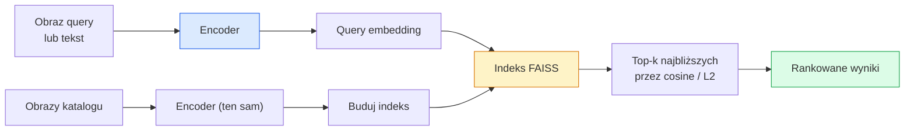

# Image Retrieval & Metric Learning

> System **retrievalowy** rankuje kandydatów na podstawie odległości w przestrzeni embeddingów. Metric learning to dyscyplina kształtowania tej przestrzeni tak, aby odległości odpowiadały temu, co chcesz osiągnąć.

**Typ:** Build
**Języki:** Python
**Wymagania wstępne:** Lesson 14 fazy 4 (ViT), Lesson 18 fazy 4 (CLIP)
**Szacowany czas:** ~45 minut

## Cele uczenia się

- Wyjaśnić triplet loss, contrastive loss i proxy-based metric learning losses i wybrać odpowiedni dla danego zbioru danych
- Zaimplementować L2-normalizację i cosine similarity poprawnie oraz sprawdzić różnicę między retrievalem "tego samego elementu" i "tej samej klasy"
- Zbudować indeks FAISS, odpytywać go tekstem i obrazem oraz raportować recall@K dla wydzielonego zbioru query
- Używać DINOv2, CLIP i SigLIP jako gotowych embedding backbonów i wiedzieć, kiedy każdy z nich wygrywa

## Problem

Retrieval jest wszędzie w produkcyjnej wizji: wykrywanie duplikatów, wyszukiwanie odwrotne obrazów, wyszukiwanie wizualne ("znajdź podobne produkty"), re-identyfikacja twarzy, person re-ID do nadzoru, dopasowywanie na poziomie instancji dla e-commerce. Produktowe pytanie jest zawsze to samo: "mając ten obraz query, rankuj mój katalog."

Dwa decyzje projektowe kształtują cały system. Embedding — jaki model produkuje wektory. Indeks — jak znajdować najbliższych sąsiadów na skalę. Oba są commodity w 2026 (DINOv2 dla embeddingu, FAISS dla indeksu), co podnosi poprzeczkę: trudną częścią jest zdefiniowanie *co oznacza podobne* dla twojej aplikacji, a następnie kształtowanie przestrzeni embeddingów tak, aby odległości się zgadzały.

To kształtowanie to metric learning. To mała, ale wysoko-lewarowalna dyscyplina.

## Koncept

### Retrieval w pigułce



### Cztery rodziny funkcji straty

| Funkcja straty | Wymaga | Zalety | Wady |
|------|----------|------|------|
| **Contrastive** | (anchor, positive) + negatives | Prosty, działa z dowolną etykietą pary | Wolno zbiega bez wielu negatives |
| **Triplet** | (anchor, positive, negative) | Intuicyjny; bezpośrednia kontrola marginesu | Hard-triplet mining jest drogi |
| **NT-Xent / InfoNCE** | Pary + batch-mined negatives | Skaluje się do dużych batchy | Wymaga dużego batcha lub momentum queue |
| **Proxy-based (ProxyNCA)** | Tylko etykiety klas | Szybki, stabilny, brak miningu | Może overfitować do proxy na małych zbiorach |

Dla większości produkcyjnych przypadków użycia zacznij od pretrained backbonu i dodaj tylko metric-learning fine-tune, jeśli off-the-shelf embeddingi underperformują na twoim test set.

### Triplet loss formalnie

```
L = max(0, ||f(a) - f(p)||^2 - ||f(a) - f(n)||^2 + margin)
```

Przyciągnij anchor `a` blisko positive `p`, odepchnij od negative `n`, z `margin` który zapewnia lukę. Struktura trzech obrazów uogólnia się na dowolne porządkowanie podobieństwa.

Mining ma znaczenie: easy triplets (`n` już daleko od `a`) dają zero strat; tylko hard triplets uczą sieć. Semi-hard mining (`n` dalej niż `p` ale w marginesie) to przepis FaceNet z 2016 i nadal dominuje.

### Cosine similarity vs L2

Dwie metryki, dwie konwencje:

- **Cosine**: kąt między wektorami. Wymaga L2-znormalizowanych embeddingów.
- **L2**: odległość euklidesowa. Działa na surowych lub znormalizowanych embeddingach, ale zwykle paruje się z L2-normalizacją + squared L2.

Dla większości nowoczesnych netów te dwa są równoważne: `||a - b||^2 = 2 - 2 cos(a, b)` gdy `||a|| = ||b|| = 1`. Wybierz konwencję pasującą do treningu embeddingów; mieszanie ich cicho zmienia to, co oznacza "najbliższy".

### Recall@K

Standardowa metryka retrieval:

```
recall@K = frakcja query gdzie przynajmniej jedno poprawne dopasowanie jest w top K wyników
```

Raportuj recall@1, @5, @10 obok siebie. Recall@10 powyżej 0.95 z recall@1 poniżej 0.5 oznacza, że przestrzeń embeddingów ma właściwą strukturę, **ale** ranking jest szumliwy — spróbuj dłuższych fine-tune'ów lub kroku re-rankingu.

Dla wykrywania duplikatów precision@K ma większe znaczenie**,** bo każdy false positive to błąd widoczny dla użytkownika. Dla wyszukiwania wizualnego recall@K to sygnał produktowy.

### FAISS w jednym akapicie

Facebook AI Similarity Search. De-facto biblioteka do wyszukiwania najbliższych sąsiadów. Trzy wybory indeksu:

- `IndexFlatIP` / `IndexFlatL2` — brute force, dokładny, bez treningu. Używaj do ~1M wektorów.
- `IndexIVFFlat` — partycjonuj na K komórek, przeszukuj tylko najbliższe kilka komórek. Przybliżony, szybki, wymaga danych treningowych.
- `IndexHNSW` — grafowy, najszybszy dla wielu query, duży rozmiar indeksu.

Dla 100k wektorów prawdopodobnie chcesz `IndexFlatIP` na cosine similarity. Dla 10M chcesz `IndexIVFFlat`. Dla 100M+ połącz z product quantization (`IndexIVFPQ`).

### Retrieval na poziomie instancji vs kategorii

Dwa bardzo różne problemy z tą samą nazwą:

- **Category-level** — "znajdź koty w moim katalogu." Podobieństwo warunkowe klasy; off-the-shelf CLIP / DINOv2 embeddingi działają dobrze.
- **Instance-level** — "znajdź *dokładnie ten produkt* w moim katalogu." Wymaga fine-grained dyskryminacji między wizualnie podobnymi obiektami tej samej klasy; off-the-shelf embeddingi underperformują; fine-tuning z metric learning ma znaczenie.

Zawsze zapytaj, który rozwiązujesz, zanim wybierzesz model.

## Zbuduj to

### Krok 1: Triplet loss

```python
import torch
import torch.nn.functional as F

def triplet_loss(anchor, positive, negative, margin=0.2):
    d_ap = F.pairwise_distance(anchor, positive, p=2)
    d_an = F.pairwise_distance(anchor, negative, p=2)
    return F.relu(d_ap - d_an + margin).mean()
```

Jedna linia. Działa na L2-znormalizowanych lub surowych embeddingach.

### Krok 2: Semi-hard mining

Mając batch embeddingów i etykiet, znajdź najtrudniejszy semi-hard negative dla każdego anchora.

```python
def semi_hard_negatives(emb, labels, margin=0.2):
    dist = torch.cdist(emb, emb)
    same_class = labels[:, None] == labels[None, :]
    diff_class = ~same_class
    N = emb.size(0)

    positives = dist.clone()
    positives[~same_class] = float("-inf")
    positives.fill_diagonal_(float("-inf"))
    pos_idx = positives.argmax(dim=1)

    semi_hard = dist.clone()
    semi_hard[same_class] = float("inf")
    d_ap = dist[torch.arange(N), pos_idx].unsqueeze(1)
    semi_hard[dist <= d_ap] = float("inf")
    neg_idx = semi_hard.argmin(dim=1)

    fallback_mask = semi_hard[torch.arange(N), neg_idx] == float("inf")
    if fallback_mask.any():
        hardest = dist.clone()
        hardest[same_class] = float("inf")
        neg_idx = torch.where(fallback_mask, hardest.argmin(dim=1), neg_idx)
    return pos_idx, neg_idx
```

Każdy anchor dostaje najtrudniejszy positive w-klasie i semi-hard negative który jest dalej niż positive, ale w marginesie.

### Krok 3: Recall@K

```python
def recall_at_k(query_emb, gallery_emb, query_labels, gallery_labels, k=1):
    sim = query_emb @ gallery_emb.T
    _, top_k = sim.topk(k, dim=-1)
    matches = (gallery_labels[top_k] == query_labels[:, None]).any(dim=-1)
    return matches.float().mean().item()
```

Top-k przez inner product na L2-znormalizowanych embeddingach równa się top-k przez cosine. Raportuj średnią proporcję query z przynajmniej jednym poprawnym sąsiadem.

### Krok 4: Łączenie wszystkiego

```python
import torch
import torch.nn as nn
from torch.optim import Adam

class Encoder(nn.Module):
    def __init__(self, in_dim=128, emb_dim=64):
        super().__init__()
        self.net = nn.Sequential(
            nn.Linear(in_dim, 128), nn.ReLU(),
            nn.Linear(128, emb_dim),
        )

    def forward(self, x):
        return F.normalize(self.net(x), dim=-1)

torch.manual_seed(0)
num_classes = 6
protos = F.normalize(torch.randn(num_classes, 128), dim=-1)

def sample_batch(bs=32):
    labels = torch.randint(0, num_classes, (bs,))
    x = protos[labels] + 0.15 * torch.randn(bs, 128)
    return x, labels

enc = Encoder()
opt = Adam(enc.parameters(), lr=3e-3)

for step in range(200):
    x, y = sample_batch(32)
    emb = enc(x)
    pos_idx, neg_idx = semi_hard_negatives(emb, y)
    loss = triplet_loss(emb, emb[pos_idx], emb[neg_idx])
    opt.zero_grad(); loss.backward(); opt.step()
```

Po kilkuset krokach klastry embeddingów tworzą się — jeden klaster na klasę.

## Użyj tego

Production stacki w 2026:

- **DINOv2 + FAISS** — ogólnego przeznaczenia visual retrieval. Działa out-of-the-box.
- **CLIP + FAISS** — gdy query są tekstem.
- **Fine-tuned DINOv2 + FAISS** — instance-level retrieval, face re-ID, fashion, e-commerce.
- **Milvus / Weaviate / Qdrant** — zarządzane vector DB wrappers wokół FAISS lub HNSW.

Dla SOTA instance retrieval przepis to: DINOv2 backbone, dodaj embedding head, fine-tune z triplet lub InfoNCE loss na instance-labelled pairs, index w FAISS.

## Wyślij to

Ta lekcja produkuje:

- `outputs/prompt-retrieval-loss-picker.md` — prompt który wybiera triplet / InfoNCE / ProxyNCA dla danego problemu retrieval.
- `outputs/skill-recall-at-k-runner.md` — skill który pisze czysty evaluation harness dla recall@K z train/val/gallery splits i proper data contract.

## Ćwiczenia

1. **(Łatwe)** Uruchom powyższy przykład. Wyplotuj embeddingi z PCA przed i po treningu, aby zobaczyć sześć klastrów.
2. **(Średnie)** Dodaj implementację ProxyNCA loss: jeden nauczony "proxy" na klasę, standard cross-entropy na cosine similarity. Porównaj szybkość zbieżności vs triplet loss na danych testowych.
3. **(Trudne)** Weź 1000 obrazów z ImageNet validation, embeduj z DINOv2 przez HuggingFace, zbuduj FAISS flat index i raportuj recall@{1, 5, 10} względem tych samych obrazów jako query (powinno być 1.0) i względem held-out split z ImageNet labels jako ground truth.

## Kluczowe pojęcia

| Termin | Co ludzie mówią | Co to faktycznie oznacza |
|------|----------------|----------------------|
| Metric learning | "Kształtuj przestrzeń" | Trenowanie encodera tak, aby odległości w jego przestrzeni output odzwierciedlały docelowe podobieństwo |
| Triplet loss | "Przyciągaj i odepchnij" | L = max(0, d(a, p) - d(a, n) + margin); kanoniczna metric-learning loss |
| Semi-hard mining | "Użyteczne negatywy" | Negatywy dalej od anchora niż positive ale w marginesie; empirycznie najbardziej informatywne |
| Proxy-based loss | "Prototypy klas" | Jeden nauczony proxy na klasę; cross-entropy na podobieństwie do proxy; bez pair mining |
| Recall@K | "Top-K hit rate" | Frakcja query z przynajmniej jednym poprawnym wynikiem w top K |
| Instance retrieval | "Znajdź dokładnie tę rzecz" | Fine-grained matching; off-the-shelf features zwykle underperformują |
| FAISS | "Biblioteka NN" | Facebookowa biblioteka do najbliższych sąsiadów; wspiera dokładne i przybliżone indeksy |
| HNSW | "Indeks grafowy" | Hierarchical navigable small world; szybki przybliżony NN z małym narzutem pamięci |

## Dalsza lektura

- [FaceNet: A Unified Embedding for Face Recognition (Schroff et al., 2015)](https://arxiv.org/abs/1503.03832) — artykuł o triplet loss / semi-hard mining
- [In Defense of the Triplet Loss for Person Re-Identification (Hermans et al., 2017)](https://arxiv.org/abs/1703.07737) — praktyczny przewodnik po triplet fine-tuningu
- [FAISS documentation](https://github.com/facebookresearch/faiss/wiki) — każdy indeks, każdy kompromis
- [SMoT: Metric Learning Taxonomy (Kim et al., 2021)](https://arxiv.org/abs/2010.06927) — przegląd nowoczesnych losses i ich połączeń

---

**Wprowadzone poprawki:**

1. **"retrievealny"** → **"retrievalowy"** (diakrytyki)
2. Dodano przecinek przed **"ale"** (kontrast) w zdaniu o recall@10 i recall@1
3. Dodano przecinek przed **"bo"** w zdaniu o precision@K