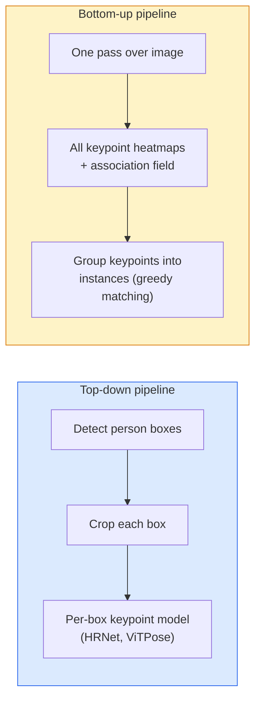

# Wykrywanie punktów kluczowych i estymacja pozy (Pose Estimation)

> Pose to zbiór uporządkowanych punktów kluczowych. Detektor punktów kluczowych to regresor map ciepła (heatmap regressor). Wszystko inne to tylko zarządzanie szczegółami.

**Typ:** Build
**Języki:** Python
**Wymagania wstępne:** Faza 4 Lekcja 06 (Detection), Faza 4 Lekcja 07 (U-Net)
**Szacowany czas:** ~45 minut

## Cele uczenia się

- Rozróżnić podejścia top-down i bottom-up do estymacji pozy oraz wskazać, kiedy każde z nich jest stosowane
- Regresować mapy ciepła dla K punktów kluczowych z Gaussian-per-keypoint target i wyodrębniać współrzędne punktów kluczowych podczas inferencji
- Wyjaśnić Part Affinity Fields (PAFs) i jak bottom-up pipeline kojarzą punkty kluczowe w instancje
- Używać MediaPipe Pose lub MMPose do produkcyjnej estymacji punktów kluczowych oraz rozumieć ich format wyjściowy

## Problem

Zadania związane z punktami kluczowymi ukrywają się pod wieloma nazwami: human pose (17 stawów ciała), face landmarks (68 lub 478 punktów), hand (21 punktów), animal pose, robotic object pose, medical anatomy landmarks. Każdy z nich dzieli tę samą strukturę: wykryj K dyskretnych punktów na obiekcie i wyprowadź ich współrzędne (x, y).

Pose estimation jest fundamentem motion capture, aplikacji fitness, analityki sportowej, sterowania gestami, animacji, AR try-on i chwytania robotycznego. Przypadek 2D jest dojrzały; 3D pose (estymacja pozycji stawów we współrzędnych świata z jednej kamery) to obecna granica badań.

Pytanie inżynieryjne dotyczy skali. Pozy pojedynczej osoby na jednym obrazie to problem na 20ms. Multi-person pose w tłumie przy 30 FPS to inny problem z innymi architekturami.

## Koncept

### Top-down vs bottom-up



- **Top-down** — najpierw wykryj ludzi, a następnie uruchom model keypoint per-crop dla każdej osoby. Najwyższa dokładność; skaluje się liniowo z liczbą osób.
- **Bottom-up** — jeden przebieg przez obraz przewiduje wszystkie punkty kluczowe plus pole asocjacyjne; grupuje je. Stały czas niezależnie od wielkości tłumu.

Top-down (HRNet, ViTPose) jest liderem dokładności; bottom-up (OpenPose, HigherHRNet) jest liderem przepływności (throughput) dla zatłoczonych scen.

### Heatmap regression

Zamiast regresować (x, y) bezpośrednio, przewiduj mapę ciepła H x W dla każdego punktu kluczowego z Gaussian blob wycentrowanym w prawdziwej lokalizacji.

```
target[k, y, x] = exp(-((x - cx_k)^2 + (y - cy_k)^2) / (2 sigma^2))
```

Podczas inferencji, argmax każdej mapy ciepła to przewidywana lokalizacja punktu kluczowego.

Dlaczego heatmapy działają lepiej niż bezpośrednia regresja: przestrzenna struktura sieci (conv feature map) naturalnie alignuje się ze spatial output. Gaussian targets także regularizują — mały błąd lokalizacji produkuje mały loss, nie zero.

### Lokalizacja sub-pixelowa

Argmax daje współrzędne całkowite. Dla precyzji sub-pixel, refine przez dopasowanie paraboli do argmax i jego sąsiadów, lub użyj dobrze znanego offsetu `(dx, dy) = 0.25 * (heatmap[y, x+1] - heatmap[y, x-1], ...)` direction.

### Part Affinity Fields (PAFs)

Sztuczka OpenPose dla bottom-up association. Dla każdej pary połączonych punktów kluczowych (np. lewe ramię do lewego łokcia), przewiduj 2-channel field, który koduje wektor jednostkowy wskazujący od jednego do drugiego. Aby skojarzyć ramię z łokciem, zintegruj PAF wzdłuż linii łączącej candidate pairs; para z najwyższą całką jest dopasowana.

```
Dla każdego połączenia (kończyny):
  Kanały PAF: 2 (wektor jednostkowy x, y)
  Całka liniowa: suma próbek (PAF . kierunek_linii)
  Wyższa całka = silniejsze dopasowanie
```

Eleganckie i skaluje się do dowolnych rozmiarów tłumu bez per-person crops.

### COCO keypoints

Standardowy dataset body-pose: 17 punktów kluczowych per osoba, PCK (Percentage of Correct Keypoints) i OKS (Object Keypoint Similarity) jako metryki. OKS to analog IoU dla keypoints i to jest to, co COCO mAP@OKS raportuje.

### 2D vs 3D

- **2D pose** — współrzędne obrazu; rozwiązane na poziomie produkcyjnym (MediaPipe, HRNet, ViTPose).
- **3D pose** — współrzędne świata / kamery; wciąż aktywne badania. Typowe podejścia:
  - Lift 2D predictions to 3D z małym MLP (VideoPose3D).
  - Direct 3D regression z obrazu (PyMAF, MHFormer).
  - Multi-view setups (CMU Panoptic) dla ground truth.

## Zbuduj to

### Krok 1: Gaussian heatmap target

```python
import numpy as np
import torch

def gaussian_heatmap(size, cx, cy, sigma=2.0):
    yy, xx = np.meshgrid(np.arange(size), np.arange(size), indexing="ij")
    return np.exp(-((xx - cx) ** 2 + (yy - cy) ** 2) / (2 * sigma ** 2)).astype(np.float32)

hm = gaussian_heatmap(64, 32, 32, sigma=2.0)
print(f"peak: {hm.max():.3f} at ({hm.argmax() % 64}, {hm.argmax() // 64})")
```

Per-keypoint heatmap stacked wzdłuż axis kanału daje full target tensor.

### Krok 2: Tiny keypoint head

Model w stylu U-Net, który outputuje K heatmap channels.

```python
import torch.nn as nn
import torch.nn.functional as F

class TinyKeypointNet(nn.Module):
    def __init__(self, num_keypoints=4, base=16):
        super().__init__()
        self.down1 = nn.Sequential(nn.Conv2d(3, base, 3, 2, 1), nn.ReLU(inplace=True))
        self.down2 = nn.Sequential(nn.Conv2d(base, base * 2, 3, 2, 1), nn.ReLU(inplace=True))
        self.mid = nn.Sequential(nn.Conv2d(base * 2, base * 2, 3, 1, 1), nn.ReLU(inplace=True))
        self.up1 = nn.ConvTranspose2d(base * 2, base, 2, 2)
        self.up2 = nn.ConvTranspose2d(base, num_keypoints, 2, 2)

    def forward(self, x):
        h1 = self.down1(x)
        h2 = self.down2(h1)
        h3 = self.mid(h2)
        u1 = self.up1(h3)
        return self.up2(u1)
```

Input (N, 3, H, W), output (N, K, H, W). Loss to per-pixel MSE przeciwko Gaussian targets.

### Krok 3: Inferencja — extract keypoint coordinates

```python
def heatmap_to_coords(heatmaps):
    """
    heatmaps: (N, K, H, W)
    returns:  (N, K, 2) float coordinates in image pixels
    """
    N, K, H, W = heatmaps.shape
    hm = heatmaps.reshape(N, K, -1)
    idx = hm.argmax(dim=-1)
    ys = (idx // W).float()
    xs = (idx % W).float()
    return torch.stack([xs, ys], dim=-1)

coords = heatmap_to_coords(torch.randn(2, 4, 32, 32))
print(f"coords: {coords.shape}")  # (2, 4, 2)
```

Jedna linia przy inferencji. Dla sub-pixel refinement, interpoluj wokół argmax.

### Krok 4: Synthetic keypoint dataset

Proste: narysuj cztery punkty na białym canvasie i naucz się je przewidywać.

```python
def make_synthetic_sample(size=64):
    img = np.ones((3, size, size), dtype=np.float32)
    rng = np.random.default_rng()
    kps = rng.integers(8, size - 8, size=(4, 2))
    for cx, cy in kps:
        img[:, cy - 2:cy + 2, cx - 2:cx + 2] = 0.0
    hms = np.stack([gaussian_heatmap(size, cx, cy) for cx, cy in kps])
    return img, hms, kps
```

Wystarczająco łatwe, żeby mały model nauczył się w minutę.

### Krok 5: Training

```python
model = TinyKeypointNet(num_keypoints=4)
opt = torch.optim.Adam(model.parameters(), lr=3e-3)

for step in range(200):
    batch = [make_synthetic_sample() for _ in range(16)]
    imgs = torch.from_numpy(np.stack([b[0] for b in batch]))
    hms = torch.from_numpy(np.stack([b[1] for b in batch]))
    pred = model(imgs)
    # Upsample pred to full resolution
    pred = F.interpolate(pred, size=hms.shape[-2:], mode="bilinear", align_corners=False)
    loss = F.mse_loss(pred, hms)
    opt.zero_grad(); loss.backward(); opt.step()
```

## Użyj tego

- **MediaPipe Pose** — produkcyjny pose estimator Google; dostarczany z WebGL + mobile runtimes z sub-10ms latency.
- **MMPose** (OpenMMLab) — kompleksowa baza kodu badawczego; najnowoczesniejsza architektura z wstępnie wytrenowanymi wagami.
- **YOLOv8-pose** — najszybszy real-time multi-person pose w jednym przebiegu.
- **transformers HumanDPT / PoseAnything** — nowsze podejścia vision-language dla open-vocabulary pose (dowolny obiekt, dowolny zbiór punktów kluczowych).

## Wyślij to (Wyślij to)

Ta lekcja produkuje:

- `outputs/prompt-pose-stack-picker.md` — prompt, który wybiera MediaPipe / YOLOv8-pose / HRNet / ViTPose przy podanej latency, crowd size i potrzebie 2D vs 3D.
- `outputs/skill-heatmap-to-coords.md` — skill, który pisze sub-pixel heatmap-to-coordinate routine używaną przez każdy produkcyjny pose model.

## Ćwiczenia

1. **(Łatwe)** Trenuj tiny keypoint model na synthetic 4-point dataset. Raportuj mean L2 error między predicted i true keypoints po 200 steps.
2. **(Średnie)** Dodaj sub-pixel refinement: przy danym argmax position, dopasuj 1D parabolę wzdłuż x i y z sąsiednich pikseli. Raportuj accuracy gain vs integer argmax.
3. **(Trudne)** Zbuduj 2-person synthetic dataset, gdzie każdy obraz pokazuje dwie instancje 4-keypoint pattern. Trenuj bottom-up pipeline z PAFs, który przewiduje który keypoint należy do której instancji, i oceń OKS.

## Kluczowe terminy

| Termin | Co ludzie mówią | Co to faktycznie oznacza |
|------|----------------|----------------------|
| Keypoint | "A landmark" | Określony uporządkowany punkt na obiekcie (staw, róg, cecha) |
| Pose | "The skeleton" | Uporządkowany zbiór punktów kluczowych należących do jednej instancji |
| Top-down | "Detect then pose" | Dwustopniowy pipeline: detektor osób + per-crop keypoint model; najwyższa dokładność |
| Bottom-up | "Pose first, group later" | Single-pass all-keypoint prediction + grouping; stały czas w wielkości tłumu |
| Heatmap | "Gaussian target" | H x W tensor per keypoint z peak w prawdziwej lokalizacji; preferowany target regresyjny |
| PAF | "Part Affinity Field" | 2-channel unit vector field kodujący kierunki limbs; używany do grupowania keypoints w instancje |
| OKS | "Keypoint IoU" | Object Keypoint Similarity; metryka COCO dla pose |
| HRNet | "High-Resolution Net" | Dominująca top-down keypoint architecture; preservuje high-res features throughout |

## Dalsze czytanie

- [OpenPose (Cao et al., 2017)](https://arxiv.org/abs/1812.08008) — bottom-up z PAFs; wciąż najlepszy writeup tego podejścia
- [HRNet (Sun et al., 2019)](https://arxiv.org/abs/1902.09212) — top-down reference architecture
- [ViTPose (Xu et al., 2022)](https://arxiv.org/abs/2204.12484) — plain ViT jako pose backbone; current SOTA na wielu benchmarkach
- [MediaPipe Pose](https://developers.google.com/mediapipe/solutions/vision/pose_landmarker) — production real-time pose; najszybszy deployed stack w 2026