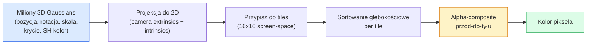

# 3D Gaussian Splatting from Scratch

> Scena to chmura milionów trójwymiarowych Gaussian. Każda ma pozycję, orientację, skalę, krycie i kolor zależny od kierunku widzenia. Rasteryzuj je, backprop przez rasteryzację, gotowe.

**Typ:** Build
**Języki:** Python
**Wymagania wstępne:** Phase 4 Lesson 13 (3D Vision & NeRF), Phase 1 Lesson 12 (Tensor Operations), Phase 4 Lesson 10 (Diffusion basics opcjonalnie)
**Szacowany czas:** ~90 minut

## Cele uczenia się

- Wyjaśnić, dlaczego 3D Gaussian Splatting zastąpił NeRF jako produkcyjny standard dla fotorealistycznej rekonstrukcji 3D w 2026 roku
- Określić sześć parametrów per-Gaussian (pozycja, rotacja kwaternionowa, skala, krycie, kolor sferycznych harmonicznych, opcjonalny feature) i ile zmiennoprzecinkowych każdy wnosi
- Zaimplementować rasteryzer 2D Gaussian splatting od podstaw używając alpha compositing, a następnie pokazać jak przypadek 3D sprowadza się do tej samej pętli
- Użyć `nerfstudio`, `gsplat` lub `SuperSplat` do rekonstrukcji sceny z 20-50 zdjęć i eksportu do rozszerzenia glTF `KHR_gaussian_splatting` lub schematu OpenUSD 26.03 `UsdVolParticleField3DGaussianSplat`

## Problem

NeRF przechowuje scenę jako wagi MLP. Każdy renderowany piksel to setki zapytań MLP wzdłuż promienia. Trening trwa godziny, renderowanie trwa sekundy, a wagi nie mogą być edytowane — jeśli chcesz przesunąć krzesło w scenie, musisz wytrenować od nowa.

3D Gaussian Splatting (Kerbl, Kopanas, Leimkühler, Drettakis, SIGGRAPH 2023) zastąpił to wszystko. Scena to jawny zbiór 3D Gaussians. Renderowanie to GPU rastetryzacja przy 100+ fps. Trening trwa minuty. Edycja jest bezpośrednia: przesuń podzbiór Gaussians i przesunąłeś krzesło. Do 2026 roku Khronos Group zatwierdził rozszerzenie glTF dla Gaussian splats, OpenUSD 26.03 zawiera schemat Gaussian splat, Zillow i Apartments.com renderują nieruchomości przy ich użyciu, a większość nowych prac badawczych nad rekonstrukcją 3D to warianty podstawowej idei 3DGS.

Model umysłowy jest prosty, matematyka ma wystarczająco dużo poruszających się części, że większość wprowadzeń zaczyna od rastetryzacji i pomija projekcje oraz sferyczne harmoniczne. Ta lekcja buduje całość — najpierw wersję 2D, potem rozszerzenie 3D.

## Koncepcja

### Co niesie Gaussian

Jedna 3D Gaussian to parametryczny blob w przestrzeni z tymi atrybutami:

```
position         mu         (3,)    centrum we współrzędnych świata
rotation         q          (4,)    unit quaternion kodujący orientację
scale            s          (3,)    log-skale per axis (wykładnicze przy renderowaniu)
opacity          alpha      (1,)    post-sigmoid opacity [0, 1]
SH coefficients  c_lm       (3 * (L+1)^2,)   kolor zależny od widoku
```

Rotacja + skala budują macierz kowariancji 3x3: `Sigma = R S S^T R^T`. To jest kształt Gaussiana w 3D. Sferyczne harmoniczne pozwalają kolorowi zmieniać się wraz z kierunkiem widzenia — spekularne refleksy, subtelne polyski, świecenie zależne od widoku — bez przechowywania per-view tekstur. Przy SH stopniu 3 dostajesz 16 współczynników na kanał koloru, 48 zmiennoprzecinkowych per Gaussian dla samego koloru.

Scena typowo ma 1-5 milionów Gaussians. Każdy przechowuje około 60 zmiennoprzecinkowych (3 + 4 + 3 + 1 + 48 + misc). To 240 MB dla sceny z pięcioma milionami Gaussians — znacznie mniej niż równoważny point cloud z per-point teksturą i rząd wielkości mniej niż wagi MLP NeRF-a re-renderowanego w wysokiej rozdzielczości.

### Rastetryzacja, nie ray marching



Pięć kroków, wszystkie przyjazne dla GPU. Żadne zapytanie MLP per piksel. Pojedynczy RTX 3080 Ti renderuje 6 milionów splats przy 147 fps.

### Krok projekcji

3D Gaussian na pozycji świata `mu` z 3D kowariancją `Sigma` projektuje do 2D Gaussiana na pozycji ekranu `mu'` z 2D kowariancją `Sigma'`:

```
mu' = project(mu)
Sigma' = J W Sigma W^T J^T          (2 x 2)

W = viewing transform (rotacja + translacja kamery)
J = Jakobian perspektywicznej projekcji przy mu'
```

Footprint 2D Gaussiana to elipsa, której osie to wektory własne `Sigma'`. Każdy piksel wewnątrz tej elipsy otrzymuje wkład Gaussiana, ważony przez `exp(-0.5 * (p - mu')^T Sigma'^-1 (p - mu'))`.

### Reguła alpha-compositing

Dla jednego piksela, Gaussians, które go pokrywają, są sortowane tył-do-przodu (lub równoważnie przód-do-tyłu z odwróconym wzorem). Kolor jest komponowany tym samym równaniem co każdy półprzezroczysty rastetryzer od lat 80.:

```
C_pixel = sum_i alpha_i * T_i * c_i

T_i = prod_{j < i} (1 - alpha_j)       transmitancja do i
alpha_i = opacity_i * exp(-0.5 * d^T Sigma'^-1 d)   lokalny wkład
c_i = eval_SH(SH_i, view_direction)    kolor zależny od widoku
```

To jest **to samo równanie co objętościowy render NeRF-a**, tylko nad jawnym rzadkim zbiorem Gaussians zamiast gęstymi próbkami wzdłuż promienia. Ta tożsamość wyjaśnia, dlaczego jakość renderingu dorównuje NeRF-owi — oba całkują to samo równanie pola radiacyjnego.

### Dlaczego to jest różniczkowalne

Każdy krok — projekcja, przypisanie tile, alpha compositing, ewaluacja SH — jest różniczkowalny względem parametrów Gaussian. Mając ground-truth image, oblicz stratę renderowanego piksela, backprop przez rasteryzer, aktualizuj wszystkie `(mu, q, s, alpha, c_lm)` przez gradient descent. Przez ~30 000 iteracji Gaussians znajdują swoje właściwe pozycje, skale i kolory.

### Densyfikacja i przycinanie

Ustalony zbiór Gaussians nie może pokryć złożonej sceny. Trening obejmuje dwa mechanizmy adaptacyjne:

- **Clone** — sklonuj Gaussiana w jego obecnej pozycji, gdy wielkość gradientu jest wysoka, ale jego skala jest mała — rekonstrukcja potrzebuje tutaj więcej detali.
- **Split** — podziel dużego Gaussiana na dwa mniejsze, gdy jego gradient jest wysoki — jeden duży Gaussian jest zbyt gładki, żeby dopasować region.
- **Prune** — usuń Gaussians, których krycie spadło poniżej progu — nie wnoszą wkładu.

Densyfikacja uruchamia się co N iteracji. Scena typowo rośnie z ~100k początkowych Gaussians (zasianych ze SfM points) do 1-5M na końcu treningu.

### Sferyczne harmoniczne w jednym akapicie

Kolor zależny od widoku to funkcja `c(direction)` na sferze jednostkowej. Sferyczne harmoniczne to Fourier basis sfery. Obetnij przy stopniu `L` i dostajesz `(L+1)^2` funkcji bazowych per kanał. Ewaluacja koloru dla nowego widoku to iloczyn skalarny między nauczonymi współczynnikami SH a basisą ewaluowaną przy kierunku widzenia. Stopień 0 = jeden współczynnik = stały kolor. Stopień 3 = 16 współczynników = wystarczająco do uchwycenia Lambertian shading, spekularności i łagodnego odbicia. SD Gaussian Splatting papers używają stopnia 3 domyślnie.

### Stos produkcyjny 2026

```
1. Capture         smartphone / DJI drone / handheld scanner
2. SfM / MVS       COLMAP lub GLOMAP wyprowadza camera poses + sparse points
3. Train 3DGS      nerfstudio / gsplat / inria official / PostShot (~10-30 min na RTX 4090)
4. Edit            SuperSplat / SplatForge (clean floaters, segment)
5. Export          .ply -> glTF KHR_gaussian_splatting lub .usd (OpenUSD 26.03)
6. View            Cesium / Unreal / Babylon.js / Three.js / Vision Pro
```

### Warianty 4D i generatywne

- **4D Gaussian Splatting** — Gaussians są funkcjami czasu; używane do objętościowego wideo (Superman 2026, A$AP Rocky "Helicopter").
- **Generatywne splats** — text-to-splat models (Marble by World Labs), które generują całe sceny.
- **3D Gaussian Unscented Transform** — wariant NVIDIA NuRec dla symulacji autonomicznej jazdy.

## Zbuduj to

### Krok 1: 2D Gaussian

Najpierw budujemy rastetryzer 2D. Przypadek 3D redukuje się do niego po projekcji.

```python
import torch
import torch.nn as nn
import torch.nn.functional as F


def eval_2d_gaussian(means, covs, points):
    """
    means:  (G, 2)      centres
    covs:   (G, 2, 2)   covariance matrices
    points: (H, W, 2)   pixel coordinates
    returns: (G, H, W)  density at every pixel for every Gaussian
    """
    G = means.size(0)
    H, W, _ = points.shape
    flat = points.view(-1, 2)
    inv = torch.linalg.inv(covs)
    diff = flat[None, :, :] - means[:, None, :]
    d = torch.einsum("gpi,gij,gpj->gp", diff, inv, diff)
    density = torch.exp(-0.5 * d)
    return density.view(G, H, W)
```

`einsum` wykonuje formę kwadratową `diff^T Sigma^-1 diff` dla każdej pary (Gaussian, piksel).

### Krok 2: 2D splatting rasteriser

Alpha-compositing przód-do-tyłu. Głębia w 2D nie ma sensu, więc używamy nauczanego per-Gaussian skalara dla porządku.

```python
def rasterise_2d(means, covs, colours, opacities, depths, image_size):
    """
    means:     (G, 2)
    covs:      (G, 2, 2)
    colours:   (G, 3)
    opacities: (G,)     in [0, 1]
    depths:    (G,)     per-Gaussian scalar used for ordering
    image_size: (H, W)
    returns:   (H, W, 3) rendered image
    """
    H, W = image_size
    yy, xx = torch.meshgrid(
        torch.arange(H, dtype=torch.float32, device=means.device),
        torch.arange(W, dtype=torch.float32, device=means.device),
        indexing="ij",
    )
    points = torch.stack([xx, yy], dim=-1)

    densities = eval_2d_gaussian(means, covs, points)
    alphas = opacities[:, None, None] * densities
    alphas = alphas.clamp(0.0, 0.99)

    order = torch.argsort(depths)
    alphas = alphas[order]
    colours_sorted = colours[order]

    T = torch.ones(H, W, device=means.device)
    out = torch.zeros(H, W, 3, device=means.device)
    for i in range(means.size(0)):
        a = alphas[i]
        out += (T * a)[..., None] * colours_sorted[i][None, None, :]
        T = T * (1.0 - a)
    return out
```

Nie szybkie — prawdziwa implementacja używa tile-based CUDA kernels — ale dokładnie ta matematyka i w pełni różniczkowalne.

### Krok 3: Trenowalna 2D splat scene

```python
class Splats2D(nn.Module):
    def __init__(self, num_splats=128, image_size=64, seed=0):
        super().__init__()
        g = torch.Generator().manual_seed(seed)
        H, W = image_size, image_size
        self.means = nn.Parameter(torch.rand(num_splats, 2, generator=g) * torch.tensor([W, H]))
        self.log_scale = nn.Parameter(torch.ones(num_splats, 2) * math.log(2.0))
        self.rot = nn.Parameter(torch.zeros(num_splats))  # single angle in 2D
        self.colour_logits = nn.Parameter(torch.randn(num_splats, 3, generator=g) * 0.5)
        self.opacity_logit = nn.Parameter(torch.zeros(num_splats))
        self.depth = nn.Parameter(torch.rand(num_splats, generator=g))

    def covs(self):
        s = torch.exp(self.log_scale)
        c, si = torch.cos(self.rot), torch.sin(self.rot)
        R = torch.stack([
            torch.stack([c, -si], dim=-1),
            torch.stack([si, c], dim=-1),
        ], dim=-2)
        S = torch.diag_embed(s ** 2)
        return R @ S @ R.transpose(-1, -2)

    def forward(self, image_size):
        covs = self.covs()
        colours = torch.sigmoid(self.colour_logits)
        opacities = torch.sigmoid(self.opacity_logit)
        return rasterise_2d(self.means, covs, colours, opacities, self.depth, image_size)
```

`log_scale`, `opacity_logit` i `colour_logits` to wszystkie nieograniczone parametry mapowane przez odpowiednią aktywację przy renderowaniu. To jest standardowy wzorzec dla każdej implementacji 3DGS.

### Krok 4: Dopasuj 2D Gaussians do obrazu docelowego

```python
import math
import numpy as np

def make_target(size=64):
    yy, xx = np.meshgrid(np.arange(size), np.arange(size), indexing="ij")
    img = np.zeros((size, size, 3), dtype=np.float32)
    # Red circle
    mask = (xx - 20) ** 2 + (yy - 20) ** 2 < 10 ** 2
    img[mask] = [1.0, 0.2, 0.2]
    # Blue square
    mask = (np.abs(xx - 45) < 8) & (np.abs(yy - 40) < 8)
    img[mask] = [0.2, 0.3, 1.0]
    return torch.from_numpy(img)


target = make_target(64)
model = Splats2D(num_splats=64, image_size=64)
opt = torch.optim.Adam(model.parameters(), lr=0.05)

for step in range(200):
    pred = model((64, 64))
    loss = F.mse_loss(pred, target)
    opt.zero_grad(); loss.backward(); opt.step()
    if step % 40 == 0:
        print(f"step {step:3d}  mse {loss.item():.4f}")
```

Przez 200 kroków 64 Gaussians osiada na dwóch kształtach. To jest cała idea — gradient descent na jawnych geometrycznych prymitywach.

### Krok 5: Z 2D do 3D

Rozszerzenie 3D zachowuje tę samą pętlę. Dodatki:

1. Per-Gaussian rotacja to kwaternion zamiast pojedynczego kąta.
2. Kowariancja to `R S S^T R^T` z `R` zbudowanym z kwaternionu i `S = diag(exp(log_scale))`.
3. Projekcja `(mu, Sigma) -> (mu', Sigma')` używa camera extrinsics i Jakobianu perspektywicznej projekcji przy `mu`.
4. Kolor staje się rozwinięciem sferycznych harmonicznych; ewaluuj go przy kierunku widzenia.
5. Sortowanie głębokości jest z rzeczywistej camera-space z zamiast nauczanego skalara.

Każda implementacja produkcyjna (`gsplat`, `inria/gaussian-splatting`, `nerfstudio`) robi dokładnie to na GPU z tile-based CUDA kernels.

### Krok 6: Ewaluacja sferycznych harmonicznych

SH basis do stopnia 3 ma 16 wyrazów per kanał. Ewaluacja:

```python
def eval_sh_degree_3(sh_coeffs, dirs):
    """
    sh_coeffs: (..., 16, 3)   last dim is RGB channels
    dirs:      (..., 3)       unit vectors
    returns:   (..., 3)
    """
    C0 = 0.282094791773878
    C1 = 0.488602511902920
    C2 = [1.092548430592079, 1.092548430592079,
          0.315391565252520, 1.092548430592079,
          0.546274215296039]
    x, y, z = dirs[..., 0], dirs[..., 1], dirs[..., 2]
    x2, y2, z2 = x * x, y * y, z * z
    xy, yz, xz = x * y, y * z, x * z

    result = C0 * sh_coeffs[..., 0, :]
    result = result - C1 * y[..., None] * sh_coeffs[..., 1, :]
    result = result + C1 * z[..., None] * sh_coeffs[..., 2, :]
    result = result - C1 * x[..., None] * sh_coeffs[..., 3, :]

    result = result + C2[0] * xy[..., None] * sh_coeffs[..., 4, :]
    result = result + C2[1] * yz[..., None] * sh_coeffs[..., 5, :]
    result = result + C2[2] * (2.0 * z2 - x2 - y2)[..., None] * sh_coeffs[..., 6, :]
    result = result + C2[3] * xz[..., None] * sh_coeffs[..., 7, :]
    result = result + C2[4] * (x2 - y2)[..., None] * sh_coeffs[..., 8, :]

    # degree 3 terms omitted here for brevity; full 16-coefficient version in the code file
    return result
```

Nauczone `sh_coeffs` przechowują "kolor w każdym kierunku" dla tego Gaussiana. Przy renderowaniu ewaluujesz przeciwko bieżącemu kierunkowi widzenia i dostajesz wektor RGB 3.

## Użyj tego

Dla prawdziwej pracy z 3DGS, użyj `gsplat` (Meta) lub `nerfstudio`:

```bash
pip install nerfstudio gsplat
ns-download-data example
ns-train splatfacto --data path/to/data
```

`splatfacto` to trenujący 3DGS w nerfstudio. Uruchomienie trwa 10-30 minut na RTX 4090 dla typowej sceny.

Opcje eksportu, które mają znaczenie w 2026:

- `.ply` — surowa chmura Gaussian (przenośna, największy plik).
- `.splat` — format quantised PlayCanvas / SuperSplat.
- glTF `KHR_gaussian_splatting` — standard Khronos, przenośny między viewerami (Feb 2026 RC).
- OpenUSD `UsdVolParticleField3DGaussianSplat` — natywny dla USD, dla NVIDIA Omniverse i pipeline'ów Vision Pro.

Dla scen 4D / dynamicznych, `4DGS` i `Deformable-3DGS` rozszerzają tę samą maszynerię o zmieniające się w czasie means i krycie.

## Wyślij to

Ta lekcja produkuje:

- `outputs/prompt-3dgs-capture-planner.md` — prompt, który planuje sesję capture (liczba zdjęć, ścieżka kamery, oświetlenie) dla danego typu sceny.
- `outputs/skill-3dgs-export-router.md` — skill, który wybiera właściwy format eksportu (`.ply` / `.splat` / glTF / USD) mając dany downstream viewer lub engine.

## Ćwiczenia

1. **(Łatwe)** Uruchom trenujący 2D splat powyżej na innym syntetycznym obrazie. Zmień `num_splats` w `[16, 64, 256]` i wykreśl MSE vs step dla każdego. Zidentyfikuj punkt malejących zwrotów.
2. **(Średnie)** Rozszerz 2D rasteryzer o obsługę per-Gaussian kolorów RGB zależnych od skalarnego "kąta widzenia" przez harmoniczny stopnia 2. Trenuj na parze obrazów docelowych i zweryfikuj, że model rekonstruuje oba.
3. **(Trudne)** Sklonuj `nerfstudio` i trenuj `splatfacto` na capture 20 zdjęć dowolnej sceny (biurko, roślina, twarz, pokój). Eksportuj do glTF `KHR_gaussian_splatting` i otwórz w viewerze (Three.js `GaussianSplats3D`, SuperSplat, Babylon.js V9). Zgłoś czas treningu, liczbę Gaussians i rendered fps.

## Kluczowe terminy

| Termin | Co ludzie mówią | Co to faktycznie oznacza |
|--------|----------------|----------------------|
| 3DGS | "Gaussian splats" | Jawna reprezentacja sceny jako milionów 3D Gaussians z per-Gaussian pozycją, rotacją, skalą, kryciem, SH kolorem |
| Kowariancja | "Kształt Gaussiana" | `Sigma = R S S^T R^T`; orientacja i anizotropowa skala jednego Gaussiana |
| Alpha compositing | "Blend tył-do-przodu" | To samo równanie, co objętościowy render NeRF-a, teraz nad jawnym rzadkim zbiorem |
| Densyfikacja | "Klonuj i dziel" | Adaptacyjne dodawanie nowych Gaussians, gdzie rekonstrukcja jest under-fit |
| Przycinanie | "Usuwaj niskie krycie" | Usuń Gaussians, których krycie spadło poniżej progu — nie wnoszą wkładu |
| Sferyczne harmoniczne | "Kolor zależny od widoku" | Fourier basis na sferze; przechowuje kolor jako funkcję kierunku widzenia |
| Splatfacto | "3DGS nerfstudio" | Najłatwiejsza ścieżka do treningu 3DGS w 2026 |
| `KHR_gaussian_splatting` | "standard glTF" | Rozszerzenie Khronos 2026, które czyni 3DGS przenośnym między viewerami i engine'ami |

## Dalsze czytanie

- [3D Gaussian Splatting for Real-Time Radiance Field Rendering (Kerbl et al., SIGGRAPH 2023)](https://repo-sam.inria.fr/fungraph/3d-gaussian-splatting/) — oryginalny paper
- [gsplat (Meta/nerfstudio)](https://github.com/nerfstudio-project/gsplat) — produkcyjnej jakości CUDA rasteriser
- [nerfstudio Splatfacto](https://docs.nerf.studio/nerfology/methods/splat.html) — referencyjna receptura treningowa
- [Khronos KHR_gaussian_splatting extension](https://github.com/KhronosGroup/glTF/blob/main/extensions/2.0/Khronos/KHR_gaussian_splatting/README.md) — przenośny format 2026
- [OpenUSD 26.03 release notes](https://openusd.org/release/) — schemat `UsdVolParticleField3DGaussianSplat`
- [THE FUTURE 3D State of Gaussian Splatting 2026](https://www.thefuture3d.com/blog-0/2026/4/4/state-of-gaussian-splatting-2026) — przegląd branżowy