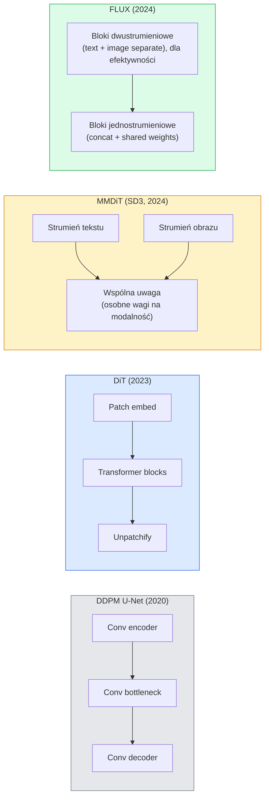

# Diffusion Transformers i Rectified Flow

> U-Net nie jest sekretem dyfuzji. Zastąp go transformerem, zamień harmonogram szumu na prostoliniowy przepływ, a nagle masz SD3, FLUX i każdy model text-to-image z 2026 roku.

**Typ:** Nauka + Budowanie
**Języki:** Python
**Wymagania wstępne:** Lesson 10 z Fazy 4 (Diffusion DDPM), Lesson 14 z Fazy 4 (ViT), Lesson 02 z Fazy 7 (Self-Attention)
**Szacowany czas:** ~75 minut

## Cele uczenia się

- Prześledzić ewolucję od U-Net DDPM (Lesson 10) do Diffusion Transformer (DiT), MMDiT (SD3) i single+double-stream DiT (FLUX)
- Wyjaśnić rectified flow: dlaczego prostoliniowa trajektoria między szumem a danymi pozwala modelom próbkować w 20 krokach zamiast 1000
- Zaimplementować mały blok DiT i pętlę treningową rectified flow, obie w mniej niż 100 liniach
- Rozróżnić warianty modeli (SD3, FLUX.1-dev, FLUX.1-schnell, Z-Image, Qwen-Image) przez architekturę, liczbę parametrów i licencję

## Problem

Lesson 10 zbudował DDPM z denoiserem U-Net. Ten przepis dominował w latach 2020-2023: U-Net + harmonogram beta + funkcja straty przewidywania szumu. Wyprodukowano Stable Diffusion 1.5 i 2.1 oraz DALL-E 2.

Każdy najnowocześniejszy model text-to-image z 2026 roku go porzucił. Stable Diffusion 3, FLUX, SD4, Z-Image, Qwen-Image, Hunyuan-Image — żaden nie używa U-Neta. Wszystkie używają Diffusion Transformers (DiT). SD3 i FLUX zamieniają też harmonogram szumu DDPM na rectified flow, który prostuje ścieżkę od szumu do danych i umożliwia wnioskowanie w 1-4 krokach dzięki wariantom consistency lub distillation.

Ta zmiana ma znaczenie, bo to dlatego dyfuzyjna generacja obrazów stała się kontrolowalna, dokładna względem promptów (SD3/SD4 rozwiązały renderowanie tekstu) i szybka w produkcji. Zrozumienie DiT + rectified flow to zrozumienie stosu generatywnego obrazu w 2026 roku.

## Koncepcja

### Od U-Neta do transformera



- **DiT** (Peebles & Xie, 2023) — zastąp U-Net transformerem podobnym do ViT na latent patches. Kondycjonowanie przez adaptacyjne layer norm (AdaLN).
- **MMDiT** (SD3, Esser et al., 2024) — dwa strumienie z osobnymi wagami dla tokenów tekstowych i obrazowych, które dzielą wspólną uwagę.
- **FLUX** (Black Forest Labs, 2024) — pierwsze N bloków to double-stream jak SD3, późniejsze bloki łączą i dzielą wagi (single-stream), dla efektywności przy większej głębokości.
- **Z-Image** (2025) — efektywny single-stream DiT przy 6B parametrach, który rzuca wyzwanie "skaluj za wszelką cenę".

### Rectified flow w jednym akapicie

DDPM definiuje proces forward jako szumliwy SDE, gdzie `x_t` jest coraz bardziej zniekształcony. Nauczony reverse to drugi SDE, rozwiązywany przez 1000 małych kroków.

Rectified flow definiuje **prostoliniową** interpolację między czystymi danymi a czystym szumem:

```
x_t = (1 - t) * x_0 + t * epsilon,     t in [0, 1]
```

Trenuj sieć, żeby przewidywała prędkość `v_theta(x_t, t) = epsilon - x_0` — kierunek do przodu wzdłuż prostoliniowej ścieżki od czystych danych do szumu (`dx_t/dt`). Podczas próbkowania całkujesz tę prędkość wstecz, żeby krokować od szumu w kierunku danych. Wynikające ODE jest znacznie bliższe linii prostej, więc potrzeba znacznie mniej kroków całkowania do próbkowania.

SD3 nazywa to **Rectified Flow Matching**. FLUX, Z-Image i większość modeli z 2026 roku używa tego samego celu. Typowe wnioskowanie: 20-30 kroków Eulera (deterministyczne) vs 50+ kroków DDIM w starym reżimie DDPM. Zdestylowane / turbo / schnell / LCM warianty redukują to do 1-4 kroków.

### AdaLN conditioning

DiTy kondycjonują na timestep i klasę/tekst przez **adaptive layer norm**: przewidują `scale` i `shift` z wektora kondycjonującego i aplikują je po LayerNorm. Znacznie czystsze niż modulacja FiLM w U-Netach i domyślne w każdym nowoczesnym DiT.

```
cond -> MLP -> (scale, shift, gate)
norm(x) * (1 + scale) + shift, następnie residual add * gate
```

### Enkodery tekstu w SD3 i FLUX

- **SD3** używa trzech enkoderów tekstowych: dwa modele CLIP + T5-XXL. Embeddingi konkatenowane i przekazywane do strumienia obrazowego jako kondycjonowanie tekstowe.
- **FLUX** używa jednego CLIP-L + T5-XXL.
- **Qwen-Image / Z-Image** warianty używają własnych enkoderów tekstowych wyrównanych z ich bazowymi LLM-ami.

Enkoder tekstowy to duża część tego, dlaczego SD3/FLUX tak bardzo lepiej rozumieją prompty niż SD1.5. Sam T5-XXL ma 4.7B parametrów.

### Classifier-free guidance nadal obowiązuje

Rectified flow zmienia sampler, nie kondycjonowanie. Classifier-free guidance (porzucanie tekstu z 10% prawdopodobieństwem podczas treningu, mieszanie warunkowych i bezwarunkowych predykcji podczas wnioskowania) działa identycznie z rectified flow. Większość modeli z 2026 roku używa guidance scale 3.5-5 — niższego niż 7.5 SD1.5, bo modele rectified flow domyślnie lepiej podążają za promptami.

### Consistency, Turbo, Schnell, LCM

Cztery nazwy na tę samą ideę: destylować wolny wieloetapowy model w szybki małoetapowy model.

- **LCM (Latent Consistency Model)** — trening studenta, który przewiduje końcowe `x_0` z dowolnego pośredniego `x_t` w jednym kroku.
- **SDXL Turbo / FLUX schnell** — 1-4-etapowe modele trenowane z adversarial diffusion distillation.
- **SD Turbo** — Consistency Models w stylu OpenAI zaadaptowane do latent diffusion.

Produkcyjne serwowanie każdego nowego modelu wysyła zarówno checkpoint "pełnej jakości", jak i wariant "turbo / schnell". Schnell ("szybki" po niemiecku, konwencja Black Forest Labs) działa w 1-4 krokach i pasuje do pipeline'ów real-time.

### Krajobraz modeli w 2026 roku

| Model | Rozmiar | Architektura | Licencja |
|-------|---------|--------------|----------|
| Stable Diffusion 3 Medium | 2B | MMDiT | SAI Community |
| Stable Diffusion 3.5 Large | 8B | MMDiT | SAI Community |
| FLUX.1-dev | 12B | Double + Single Stream DiT | non-commercial |
| FLUX.1-schnell | 12B | to samo, zdestylowane | Apache 2.0 |
| FLUX.2 | — | iterowany FLUX.1 | mieszana |
| Z-Image | 6B | S3-DiT (Scalable Single-Stream) | permissive |
| Qwen-Image | ~20B | DiT + Qwen text tower | Apache 2.0 |
| Hunyuan-Image-3.0 | ~80B | DiT | research |
| SD4 Turbo | 3B | DiT + distillation | SAI Commercial |

FLUX.1-schnell to domyślny open-source na 2026 rok. Z-Image jest liderem efektywności. FLUX.2 i SD4 to obecne szczyty jakości.

### Dlaczego ta zmiana fazy ma znaczenie

DDPM + U-Net działał. DiT + rectified flow działa **lepiej, szybciej i skaluje się czytelniej**. Przejście przypomina to od RNN-ów do transformerów w NLP: obie architektury rozwiązywały ten sam problem, ale transformery się skalują i teraz dominują. Każdy artykuł z 2026 roku o generacji obrazu, wideo lub 3D używa denoisera w kształcie DiT i zazwyczaj celu rectified flow. U-Net DDPM jest teraz głównie pedagogiczny (Lesson 10).

## Zbuduj to

### Krok 1: Blok DiT z AdaLN

```python
import torch
import torch.nn as nn


class AdaLNZero(nn.Module):
    """
    Adaptive LayerNorm with a gate. Predicts (scale, shift, gate) from the conditioning.
    Init such that the whole block starts as identity ("zero init").
    """

    def __init__(self, dim, cond_dim):
        super().__init__()
        self.norm = nn.LayerNorm(dim, elementwise_affine=False)
        self.mlp = nn.Linear(cond_dim, dim * 3)
        nn.init.zeros_(self.mlp.weight)
        nn.init.zeros_(self.mlp.bias)

    def forward(self, x, cond):
        scale, shift, gate = self.mlp(cond).chunk(3, dim=-1)
        h = self.norm(x) * (1 + scale.unsqueeze(1)) + shift.unsqueeze(1)
        return h, gate.unsqueeze(1)


class DiTBlock(nn.Module):
    def __init__(self, dim=192, heads=3, mlp_ratio=4, cond_dim=192):
        super().__init__()
        self.adaln1 = AdaLNZero(dim, cond_dim)
        self.attn = nn.MultiheadAttention(dim, heads, batch_first=True)
        self.adaln2 = AdaLNZero(dim, cond_dim)
        self.mlp = nn.Sequential(
            nn.Linear(dim, dim * mlp_ratio),
            nn.GELU(),
            nn.Linear(dim * mlp_ratio, dim),
        )

    def forward(self, x, cond):
        h, gate1 = self.adaln1(x, cond)
        a, _ = self.attn(h, h, h, need_weights=False)
        x = x + gate1 * a
        h, gate2 = self.adaln2(x, cond)
        x = x + gate2 * self.mlp(h)
        return x
```

`AdaLNZero` startuje jako mapping identycznościowy, bo jego wagi MLP są inicjalizowane zerami. Trening przesuwa blok od identyczności; to dramatycznie stabilizuje głębokie transformery dyfuzyjne.

### Krok 2: Mały DiT

```python
def timestep_embedding(t, dim):
    import math
    half = dim // 2
    freqs = torch.exp(-math.log(10000) * torch.arange(half, device=t.device) / half)
    args = t[:, None].float() * freqs[None]
    return torch.cat([args.sin(), args.cos()], dim=-1)


class TinyDiT(nn.Module):
    def __init__(self, image_size=16, patch_size=2, in_channels=3, dim=96, depth=4, heads=3):
        super().__init__()
        self.patch_size = patch_size
        self.num_patches = (image_size // patch_size) ** 2
        self.patch = nn.Conv2d(in_channels, dim, kernel_size=patch_size, stride=patch_size)
        self.pos = nn.Parameter(torch.zeros(1, self.num_patches, dim))
        self.time_mlp = nn.Sequential(
            nn.Linear(dim, dim * 2),
            nn.SiLU(),
            nn.Linear(dim * 2, dim),
        )
        self.blocks = nn.ModuleList([DiTBlock(dim, heads, cond_dim=dim) for _ in range(depth)])
        self.norm_out = nn.LayerNorm(dim, elementwise_affine=False)
        self.head = nn.Linear(dim, patch_size * patch_size * in_channels)

    def forward(self, x, t):
        n = x.size(0)
        x = self.patch(x)
        x = x.flatten(2).transpose(1, 2) + self.pos
        t_emb = self.time_mlp(timestep_embedding(t, self.pos.size(-1)))
        for blk in self.blocks:
            x = blk(x, t_emb)
        x = self.norm_out(x)
        x = self.head(x)
        return self._unpatchify(x, n)

    def _unpatchify(self, x, n):
        p = self.patch_size
        h = w = int(self.num_patches ** 0.5)
        x = x.view(n, h, w, p, p, -1).permute(0, 5, 1, 3, 2, 4).reshape(n, -1, h * p, w * p)
        return x
```

### Krok 3: Trening rectified flow

```python
import torch.nn.functional as F

def rectified_flow_train_step(model, x0, optimizer, device):
    model.train()
    x0 = x0.to(device)
    n = x0.size(0)
    t = torch.rand(n, device=device)
    epsilon = torch.randn_like(x0)
    x_t = (1 - t[:, None, None, None]) * x0 + t[:, None, None, None] * epsilon

    target_velocity = epsilon - x0
    pred_velocity = model(x_t, t)

    loss = F.mse_loss(pred_velocity, target_velocity)
    optimizer.zero_grad()
    loss.backward()
    optimizer.step()
    return loss.item()
```

Porównaj z funkcją straty przewidywania szumu DDPM (Lesson 10): ta sama struktura, inny cel. Zamiast przewidywać szum `epsilon`, przewidujemy **prędkość** `epsilon - x_0`, która wskazuje od danych do szumu wzdłuż prostoliniowej interpolacji.

### Krok 4: Sampler Eulera

Rectified flow to ODE. Metoda Eulera to najprostszy i, dla dobrze wytrenowanego modelu rectified flow, prawie tak samo dokładny jak solwery wyższego rzędu przy 20+ krokach.

```python
@torch.no_grad()
def rectified_flow_sample(model, shape, steps=20, device="cpu"):
    model.eval()
    x = torch.randn(shape, device=device)
    dt = 1.0 / steps
    t = torch.ones(shape[0], device=device)
    for _ in range(steps):
        v = model(x, t)
        x = x - dt * v
        t = t - dt
    return x
```

20 kroków. Na wytrenowanym modelu to produkuje próbki porównywalne z 1000-krokowym DDPM.

### Krok 5: End-to-end smoke test

```python
import numpy as np

def synthetic_blobs(num=200, size=16, seed=0):
    rng = np.random.default_rng(seed)
    out = np.zeros((num, 3, size, size), dtype=np.float32)
    yy, xx = np.meshgrid(np.arange(size), np.arange(size), indexing="ij")
    for i in range(num):
        cx, cy = rng.uniform(4, size - 4, size=2)
        r = rng.uniform(2, 4)
        mask = (xx - cx) ** 2 + (yy - cy) ** 2 < r ** 2
        colour = rng.uniform(-1, 1, size=3)
        for c in range(3):
            out[i, c][mask] = colour[c]
    return torch.from_numpy(out)
```

Trenuj `TinyDiT` na tym z rectified flow. Po 500 krokach próbkowane outputy powinny wyglądać jak blade plamy koloru.

## Użyj tego

Do prawdziwej generacji obrazów z FLUX / SD3 / Z-Image, `diffusers` dostarcza każdy z ujednoliconym API:

```python
from diffusers import FluxPipeline, StableDiffusion3Pipeline
import torch

pipe = FluxPipeline.from_pretrained(
    "black-forest-labs/FLUX.1-schnell",
    torch_dtype=torch.bfloat16,
).to("cuda")

out = pipe(
    prompt="a golden retriever surfing a tsunami, hyperrealistic, studio lighting",
    guidance_scale=0.0,           # schnell was trained without CFG
    num_inference_steps=4,
    max_sequence_length=256,
).images[0]
out.save("surf.png")
```

Trzy linie. `FLUX.1-schnell` w czterech krokach. Zamień model id na `black-forest-labs/FLUX.1-dev` dla wyższej jakości przy 20-30 krokach z CFG.

Dla SD3:

```python
pipe = StableDiffusion3Pipeline.from_pretrained(
    "stabilityai/stable-diffusion-3.5-large",
    torch_dtype=torch.bfloat16,
).to("cuda")
out = pipe(prompt, guidance_scale=3.5, num_inference_steps=28).images[0]
```

## Wyślij to

Ta lekcja produkuje:

- `outputs/prompt-dit-model-picker.md` — wybiera między SD3, FLUX.1-dev, FLUX.1-schnell, Z-Image, SD4 Turbo przy danych ograniczeniach jakości, opóźnienia i licencji.
- `outputs/skill-rectified-flow-trainer.md` — pisze kompletną pętlę treningową dla rectified flow z AdaLN DiT i samplingiem Eulera.

## Ćwiczenia

1. **(Łatwe)** Wytrenuj TinyDiT powyżej na syntetycznym datasecie blob przez 500 kroków. Porównaj próbki wygenerowane przy 10, 20 i 50 krokach Eulera.
2. **(Średnie)** Dodaj kondycjonowanie tekstowe przez konkatenację nauczanego embeddingu klasy do time embeddingu (10 klas blobów "według koloru"). Próbkuj z klasą 0, 5 i 9 i zweryfikuj, że kolory się zgadzają.
3. **(Trudne)** Oblicz dystans Frécheta (FID proxy) między wygenerowanymi próbkami z wersji rectified-flow i DDPM tej samej wielkości sieci trenowanej na tych samych danych przez tę samą liczbę kroków. Raportuj, który szybciej zbiega.

## Kluczowe terminy

| Termin | Co ludzie mówią | Co to faktycznie oznacza |
|--------|----------------|-------------------------|
| DiT | "Diffusion transformer" | Transformer, który zastępuje U-Net jako denoiser dyfuzyjny; operuje na patchyfikowanych latentach |
| AdaLN | "Adaptive layer norm" | Kondycjonowanie timestepu/tekstu przez nauczane scale, shift, gate aplikowane po LayerNorm; standard w każdym nowoczesnym DiT |
| MMDiT | "Multi-modal DiT (SD3)" | Osobne strumienie wag dla tokenów tekstowych i obrazowych, które dzielą joint self-attention |
| Jednostrumieniowy / dwustrumieniowy | "Single-stream / double-stream" | Pierwsze N bloków to double-stream (osobne wagi na modalność), późniejsze bloki to single-stream (konkatenacja + dzielone wagi) dla efektywności |
| Rectified flow | "Straight-line noise-to-data" | Liniowa interpolacja między danymi a szumem; sieć przewiduje prędkość; mniej kroków ODE potrzeba przy wnioskowaniu |
| Velocity target | "epsilon - x_0" | Cel regresji w rectified flow; wskazuje od czystych danych do szumu |
| CFG guidance | "classifier-free guidance" | Mieszanie warunkowych i bezwarunkowych predykcji; wciąż używane w modelach rectified flow |
| Schnell / turbo / LCM | "1-4 step distillation" | Małokrokowe warianty zdestylowane z modeli pełnej jakości; produkcyjne real-time |

## Dalsza lektura

- [Scalable Diffusion Models with Transformers (Peebles & Xie, 2023)](https://arxiv.org/abs/2212.09748) — artykuł DiT
- [Scaling Rectified Flow Transformers (Esser et al., SD3 paper)](https://arxiv.org/abs/2403.03206) — MMDiT i rectified-flow na skali
- [FLUX.1 model card and technical report (Black Forest Labs)](https://huggingface.co/black-forest-labs/FLUX.1-dev) — szczegóły double + single-stream
- [Z-Image: Efficient Image Generation Foundation Model (2025)](https://arxiv.org/html/2511.22699v1) — single-stream DiT przy 6B
- [Elucidating the Design Space of Diffusion (Karras et al., 2022)](https://arxiv.org/abs/2206.00364) — referencja dla każdego kompromisu projektowego dyfuzji
- [Latent Consistency Models (Luo et al., 2023)](https://arxiv.org/abs/2310.04378) — jak LCM-LoRA daje 4-krokowe wnioskowanie