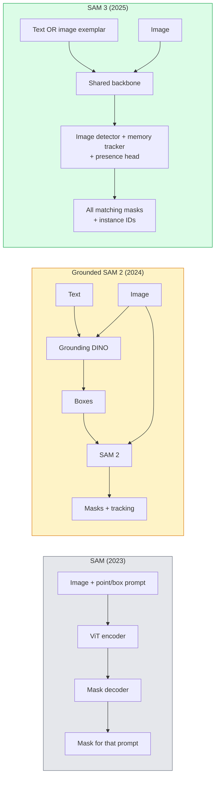

```markdown
# SAM 3 i Open-Vocabulary Segmentation

> Daj modelowi podpowiedź tekstową i obraz, a otrzymasz maski dla każdego pasującego obiektu. SAM 3 zrealizował to w jednym forward pass.

**Typ:** Użycie + Budowanie
**Języki:** Python
**Wymagania wstępne:** Phase 4 Lesson 07 (U-Net), Phase 4 Lesson 08 (Mask R-CNN), Phase 4 Lesson 18 (CLIP)
**Szacowany czas:** ~60 minut

## Cele uczenia się

- Rozróżniać SAM (tylko wizualne prompty), Grounded SAM / SAM 2 (detektor + SAM) i SAM 3 (natywne tekstowe prompty przez Promptable Concept Segmentation)
- Wyjaśnić architekturę SAM 3: shared backbone + detektor obrazu + memory-based video tracker + presence head + decoupled detector-tracker design
- Używać integracji Hugging Face `transformers` SAM 3 do text-prompted detection, segmentacji i video tracking
- Wybierać między SAM 3, Grounded SAM 2, YOLO-World i SAM-MI na podstawie latency, złożoności konceptu i targetu deploymentu

## Problem

SAM z 2023 roku był modelem obsługującym tylko wizualne prompty: klikasz punkt lub rysujesz prostokąt i zwraca maskę. Dla "pokaż mi wszystkie pomarańcze na tym zdjęciu" potrzebowałeś detektora (Grounding DINO), żeby wygenerować boxes, a potem SAM, żeby segmentować każdy z nich. Grounded SAM zamienił to w pipeline, ale to była kaskada dwóch zamrożonych modeli z nieuniknionym akumulowaniem błędów.

SAM 3 (Meta, Nov 2025, ICLR 2026) zlikwidował kaskadę. Akceptuje krótką frazę rzeczownikową lub obraz-przykład jako prompt, i zwraca wszystkie pasujące maski i instance IDs w jednym forward pass. To jest **Promptable Concept Segmentation (PCS)**. W połączeniu z aktualizacją Object Multiplex z marca 2026 (SAM 3.1), śledzi wiele instancji tego samego konceptu przez wideo wydajnie.

Ta lekcja dotyczy strukturalnej zmiany, którą to reprezentuje. 2D seg, detection i text-image grounding połączyły się w jeden model. Produkcja pytanie nie brzmi już "jaki pipeline ze sobą połączę", ale "który promptowalny model obsłuży mój przypadek użycia end-to-end."

## Koncepcja

### Trzy generacje



### Promptable Concept Segmentation

"Concept prompt" to krótka fraza rzeczownikowa (`"yellow school bus"`, `"striped red umbrella"`, `"hand holding a mug"`) lub obraz-przykład. Model zwraca maski segmentacji dla każdej instancji na obrazie, która pasuje do konceptu, plus unikalne instance ID per match.

To różni się od klasycznego visual-prompt SAM w trzech aspektach:

1. Nie wymaga per-instance prompting — jeden tekst prompt zwraca wszystkie matches.
2. Open-vocabulary — koncept może być czymkolwiek opisywalnym w natural language.
3. Zwraca wiele instancji na raz zamiast jednej maski per prompt.

### Kluczowe elementy architektury

- **Shared backbone** — pojedynczy ViT przetwarza obraz. Oba detektor head i memory-based tracker z niego czytają.
- **Presence head** — przewiduje czy koncept jest obecny na obrazie w ogóle. Decouples "is this here?" od "where is it?", redukuje false positives na absent concepts.
- **Decoupled detector-tracker** — image-level detection i video-level tracking mają osobne heads, więc nie zakłócają się nawzajem.
- **Memory bank** — przechowuje per-instance features przez klatki dla video tracking (ten sam mechanizm co używał SAM 2).

### Training na skali

SAM 3 był trenowany na **4 milionach unikalnych konceptów** wygenerowanych przez data engine, który iteracyjnie annotuje i poprawia używając AI + human review. Nowy **SA-CO benchmark** zawiera 270K unikalnych konceptów, 50x większy niż poprzednie benchmarki. SAM 3 osiąga 75-80% ludzkiej wydajności na SA-CO i podwaja istniejące systemy na image + video PCS.

### SAM 3.1 Object Multiplex

Aktualizacja z marca 2026: **Object Multiplex** wprowadza shared-memory mechanism dla joint tracking wielu instancji tego samego konceptu na raz. Wcześniej, tracking N instancji oznaczał N osobnych memory banks. Multiplex to collapsuje w jeden shared memory z per-instance queries. Rezultat: zasadniczo szybszy multi-object tracking, ale bez poświęcania accuracy.

### Gdzie Grounded SAM nadal ma znaczenie w 2026

- Gdy potrzebujesz specyficzny open-vocabulary detector podmienić (DINO-X, Florence-2).
- Gdy licencja SAM 3 (gated na HF) jest blockerem.
- Gdy potrzebujesz większej kontroli nad threshold detektora niż SAM 3 exposeuje.
- Dla research / ablation work na komponencie detektora.

Modularne pipeliny nadal mają swoje miejsce. Dla większości produkcyjnej pracy, SAM 3 jest prostszą odpowiedzią.

### YOLO-World vs SAM 3

- **YOLO-World** — tylko open-vocabulary detector (bez masek). Real-time. Najlepszy gdy potrzebujesz boxes w wysokim fps.
- **SAM 3** — full segmentation + tracking. Wolniejszy ale bogatszy output.

Produkcja split: YOLO-World dla fast detection-only pipelines (robotics navigation, fast dashboards), SAM 3 dla wszystkiego co wymaga masek lub tracking.

### SAM-MI efficiency

SAM-MI (2025-2026) adresuje SAM's decoder bottleneck. Kluczowe idee:

- **Sparse point prompting** — używa kilku dobrze wybranych points zamiast dense prompts; redukuje decoder calls o 96%.
- **Shallow mask aggregation** — merguje rough mask predictions w jedną ostrzejszą maskę.
- **Decoupled mask injection** — decoder otrzymuje pre-computed mask features zamiast re-run.

Rezultat: ~1.6× speedup nad Grounded-SAM na open-vocabulary benchmarks.

### Output format dla trzech modeli

Wszystkie zwracają tę samą ogólną strukturę (boxes + labels + scores + masks + IDs), co jest pomocne — Twój downstream pipeline nie musi branchować na tym, który model uruchomił.

## Zbuduj To

### Krok 1: Konstrukcja podpowiedzi

Zbuduj helper który zamienia zdanie użytkownika w listę SAM 3 concept prompts. To jest granica gdzie "co użytkownik wpisał" spotyka "co model konsumuje".

```python
def split_concepts(sentence):
    """
    Heuristic splitter for multi-concept prompts.
    Zwraca listę krótkich fraz rzeczownikowych.
    """
    for sep in [",", ";", "and", "or", "&"]:
        if sep in sentence:
            parts = [p.strip() for p in sentence.replace("and ", ",").split(",")]
            return [p for p in parts if p]
    return [sentence.strip()]

print(split_concepts("cats, dogs and balloons"))
```

SAM 3 akceptuje jeden koncept per forward pass; dla multi-concept queries, loopuj lub batchuj je.

### Krok 2: Post-processing helpers

Zamień raw outputs SAM 3 w czystą listę detections, która pasuje do naszego Phase 4 Lesson 16 pipeline contract.

```python
from dataclasses import dataclass
from typing import List

@dataclass
class ConceptDetection:
    concept: str
    instance_id: int
    box: tuple          # (x1, y1, x2, y2)
    score: float
    mask_rle: str       # run-length encoded


def rle_encode(binary_mask):
    flat = binary_mask.flatten().astype("uint8")
    runs = []
    prev, count = flat[0], 0
    for v in flat:
        if v == prev:
            count += 1
        else:
            runs.append((int(prev), count))
            prev, count = v, 1
    runs.append((int(prev), count))
    return ";".join(f"{v}x{c}" for v, c in runs)
```

RLE utrzymuje response payloads small nawet dla wielu high-resolution masek. Ten sam format działa przez SAM 2, SAM 3, Grounded SAM 2.

### Krok 3: Unified open-vocab segmentation interface

Owiń cokolwiek backend masz (SAM 3, Grounded SAM 2, YOLO-World + SAM 2) za jedną metodą. Twój downstream code nie zmienia się, gdy backend się zmienia.

```python
from abc import ABC, abstractmethod
import numpy as np

class OpenVocabSeg(ABC):
    @abstractmethod
    def detect(self, image: np.ndarray, concept: str) -> List[ConceptDetection]:
        ...


class StubOpenVocabSeg(OpenVocabSeg):
    """
    Deterministic stub used for pipeline testing when real models are not loaded.
    """
    def detect(self, image, concept):
        h, w = image.shape[:2]
        return [
            ConceptDetection(
                concept=concept,
                instance_id=0,
                box=(w * 0.2, h * 0.3, w * 0.5, h * 0.8),
                score=0.89,
                mask_rle="0x100;1x50;0x200",
            ),
            ConceptDetection(
                concept=concept,
                instance_id=1,
                box=(w * 0.55, h * 0.25, w * 0.85, h * 0.75),
                score=0.74,
                mask_rle="0x80;1x40;0x220",
            ),
        ]
```

Realna podklasa `SAM3OpenVocabSeg` opakowałaby `transformers.Sam3Model` i `Sam3Processor`.

### Krok 4: Użycie Hugging Face SAM 3 (referencja)

Dla actual model, integracja `transformers`:

```python
from transformers import Sam3Processor, Sam3Model
import torch

processor = Sam3Processor.from_pretrained("facebook/sam3")
model = Sam3Model.from_pretrained("facebook/sam3").eval()

inputs = processor(images=pil_image, return_tensors="pt")
inputs = processor.set_text_prompt(inputs, "yellow school bus")

with torch.no_grad():
    outputs = model(**inputs)

masks = processor.post_process_masks(
    outputs.masks, inputs.original_sizes, inputs.reshaped_input_sizes
)
boxes = outputs.boxes
scores = outputs.scores
```

Jeden prompt, wszystkie matches zwrócone w jednym wywołaniu.

### Krok 5: Zmierz co Grounded SAM 2 dawał Ci za free

Uczciwy benchmark: co się dzieje gdy zastąpisz Grounded SAM 2 przez SAM 3 w realnym pipeline?

- Latency: SAM 3 oszczędza jeden forward pass (brak oddzielnego detektora), ale sam model jest cięższy; zwykle net-neutral lub lekkie speedup, ale podobne na common single-word concepts.
- Accuracy: SAM 3 substantially better na rare lub compositional concepts ("striped red umbrella"). Podobne na common single-word concepts.
- Flexibility: Grounded SAM 2 pozwala podmieniać detektory (DINO-X, Florence-2, Grounding DINO 1.5); SAM 3 jest monolithic.

Konkluzja: SAM 3 jest domyślnym wyborem dla 2026 open-vocab seg. Grounded SAM 2 jest nadal prawidłową odpowiedzią, gdy potrzebujesz detector flexibility lub innych warunków licencyjnych.

## Użyj To

Produkcyjne wzorce deployment:

- **Real-time annotation** — SAM 3 + CVAT's label-as-text-prompt feature. Anotatorzy wybierają nazwę etykiety; SAM 3 pre-labeluje każde pasujące instance. Review i poprawiaj.
- **Video analytics** — SAM 3.1 Object Multiplex dla multi-object tracking; feeduj klatki do memory-based trackera.
- **Robotics** — SAM 3 dla open-vocab manipulation ("pick up the red cup"); działa jako planning primitive.
- **Medical imaging** — SAM 3 fine-tuned na medical concepts; wymaga access request na HF.

Ultralytics opakowuje SAM 3 w swoim Python package:

```python
from ultralytics import SAM

model = SAM("sam3.pt")
results = model(image_path, prompts="yellow school bus")
```

Ten sam interface co YOLO i SAM 2.

## Wyślij To

Ta lekcja produkuje:

- `outputs/prompt-open-vocab-stack-picker.md` — prompt, który wybiera SAM 3 / Grounded SAM 2 / YOLO-World / SAM-MI na podstawie latency, concept complexity i licencji.
- `outputs/skill-concept-prompt-designer.md` — skill, który zamienia user utterances w dobrze sformułowane SAM 3 concept prompts (splitting, disambiguation, fallbacks).

## Ćwiczenia

1. **(Łatwe)** Uruchom SAM 3 na 10 obrazach z concept prompts, które wybierzesz. Porównaj z SAM 2 + Grounding DINO 1.5 na tych samych obrazach. Zreportuj, które koncepty każdy model przegapił.
2. **(Średnie)** Zbuduj UI "click-to-include / click-to-exclude" na szczycie SAM 3: tekst prompt zwraca candidate instances; użytkownik klika, które mają być wliczane jako pozytywne. Output finalny concept set jako JSON.
3. **(Trudne)** Fine-tune SAM 3 na custom concept set (np. 5 typów komponentów elektronicznych) z 20 labelled images każdy. Porównaj do zero-shot SAM 3 na tym samym test set; zmierz mask IoU improvement.

## Kluczowe Terminy

| Termin | Co ludzie mówią | Co to faktycznie oznacza |
|------|----------------|----------------------|
| Open-vocabulary segmentation | "Segment by text" | Produkcja masek dla obiektów opisanych w natural language, nie fixed label set |
| PCS | "Promptable Concept Segmentation" | Core task SAM 3 — dany noun-phrase lub image exemplar, segmentuj wszystkie pasujące instances |
| Concept prompt | "The text input" | Krótka fraza rzeczownikowa lub image exemplar; nie pełne zdanie |
| Presence head | "Is it here?" | Moduł SAM 3 który decyduje czy koncept istnieje na obrazie przed lokalizacją |
| SA-CO | "SAM 3 benchmark" | 270K-concept open-vocabulary segmentation benchmark; 50x większy niż prior open-vocab benchmarks |
| Object Multiplex | "SAM 3.1 update" | Shared-memory multi-object tracking; szybki joint tracking wielu instancji |
| Grounded SAM 2 | "Modular pipeline" | Detector + SAM 2 cascade; nadal relevant gdy detector swap ma znaczenie |
| SAM-MI | "Efficient SAM variant" | Mask Injection dla 1.6x speedup nad Grounded-SAM |

## Dalsze Czytanie

- [SAM 3: Segment Anything with Concepts (arXiv 2511.16719)](https://arxiv.org/abs/2511.16719)
- [SAM 3.1 Object Multiplex (Meta AI, March 2026)](https://ai.meta.com/blog/segment-anything-model-3/)
- [SAM 3 model page on Hugging Face](https://huggingface.co/facebook/sam3)
- [Grounded SAM 2 tutorial (PyImageSearch)](https://pyimagesearch.com/2026/01/19/grounded-sam-2-from-open-set-detection-to-segmentation-and-tracking/)
- [Ultralytics SAM 3 docs](https://docs.ultralytics.com/models/sam-3/)
- [SAM3-I: Instruction-aware SAM (arXiv 2512.04585)](https://arxiv.org/abs/2512.04585)
```