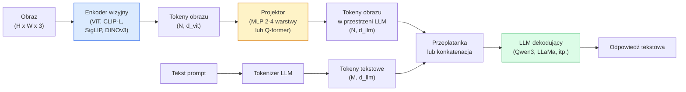

```markdown
# Modele wizyjno-językowe — wzorzec ViT-MLP-LLM

> Enkoder wizyjny konwertuje obraz na tokeny. Projektor MLP mapuje te tokeny w przestrzeń osadzeń LLM. Model językowy robi resztę. Ten wzorzec — ViT-MLP-LLM — to każdy produkcyjny VLM w 2026 roku.

**Typ:** Nauka + Zastosowanie
**Języki:** Python
**Wymagania wstępne:** Faza 4 Lekcja 14 (ViT), Faza 4 Lekcja 18 (CLIP), Faza 7 Lekcja 02 (Self-Attention)
**Szacowany czas:** ~75 minut

## Cele uczenia się

- Opisać architekturę ViT-MLP-LLM i wyjaśnić, co wnosi każdy z trzech komponentów
- Porównać Qwen3-VL, InternVL3.5, LLaVA-Next i GLM-4.6V pod względem liczby parametrów, długości kontekstu i wyników benchmarkowych
- Wyjaśnić DeepStack: dlaczego cechy ViT na wielu poziomach poprawiają wyrównanie wizyjno-językowe lepiej niż cechy z pojedynczej ostatniej warstwy
- Mierzyć halucynacje VLM w produkcji za pomocą Cross-Modal Error Rate (CMER) i działać na podstawie sygnału

## Problem

CLIP (Faza 4 Lekcja 18) daje współdzieloną przestrzeń osadzeń dla obrazów i tekstu, co wystarcza do klasyfikacji zero-shot i wyszukiwania. Nie może odpowiedzieć na pytanie "ile jest czerwonych samochodów na tym obrazie?" ponieważ CLIP nie generuje tekstu — tylko ocenia podobieństwa.

Modele wizyjno-językowe (VLM) — Qwen3-VL, InternVL3.5, LLaVA-Next, GLM-4.6V — doczepiają enkoder obrazu z rodziny CLIP do pełnego modelu językowego. Model widzi obraz plus pytanie i generuje odpowiedź. W 2026 roku otwarte VLM dorównują lub przewyższają GPT-5 i Gemini-2.5-Pro na benchmarkach multimodalnych (MMMU, MMBench, DocVQA, ChartQA, MathVista, OSWorld).

Trójka komponentów (ViT, projektor, LLM) to standard. Różnice między modelami tkwią w tym, który ViT, który projektor, który LLM, jakie dane treningowe i przepis na wyrównanie. Gdy raz zrozumiesz wzorzec, zamiana dowolnego komponentu jest mechaniczna.

## Koncepcja

### Architektura ViT-MLP-LLM



1. **Enkoder wizyjny** — wstępnie wytrenowany ViT (CLIP-L/14, SigLIP, DINOv3 lub dostrojona wersja). Produkuje tokeny patchów.
2. **Projektor** — mały moduł (MLP 2-4 warstwy lub Q-former) mapujący tokeny wizyjne w wymiar osadzeń LLM. To tutaj zachodzi większość strojenia.
3. **LLM** — decoder-only model językowy (Qwen3, Llama, Mistral, GLM, InternLM). Czyta tokeny wizyjne + tekstowe w sekwencji, generuje tekst.

Wszystkie trzy komponenty są trenowalne w zasadzie. W praktyce enkoder wizyjny i LLM pozostają głównie zamrożone, a trenowany jest projektor — kilka miliardów parametrów sygnału za tanio.

### DeepStack

Vanilla projekcja używa tylko ostatniej warstwy ViT. DeepStack (Qwen3-VL) próbkuje cechy z wielu głębokości ViT i składa je. Głębsze warstwy niosą semantykę wysokiego poziomu, a płytsze warstwy niosą szczegółowe informacje przestrzenne i teksturalne. Podawanie obu do LLM zamyka lukę między "co obraz zawiera" (semantyka) a "dokładnie gdzie" (uzasadnienie przestrzenne).

### Trzy etapy treningu

Nowoczesne VLM trenują etapowo:

1. **Wyrównanie (Alignment)** — zamroź ViT i LLM. Trenuj tylko projektor na parach obraz-opis. Uczy projektor mapować przestrzeń wizyjną w przestrzeń językową.
2. **Pre-trening** — odmroź wszystko. Trenuj na danych na dużą skalę przeplatanych obraz-tekst (500M+ par). Buduje wizualną wiedzę modelu.
3. **Strojenie instrukcji** — fine-tune na starannie dobranych trójkach (obraz, pytanie, odpowiedź). Uczy zachowania konwersacyjnego i formaty zadań. To właśnie zamienia "świadomy wizualnie LM" w użytecznego asystenta.

Większość LoRA fine-tune'ów celuje w etap 3 z małym oznakowanym zbiorem danych.

### Porównanie rodzin modeli (wczesny 2026)

| Model | Parametry | Enkoder wizyjny | LLM | Kontekst | Zalety |
|-------|-----------|-----------------|-----|----------|--------|
| Qwen3-VL-235B-A22B (MoE) | 235B (22B aktywnych) | custom ViT + DeepStack | Qwen3 | 256K | General SOTA, agent GUI |
| Qwen3-VL-30B-A3B (MoE) | 30B (3B aktywnych) | custom ViT + DeepStack | Qwen3 | 256K | Mniejszy wariant MoE |
| Qwen3-VL-8B (dense) | 8B | custom ViT | Qwen3 | 128K | Produkcja dense default |
| InternVL3.5-38B | 38B | InternViT-6B | Qwen3 + GPT-OSS | 128K | Silny MMBench / MMVet |
| InternVL3.5-241B-A28B | 241B (28B aktywnych) | InternViT-6B | Qwen3 | 128K | Konkurencyjny z GPT-4o |
| LLaVA-Next 72B | 72B | SigLIP | Llama-3 | 32K | Otwarty, łatwy do fine-tune |
| GLM-4.6V | ~70B | custom | GLM | 64K | Open-source, silny OCR |
| MiniCPM-V-2.6 | 8B | SigLIP | MiniCPM | 32K | Przyjazny dla edge |

### Agenci wizualni

Qwen3-VL-235B osiąga top globalną wydajność na OSWorld — benchmark dla **agentów wizualnych** operujących GUI (desktop, mobile, web). Model widzi screenshot, rozumie UI i emituje akcje (klik, wpisz, przewiń). W połączeniu z narzędziami zamyka pętlę na typowych zadaniach desktopowych. To właśnie chodzi pod maską większości demosów "AI PC" z 2026 roku.

### Zdolności agentyczne + warianty RoPE

VLM muszą wiedzieć **kiedy** klatka jest w wideo. Qwen3-VL ewoluował z T-RoPE (temporal rotary position embeddings) do **wyrównania czasowego opartego na tekście** — jawnych tokenów znaczników czasowych przeplatanych z klatkami wideo. Model widzi "`<timestamp 00:32>` klatka, prompt" i może wnioskować o relacjach czasowych.

### Problem wyrównania

12% par obraz-tekst w crawled dataset zawiera opisy nie w pełni uzasadnione w obrazie. VLM trenowany na tym cicho uczy się halucynować — fabrykować obiekty, źle odczytywać liczby, wymyślać relacje. W produkcji to dominujący tryb awarii.

Skywork.ai wprowadził **Cross-Modal Error Rate (CMER)** do śledzenia tego:

```
CMER = frakcja outputów gdzie pewność tekstowa jest wysoka, ale podobieństwo obraz-tekst (przez checker z rodziny CLIP) jest niskie
```

Wysoki CMER oznacza, że model pewnie mówi rzeczy nieuzasadnione w obrazie. Monitorowanie CMER i traktowanie go jako produkcyjnego KPI zmniejszyło halucynacje o ~35% w ich deploymencie. Trick polega na tym, żeby nie "naprawić model", ale "routować high-CMER outputs do human review."

### Fine-tuning z LoRA / QLoRA

Full fine-tuning 70B VLM jest poza zasięgiem większości zespołów. LoRA (rank 16-64) na attention + projektor layers, lub QLoRA z 4-bit base weights, mieści się na pojedynczym A100 / H100. Koszt: 5000-50000 przykładów, $100-$5000 w compute, 2-10 godzin treningu.

### Rozumowanie przestrzenne wciąż słabe

Obecne VLM osiągają 50-60% na benchmarkach rozumowania przestrzennego (powyżej-poniżej, lewo-prawo, liczenie, dystans). Jeśli twój use case zależy od "który obiekt jest na górze którego", waliduj mocno — generyczna wydajność VLM jest poniżej ludzkiej. Lepsze alternatywy niż VLM dla czysto przestrzennych zadań: specjalizowany keypoint / pose estimator, model głębi, lub model detekcji z post-processing geometrii boxów.

## Zbuduj to

### Krok 1: Projektor

Część, którą będziesz trenować najczęściej. MLP 2-4 warstwy z GELU.

```python
import torch
import torch.nn as nn


class Projector(nn.Module):
    def __init__(self, vit_dim=768, llm_dim=4096, hidden=4096):
        super().__init__()
        self.net = nn.Sequential(
            nn.Linear(vit_dim, hidden),
            nn.GELU(),
            nn.Linear(hidden, llm_dim),
        )

    def forward(self, x):
        return self.net(x)
```

Input to tensor tokenów `(N_patches, d_vit)`. Output to `(N_patches, d_llm)`. LLM traktuje każdy wiersz outputu jako po prostu kolejny token.

### Krok 2: Assemble ViT-MLP-LLM end-to-end

Szkielet forward passa dla minimalnego VLM. Realny kod używa `transformers`, to jest konceptualny układ.

```python
class MinimalVLM(nn.Module):
    def __init__(self, vit, projector, llm, image_token_id):
        super().__init__()
        self.vit = vit
        self.projector = projector
        self.llm = llm
        self.image_token_id = image_token_id  # placeholder token in text prompt

    def forward(self, image, input_ids, attention_mask):
        # 1. vision features
        vision_tokens = self.vit(image)                     # (B, N_patches, d_vit)
        vision_embeds = self.projector(vision_tokens)       # (B, N_patches, d_llm)

        # 2. text embeddings
        text_embeds = self.llm.get_input_embeddings()(input_ids)  # (B, M, d_llm)

        # 3. replace image placeholder tokens with vision embeds
        merged = self._merge(text_embeds, vision_embeds, input_ids)

        # 4. run LLM
        return self.llm(inputs_embeds=merged, attention_mask=attention_mask)

    def _merge(self, text_embeds, vision_embeds, input_ids):
        out = text_embeds.clone()
        expected = vision_embeds.size(1)
        for b in range(input_ids.size(0)):
            positions = (input_ids[b] == self.image_token_id).nonzero(as_tuple=True)[0]
            if len(positions) != expected:
                raise ValueError(
                    f"batch item {b} has {len(positions)} image tokens but vision_embeds has {expected} patches."
                    " Every sample in the batch must be pre-padded to the same number of image placeholder tokens.")
            out[b, positions] = vision_embeds[b]
        return out
```

Token placeholder `<image>` w tekście jest zastępowany prawdziwymi osadzeniami obrazu — ten sam wzorzec co LLaVA, Qwen-VL i InternVL używają.

### Krok 3: Obliczanie CMER

Lekki runtime check.

```python
import torch.nn.functional as F


def cross_modal_error_rate(image_emb, text_emb, text_confidence, sim_threshold=0.25, conf_threshold=0.8):
    """
    image_emb, text_emb: embeddings of image and generated text (normalised internally)
    text_confidence:     mean per-token probability in [0, 1]
    Returns:             fraction of high-confidence outputs with low image-text alignment
    """
    image_emb = F.normalize(image_emb, dim=-1)
    text_emb = F.normalize(text_emb, dim=-1)
    sim = (image_emb * text_emb).sum(dim=-1)        # cosine similarity
    high_conf_low_sim = (text_confidence > conf_threshold) & (sim < sim_threshold)
    return high_conf_low_sim.float().mean().item()
```

Traktuj CMER jako produkcyjny KPI. Monitoruj go per endpoint, per typ promptu, per klient. Rosnący CMER wskazuje, że model zaczyna halucynować na jakimś rozkładzie danych wejściowych.

### Krok 4: Toy VLM classifier (runnable)

Demonstrate, że projektor się trenuje. Fake "ViT features" wchodzą, a tiny LLM-style token przewiduje klasę.

```python
class ToyVLM(nn.Module):
    def __init__(self, vit_dim=32, llm_dim=64, num_classes=5):
        super().__init__()
        self.projector = Projector(vit_dim, llm_dim, hidden=64)
        self.head = nn.Linear(llm_dim, num_classes)

    def forward(self, vision_tokens):
        projected = self.projector(vision_tokens)
        pooled = projected.mean(dim=1)
        return self.head(pooled)
```

Można to dopasować na syntetycznych (feature, class) pairs w mniej niż 200 krokach — wystarczająco, żeby pokazać, że wzorzec projektor działa.

## Użyj tego

Trzy sposoby, w jakich zespoły produkcyjne używają VLM w 2026:

- **Hosted API** — OpenAI Vision, Anthropic Claude Vision, Google Gemini Vision. Zero infra, vendor risk.
- **Open-source self-host** — Qwen3-VL lub InternVL3.5 przez `transformers` i `vllm`. Pełna kontrola, wyższy up-front effort.
- **Fine-tune na domenie** — załaduj Qwen2.5-VL-7B lub LLaVA-1.6-7B, LoRA na 5k-50k custom examples, serwuj z `vllm` lub `TGI`.

```python
from transformers import AutoProcessor, AutoModelForVision2Seq
import torch
from PIL import Image

model_id = "Qwen/Qwen3-VL-8B-Instruct"
processor = AutoProcessor.from_pretrained(model_id)
model = AutoModelForVision2Seq.from_pretrained(model_id, torch_dtype=torch.bfloat16, device_map="auto")

messages = [{
    "role": "user",
    "content": [
        {"type": "image", "image": Image.open("plot.png")},
        {"type": "text", "text": "What does this chart show?"},
    ],
}]
inputs = processor.apply_chat_template(messages, add_generation_prompt=True, tokenize=True, return_dict=True, return_tensors="pt").to("cuda")
generated = model.generate(**inputs, max_new_tokens=256)
answer = processor.decode(generated[0][inputs["input_ids"].shape[1]:], skip_special_tokens=True)
```

`apply_chat_template` ukrywa tokenizację placeholdera `<image>`, model obsługuje merge wewnętrznie.

## Wyślij to

Ta lekcja produkuje:

- `outputs/prompt-vlm-selector.md` — wybiera Qwen3-VL / InternVL3.5 / LLaVA-Next / API biorąc pod uwagę accuracy, latency, długość kontekstu i budżet.
- `outputs/skill-cmer-monitor.md` — emituje kod do instrumentacji produkcyjnego VLM endpoint z cross-modal error rate, per-endpoint dashboards i progami alertowymi.

## Ćwiczenia

1. **(Łatwe)** Uruchom trzy prompty ("co to jest?", "policz obiekty", "opisz scenę") przez dowolny open VLM na pięciu obrazach. Oceń każdą odpowiedź jako poprawna / częściowo poprawna / zhalucynowana ręcznie. Oblicz first-pass CMER-like rate.
2. **(Średnie)** Fine-tune Qwen2.5-VL-3B lub LLaVA-1.6-7B z LoRA (rank 16) na 500 obrazach target domeny z opisami. Porównaj zero-shot vs fine-tuned MMBench-style accuracy.
3. **(Trudne)** Zamień enkoder obrazu VLM na DINOv3 zamiast jego domyślnego SigLIP/CLIP. Przetrénuj tylko projektor (zamrożony LLM + zamrożony DINOv3). Zmierz, czy dense-prediction tasks (liczenie, rozumowanie przestrzenne) się poprawiają.

## Kluczowe terminy

| Termin | Co ludzie mówią | Co to faktycznie oznacza |
|--------|----------------|-------------------------|
| ViT-MLP-LLM | "Wzorzec VLM" | Enkoder wizyjny + projektor + model językowy; każdy VLM z 2026 |
| Projektor | "Most" | MLP 2-4 warstwy (lub Q-former) mapujący tokeny wizyjne w przestrzeń osadzeń LLM |
| DeepStack | "Trik z cechami Qwen3-VL" | Wielopoziomowe cechy ViT składane zamiast tylko ostatniej warstwy |
| Image token | "<image> placeholder" | Specjalny token w strumieniu tekstowym zastępowany przez projected vision embeddings |
| CMER | "KPI halucynacji" | Cross-Modal Error Rate; wysoki, gdy pewność tekstowa jest wysoka, ale podobieństwo obraz-tekst jest niskie |
| Agent wizualny | "VLM który klika" | VLM operujący GUI (OSWorld, mobile, web) z tool calls |
| Q-former | "Most z fixed-count token bridge" | BLIP-2 style projektor produkujący fixed number of visual query tokens |
| Alignment / pre-training / instruction tuning | "Trzy etapy" | Standardowy pipeline treningowy VLM |
```