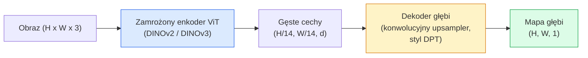

# Estymacja głębi monokularnej i geometrii

> Mapa głębi to obraz jednokanałowy, w którym każdy piksel reprezentuje odległość od kamery. Predykcja tej wartości z pojedynczej klatki RGB kiedyś była niemożliwa bez stereo czy LiDAR. W 2026 roku zamrożony enkoder ViT plus lekki decoder osiąga dokładność w granicach kilku procent od prawdy gruntu.

**Typ:** Budowanie + Użycie
**Języki:** Python
**Wymagania wstępne:** Lekcja 14 z fazy 4 (ViT), Lekcja 17 z fazy 4 (Samonadzorowane widzenie komputerowe), Lekcja 7 z fazy 4 (U-Net)
**Szacowany czas:** ~60 minut

## Cele uczenia się

- Rozróżnić głębię względną i metryczną oraz określić, którą z nich rozwiązuje każdy produkcyjny model (MiDaS, Marigold, Depth Anything V3, ZoeDepth)
- Użyć Depth Anything V3 (backbone DINOv2) do predykcji głębi dla dowolnych pojedynczych obrazów bez kalibracji
- Wyjaśnić, dlaczego głębia monokularna działa w ogóle z pojedynczego obrazu (wskaźniki perspektywy, gradienty tekstury, wyuczone priory) oraz czego nie może odzyskać (skala bezwzględna, geometria zasłonięta)
- Przekształcić detekcje 2D w punkty 3D używając mapy głębi i wewnętrznych parametrów kamery otworkowej

## Problem

Głębia to brakująca oś w widzeniu komputerowym 2D. Mając RGB, wiesz, gdzie obiekty pojawiają się na płaszczyźnie obrazu; nie wiesz jednak, jak daleko są. Czujniki głębi (układy stereo, LiDAR, time-of-flight) rozwiązują to bezpośrednio, ale są drogie, delikatne i ograniczone w zasięgu.

Estymacja głębi monokularnej — predykcja głębi z pojedynczej klatki RGB — kiedyś dawała rozmyte, niewiarygodne wyniki. Do 2026 roku wyszkolone na dużych zbiorach enkodery to zmieniły: Depth Anything V3 używa zamrożonego backbone'u DINOv2 i produkuje mapy głębi, które uogólniają się na domeny wewnątrz-/zewnątrz- pomieszczeń, medyczne i satelitarne. Marigold przeformułowuje głębię jako warunkowy problem dyfuzyjny. ZoeDepth regresuje prawdziwe odległości metryczne.

Głębia jest też pomostem między detekcją 2D a rozumieniem 3D: mnożąc piksele wykrytego bounding boxa przez głębię, przekształcasz obiekt 2D w chmurę punktów 3D. To sedno każdego systemu okluzji AR, każdej pipeline'u unikania przeszkód i każdego robota „podnieś kubek".

## Koncepcja

### Głębia względna vs metryczna

- **Głębia względna** — uporządkowane wartości `z` bez jednostki świata rzeczywistego. „Piksel A jest bliżej niż piksel B, ale stosunek odległości nie jest zakotwiczony w metrach."
- **Głębia metryczna** — bezwzględna odległość w metrach od kamery. Wymaga, aby model nauczył się statystycznej zależności między wskaźnikami obrazowymi a rzeczywistą odległością.

MiDaS i Depth Anything V3 produkują głębię względną. Marigold produkuje głębię względną. ZoeDepth, UniDepth i Metric3D produkują głębię metryczną. Modele metryczne są wrażliwe na wewnętrzne parametry kamery; modele względne nie są.

### Wzorzec enkoder-dekoder



Depth Anything V3 zamraża enkoder i trenuje tylko dekoder w stylu DPT. Enkoder dostarcza bogate cechy; dekoder interpoluje je z powrotem do rozdzielczości obrazu i regresuje głębię.

### Dlaczego pojedynczy obraz w ogóle produkuje głębię

Obraz 2D zawiera wiele monokularnych wskaźników, które korelują z głębią:

- **Perspektywa** — równoległe linie w 3D zbiegają się w 2D.
- **Gradient tekstury** — powierzchnie daleko mają mniejszą, gęstszą teksturę.
- **Kolejność zasłaniania** — bliższe obiekty zasłaniają dalsze.
- **Stałość rozmiaru** — znane obiekty (samochody, ludzie) dają przybliżoną skalę.
- **Perspektywa atmosferyczna** — dalsze obiekty wyglądają na bardziej zamglone i niebieskawe na zewnętrznych scenach.

ViT wytrenowany na miliardach obrazów internalizuje te wskaźniki. Przy wystarczającej ilości danych i silnym backbone'u, głębia monokularna osiąga rozsądną dokładność bez żadnego jawnego nadzoru 3D.

### Czego głębia monokularna nie może zrobić

- **Bezwzględnej skali metrycznej** bez wewnętrznych parametrów lub znanego obiektu w scenie. Sieć może przewidzieć „kubek jest dwa razy dalej niż łyżeczka" bez znajomości, czy kubek jest w odległości 1 m czy 10 m.
- **Geometrii zasłoniętej** — tył krzesła jest niewidoczny i nie może być wiarygodnie wywnioskowany.
- **Prawdziwie nienteksturowanych / odbijających powierzchni** — lusterka, szkło, jednolite ściany. Sieć raportuje plauzybilną, ale błędną głębię.

### Depth Anything V3 w 2026

- Standardowy DINOv2 ViT-L/14 jako enkoder (zamrożony).
- Dekoder DPT.
- Trenowany na parach obrazów z różnych źródeł (bez jawnego nadzoru głębi poza fotometryczną spójnością).
- Przewiduje przestrzennie spójną geometrię z **dowolnej liczby wejść wizualnych, z lub bez znanych pozy kamery**.
- SOTA w głębi monokularnej, geometrii dowolnego widoku, renderowaniu wizualnym, estymacji pozy kamery.

To jest model do bezpośredniego wywołania, gdy potrzebujesz głębi w 2026.

### Marigold — dyfuzja dla głębi

Marigold (Ke et al., CVPR 2024) przeformułowuje estymację głębi jako warunkową dyfuzję obraz-do-obrazu. Warunek: RGB. Cel: mapa głębi. Używa wyszkolonego Stable Diffusion 2 U-Neta jako backbone'u. Wynikowe mapy głębi są wyjątkowo ostre na granicach obiektów. Kompromis: wolniejsza inferencja niż w modelach feed-forward (10-50 kroków odwijań).

### Wewnętrzne parametry i kamera otworkowa

Aby przekształcić piksel `(u, v)` z głębią `d` w punkt 3D `(X, Y, Z)` we współrzędnych kamery:

```
fx, fy, cx, cy = wewnętrzne parametry kamery
X = (u - cx) * d / fx
Y = (v - cy) * d / fy
Z = d
```

Wewnętrzne parametry pochodzą z metadanych EXIF, wzorca kalibracyjnego lub estymatora wewnętrznych parametrów monokularnego (Perspective Fields, UniDepth). Bez wewnętrznych parametrów nadal możesz renderować chmurę punktów zakładając FOV 60-70° i umiarkowanie rozdzielczościowy punkt główny — użyteczne do wizualizacji, nie do pomiaru.

### Ewaluacja

Dwie standardowe metryki:

- **AbsRel** (bezwzględny błąd względny): `mean(|d_pred - d_gt| / d_gt)`. Niższy jest lepszy. 0.05-0.1 dla modeli produkcyjnych.
- **delta < 1.25** (dokładność progu): frakcja pikseli, gdzie `max(d_pred/d_gt, d_gt/d_pred) < 1.25`. Wyższy jest lepszy. 0.9+ dla SOTA.

Dla głębi względnej (Depth Anything V3, MiDaS), ewaluacja używa wersji niezmienniczych względem skali i przesunięcia obu metryk.

## Budowanie

### Krok 1: Metryki głębi

```python
import torch

def abs_rel_error(pred, target, mask=None):
    if mask is not None:
        pred = pred[mask]
        target = target[mask]
    return (torch.abs(pred - target) / target.clamp(min=1e-6)).mean().item()


def delta_accuracy(pred, target, threshold=1.25, mask=None):
    if mask is not None:
        pred = pred[mask]
        target = target[mask]
    ratio = torch.maximum(pred / target.clamp(min=1e-6), target / pred.clamp(min=1e-6))
    return (ratio < threshold).float().mean().item()
```

Zawsze maskuj nieprawidłowe piksele głębi (zero, NaN, nasycone) przed ewaluacją.

### Krok 2: Wyrównanie skali i przesunięcia

Dla modeli głębi względnej, wyrównaj predykcję do prawdy gruntu przed obliczaniem metryk. Dopasowanie metodą najmniejszych kwadratów `a * pred + b = target`:

```python
def align_scale_shift(pred, target, mask=None):
    if mask is not None:
        p = pred[mask]
        t = target[mask]
    else:
        p = pred.flatten()
        t = target.flatten()
    A = torch.stack([p, torch.ones_like(p)], dim=1)
    coeffs, *_ = torch.linalg.lstsq(A, t.unsqueeze(-1))
    a, b = coeffs[:2, 0]
    return a * pred + b
```

Uruchom `align_scale_shift` przed `abs_rel_error` przy ewaluacji MiDaS / Depth Anything.

### Krok 3: Przekształcenie głębi w chmurę punktów

```python
import numpy as np

def depth_to_point_cloud(depth, intrinsics):
    H, W = depth.shape
    fx, fy, cx, cy = intrinsics
    v, u = np.meshgrid(np.arange(H), np.arange(W), indexing="ij")
    z = depth
    x = (u - cx) * z / fx
    y = (v - cy) * z / fy
    return np.stack([x, y, z], axis=-1)


depth = np.random.uniform(0.5, 4.0, (240, 320))
intr = (320.0, 320.0, 160.0, 120.0)
pc = depth_to_point_cloud(depth, intr)
print(f"point cloud shape: {pc.shape}  (H, W, 3)")
```

Jedna funkcja, każda aplikacja 3D-lifted. Eksportuj chmurę punktów do `.ply` i otwórz w MeshLab lub CloudCompare.

### Krok 4: Test dymny z syntetyczną sceną głębi

```python
def synthetic_depth(size=96):
    yy, xx = np.meshgrid(np.arange(size), np.arange(size), indexing="ij")
    # Podłoga: liniowy gradient od bliskiej (góra) do dalekiej (dół)
    depth = 1.0 + (yy / size) * 4.0
    # Box na środku: bliżej
    mask = (np.abs(xx - size / 2) < size / 6) & (np.abs(yy - size * 0.6) < size / 6)
    depth[mask] = 2.0
    return depth.astype(np.float32)


gt = torch.from_numpy(synthetic_depth(96))
pred = gt + 0.3 * torch.randn_like(gt)  # symulowana predykcja
aligned = align_scale_shift(pred, gt)
print(f"before align  absRel = {abs_rel_error(pred, gt):.3f}")
print(f"after align   absRel = {abs_rel_error(aligned, gt):.3f}")
```

### Krok 5: Użycie Depth Anything V3 (referencja)

```python
import torch
from transformers import pipeline
from PIL import Image

pipe = pipeline(task="depth-estimation", model="LiheYoung/depth-anything-v2-large")

image = Image.open("street.jpg").convert("RGB")
out = pipe(image)
depth_np = np.array(out["depth"])
```

Trzy linie. `out["depth"]` to PIL w skali szarości; konwertuj do numpy dla obliczeń. Dla Depth Anything V3 konkretnie, podmień model id po wydaniu; API pozostaje bez zmian.

## Użycie

- **Depth Anything V3** (Meta AI / ByteDance, 2024-2026) — domyślny wybór dla głębi względnej. Najszybszy model z ViT-large-backbone'em w produkcji.
- **Marigold** (ETH, 2024) — najwyższa jakość wizualna, wolna inferencja.
- **UniDepth** (ETH, 2024) — głębia metryczna z estymacją wewnętrznych parametrów kamery.
- **ZoeDepth** (Intel, 2023) — głębia metryczna; starszy, ale nadal niezawodny.
- **MiDaS v3.1** — starszy, ale stabilny; dobry baseline do porównań.

Typowy wzorzec integracji:

1. Rama RGB dociera.
2. Model głębi produkuje mapę głębi.
3. Detector produkuje bounding boksy.
4. Przekształć centroidy bboxów przez głębię do 3D; scal z chmurą punktów, jeśli dostępna.
5. Poniżej: okluzja AR, planowanie ścieżki, estymacja rozmiaru obiektu, zastępstwo stereo.

Do użytku real-time, Depth Anything V2 Small (kwantyzowany INT8) osiąga ~30 fps na konsumenckiej GPU przy 518x518.

## Wysyłka

Ta lekcja produkuje:

- `outputs/prompt-depth-model-picker.md` — wybiera między Depth Anything V3, Marigold, UniDepth, MiDaS biorąc pod uwagę latency, potrzebę metrycznej vs względnej i typ sceny.
- `outputs/skill-depth-to-pointcloud.md` — skill, który buduje chmury punktów z map głębi z prawidłową obsługą wewnętrznych parametrów i eksportem do `.ply`.

## Ćwiczenia

1. **(Łatwe)** Uruchom Depth Anything V2 na dowolnych 10 obrazach swojego biurka. Zapisz głębię jako PNG w skali szarości i sprawdź. Zidentyfikuj jeden obiekt, którego przewidziana głębia wygląda źle i wyjaśnij, dlaczego monokularne wskaźniki zawiodły.
2. **(Średnie)** Mając RGB + głębię z Depth Anything V2, przekształć do chmury punktów i wyrenderuj z `open3d`. Porównaj dwie sceny (wewnątrz / na zewnątrz) i zanotuj, która wygląda bardziej wiarygodnie.
3. **(Trudne)** Weź pięć par obrazów, które różnią się tylko pozycją znanego obiektu (np. butelka przesunięta 30 cm bliżej). Użyj UniDepth do predykcji głębi metrycznej na obu. Zgłoś deltę przewidzianej odległości vs prawdziwe 30 cm.

## Kluczowe terminy

| Termin | Co ludzie mówią | Co to faktycznie oznacza |
|--------|----------------|-------------------------|
| Monokularna głębia | „Głębia z pojedynczego obrazu" | Estymacja głębi z jednej klatki RGB, bez stereo czy LiDAR |
| Głębia względna | „Uporządkowana głębia" | Uporządkowane wartości z bez jednostek świata rzeczywistego |
| Głębia metryczna | „Bezwzględna odległość" | Głębia w metrach; wymaga kalibracji lub modelu trenowanego z nadzorem metrycznym |
| AbsRel | „Bezwzględny błąd względny" | Średnia z |d_pred - d_gt| / d_gt; standardowa metryka głębi |
| Dokładność delta | „delta < 1.25" | Frakcja pikseli z predykcją w granicach 25% prawdy gruntu |
| Kamera otworkowa | „fx, fy, cx, cy" | Model kamery używany do przekształcenia (u, v, d) w (X, Y, Z) |
| DPT | „Dense Prediction Transformer" | Dekoder konwolucyjny używany na szczycie zamrożonych enkoderów ViT dla głębi |
| Backbone DINOv2 | „Powód, dla którego to działa" | Cechy samonadzorowane, które uogólniają się między domenami bez etykiet głębi |

## Dalsze czytanie

- [Strona artykułu Depth Anything V3](https://depth-anything.github.io/) — SOTA monokularna głębia z enkoderem DINOv2
- [Marigold (Ke et al., CVPR 2024)](https://marigoldmonodepth.github.io/) — estymacja głębi oparta na dyfuzji
- [UniDepth (Piccinelli et al., 2024)](https://arxiv.org/abs/2403.18913) — głębia metryczna z estymacją wewnętrznych parametrów
- [MiDaS v3.1 (Intel ISL)](https://github.com/isl-org/MiDaS) — kanoniczny baseline głębi względnej
- [Post o DINOv3 blog (Meta)](https://ai.meta.com/blog/dinov3-self-supervised-vision-model/) — rodzina enkoderów, która podnosi dokładność głębi