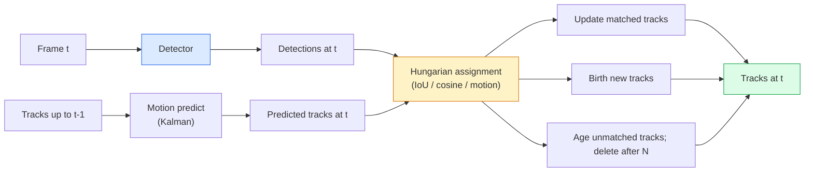

# Wielobiektowe Śledzenie i Pamięć Wideo

> Śledzenie to detekcja plus asocjacja. Wykrywaj w każdej klatce. Dopasowuj wykrycia z bieżącej klatki do śladów z poprzedniej klatki według ID.

**Typ:** Build
**Języki:** Python
**Wymagania wstępne:** Lesson 06 fazy 4 (YOLO Detection), Lesson 08 fazy 4 (Mask R-CNN), Lesson 24 fazy 4 (SAM 3)
**Szacowany czas:** ~60 minut

## Cele uczenia się

- Rozróżnić tracking-by-detection od query-based tracking i wymienić rodziny algorytmów (SORT, DeepSORT, ByteTrack, BoT-SORT, SAM 2 memory tracker, SAM 3.1 Object Multiplex)
- Zaimplementować IoU + Hungarian assignment od podstaw dla klasycznego tracking-by-detection
- Wyjaśnić memory bank SAM 2 i dlaczego radzi sobie z okluzją lepiej niż IoU-based association
- Odczytać trzy metryki śledzenia (MOTA, IDF1, HOTA) i wybrać, która ma znaczenie dla danego przypadku użycia

## Problem

Detector informuje, gdzie znajdują się obiekty w pojedynczej klatce. Tracker informuje, które wykrycie w klatce `t` jest tym samym obiektem, co wykrycie w klatce `t-1`. Bez tego nie można zliczać obiektów przekraczających linię, śledzić piłki przez okluzję ani wiedzieć, że "samochód #4 znajduje się na pasie od 8 sekund."

Tracking jest niezbędny w każdym produkcie operującym na wideo: analityka sportowa, monitoring, jazda autonomiczna, analiza obrazów medycznych, monitoring dzikiej przyrody, zliczanie znaków towarowych. Współdzielone są fundamentalne bloki konstrukcyjne: detector per-frame, model ruchu (filtr Kalmana lub coś bardziej złożonego), krok asocjacji (algorytm węgierski na IoU / cosine / cechy nauczone), oraz cykl życia tracka (narodziny, aktualizacja, śmierć).

2026 przyniósł dwa nowe wzorce: **SAM 2 memory-based tracking** (pamięć cech zamiast asocjacji modelem ruchu) i **SAM 3.1 Object Multiplex** (współdzielona pamięć dla wielu instancji tego samego konceptu). Ta lekcja najpierw omawia klasyczny stos, a następnie podejście memory-based.

## Koncepcja

### Tracking-by-detection



Każdy tracker, który napotkasz w 2026, jest wariantem tej pętli. Różnice:

- **SORT** (2016): filtr Kalmana + IoU Hungarian. Prosty, szybki, bez modelu aparycji.
- **DeepSORT** (2017): SORT + cecha aparycji oparta na CNN per track (ReID embedding). Lepiej radzi sobie ze skrzyżowaniami.
- **ByteTrack** (2021): kojarzy low-confidence detections jako drugi etap; nie wymaga cech aparycji, ale jest top performer na MOT17.
- **BoT-SORT** (2022): Byte + kompensacja ruchu kamery + ReID.
- **StrongSORT / OC-SORT** — potomkowie ByteTrack z lepszym ruchem i aparycją.

### Filtr Kalman w jednym akapicie

Filtr Kalman utrzymuje per-track state `(x, y, w, h, dx, dy, dw, dh)` z kowariancją. Przy każdej klatce **predict** stan używając modelu stałej prędkości, następnie **update** z dopasowanym wykryciem. Update bardziej ufa wykryciu, gdy niepewność predict jest wysoka. To daje gładkie trajektorie i zdolność kontynuowania tracka przez krótką okluzję (1-5 klatek).

Każdy klasyczny tracker używa filtra Kalman w kroku motion-prediction.

### Algorytm węgierski

Mając macierz kosztów `M x N` (tracks x detections), znajdź przypisanie jeden-do-jednego minimalizujące całkowity koszt. Koszt to zwykle `1 - IoU(track_bbox, detection_bbox)` lub ujemne podobieństwo cosine cech aparycji. Czas działania to O((M+N)^3); dla M, N do ~1000 jest wystarczająco szybki w Pythonie przez `scipy.optimize.linear_sum_assignment`.

### Kluczowa idea ByteTrack

Standardowe trackery odrzucają low-confidence detections (< 0.5). ByteTrack zatrzymuje je jako **second-stage candidates**: po dopasowaniu tracks do high-confidence detections, niedopasowane tracks próbują dopasować low-confidence detections z nieco luźniejszym progiem IoU. Odzyskuje krótkie okluzje, ID switches blisko tłumu.

### SAM 2 memory-based tracking

SAM 2 obsługuje wideo utrzymując **memory bank** per-instance spatio-temporal features. Mając prompt (klik, box, tekst) na jednej klatce, enkoduje instancję do pamięci. Na kolejnych klatkach, pamięć jest cross-attendowana przeciwko cechom nowej klatki, a decoder produkuje maskę dla tej samej instancji w nowej klatce.

Bez filtra Kalmana, bez Hungarian assignment. Asocjacja jest implicite w operacji memory-attention, a decoder produkuje maskę.

Zalety:

- Odporny na duże okluzje (pamięć niesie tożsamość instancji przez wiele klatek).
- Open-vocabulary gdy połączony z tekstowymi promptami SAM 3.
- Działa bez oddzielnego modelu ruchu.

Wady:

- Wolniejszy niż ByteTrack dla many-object tracking.
- Memory bank rośnie; ogranicza context window.

### SAM 3.1 Object Multiplex

Wcześniejszy SAM 2 / SAM 3 tracking utrzymuje osobny memory bank per instance. Dla 50 obiektów, 50 memory banks. Object Multiplex (marzec 2026) łączy je w jeden współdzielony z **per-instance query tokens**. Koszt skaluje sub-linearly w liczbie instancji.

Multiplex to nowy domyślny dla crowd tracking w 2026: tłumy na koncertach, pracownicy magazynów, skrzyżowania.

### Trzy metryki do poznania

- **MOTA (Multi-Object Tracking Accuracy)** — 1 - (FN + FP + ID switches) / GT. Ważone według typu błędu; pojedyncza metryka, która łączy błędy detekcji i asocjacji.
- **IDF1 (ID F1)** — harmonic mean ID precision i recall. Koncentruje się konkretnie na tym, jak dobrze każdy ground-truth track zachowuje swoje ID w czasie. Lepszy niż MOTA dla zadań wrażliwych na ID-switch.
- **HOTA (Higher Order Tracking Accuracy)** — rozkłada się na detection accuracy (DetA) i association accuracy (AssA). Standard społeczności od 2020; najbardziej kompleksowy.

Dla surveillance (kto jest kim): IDF1 to, co raportujesz. Dla sport analytics (zliczanie podań): HOTA. Dla ogólnych porównań akademickich: HOTA.

## Zbuduj to

### Krok 1: Macierz kosztów oparta na IoU

```python
import numpy as np


def bbox_iou(a, b):
    """
    a, b: (N, 4) arrays of [x1, y1, x2, y2].
    Returns (N_a, N_b) IoU matrix.
    """
    ax1, ay1, ax2, ay2 = a[:, 0], a[:, 1], a[:, 2], a[:, 3]
    bx1, by1, bx2, by2 = b[:, 0], b[:, 1], b[:, 2], b[:, 3]
    inter_x1 = np.maximum(ax1[:, None], bx1[None, :])
    inter_y1 = np.maximum(ay1[:, None], by1[None, :])
    inter_x2 = np.minimum(ax2[:, None], bx2[None, :])
    inter_y2 = np.minimum(ay2[:, None], by2[None, :])
    inter = np.clip(inter_x2 - inter_x1, 0, None) * np.clip(inter_y2 - inter_y1, 0, None)
    area_a = (ax2 - ax1) * (ay2 - ay1)
    area_b = (bx2 - bx1) * (by2 - by1)
    union = area_a[:, None] + area_b[None, :] - inter
    return inter / np.clip(union, 1e-8, None)
```

### Krok 2: Minimalny SORT-style tracker

Stały constant-velocity Kalman pominięty dla zwięzłości — używamy tutaj prostego IoU association; w produkcji Kalman predict jest niezbędny. Pakiet `sort` dostarcza pełną wersję.

```python
from scipy.optimize import linear_sum_assignment


class Track:
    def __init__(self, tid, bbox, frame):
        self.id = tid
        self.bbox = bbox
        self.last_frame = frame
        self.hits = 1

    def update(self, bbox, frame):
        self.bbox = bbox
        self.last_frame = frame
        self.hits += 1


class SimpleTracker:
    def __init__(self, iou_threshold=0.3, max_age=5):
        self.tracks = []
        self.next_id = 1
        self.iou_threshold = iou_threshold
        self.max_age = max_age

    def step(self, detections, frame):
        if not self.tracks:
            for d in detections:
                self.tracks.append(Track(self.next_id, d, frame))
                self.next_id += 1
            return [(t.id, t.bbox) for t in self.tracks]

        track_boxes = np.array([t.bbox for t in self.tracks])
        det_boxes = np.array(detections) if len(detections) else np.empty((0, 4))

        iou = bbox_iou(track_boxes, det_boxes) if len(det_boxes) else np.zeros((len(track_boxes), 0))
        cost = 1 - iou
        cost[iou < self.iou_threshold] = 1e6

        matched_track = set()
        matched_det = set()
        if cost.size > 0:
            row, col = linear_sum_assignment(cost)
            for r, c in zip(row, col):
                if cost[r, c] < 1.0:
                    self.tracks[r].update(det_boxes[c], frame)
                    matched_track.add(r); matched_det.add(c)

        for i, d in enumerate(det_boxes):
            if i not in matched_det:
                self.tracks.append(Track(self.next_id, d, frame))
                self.next_id += 1

        self.tracks = [t for t in self.tracks if frame - t.last_frame <= self.max_age]
        return [(t.id, t.bbox) for t in self.tracks]
```

60 linii. Przyjmuje per-frame detections, zwraca per-frame track IDs. Prawdziwe systemy dodają Kalman predict, ByteTrack's second-stage re-match i cechy aparycji.

### Krok 3: Synthetic trajectory test

```python
def synthetic_frames(num_frames=20, num_objects=3, H=240, W=320, seed=0):
    rng = np.random.default_rng(seed)
    starts = rng.uniform(20, 200, size=(num_objects, 2))
    velocities = rng.uniform(-5, 5, size=(num_objects, 2))
    frames = []
    for f in range(num_frames):
        dets = []
        for i in range(num_objects):
            cx, cy = starts[i] + f * velocities[i]
            dets.append([cx - 10, cy - 10, cx + 10, cy + 10])
        frames.append(dets)
    return frames


tracker = SimpleTracker()
for f, dets in enumerate(synthetic_frames()):
    tracks = tracker.step(dets, f)
```

Trzy obiekty poruszające się po liniach prostych powinny zachować swoje IDs przez wszystkie 20 klatek.

### Krok 4: ID-switch metric

```python
def count_id_switches(tracks_per_frame, gt_per_frame):
    """
    tracks_per_frame:  list of list of (track_id, bbox)
    gt_per_frame:      list of list of (gt_id, bbox)
    Returns number of ID switches.
    """
    prev_assignment = {}
    switches = 0
    for tracks, gts in zip(tracks_per_frame, gt_per_frame):
        if not tracks or not gts:
            continue
        t_boxes = np.array([b for _, b in tracks])
        g_boxes = np.array([b for _, b in gts])
        iou = bbox_iou(g_boxes, t_boxes)
        for g_idx, (gt_id, _) in enumerate(gts):
            j = iou[g_idx].argmax()
            if iou[g_idx, j] > 0.5:
                t_id = tracks[j][0]
                if gt_id in prev_assignment and prev_assignment[gt_id] != t_id:
                    switches += 1
                prev_assignment[gt_id] = t_id
    return switches
```

To uproszczona metryka IDF1-adjacent: zlicza, ile razy ground-truth object zmienia przypisane predicted track ID. Prawdziwe MOTA / IDF1 / HOTA tooling żyje w `py-motmetrics` i `TrackEval`.

## Użyj tego

Production trackery w 2026:

- `ultralytics` — YOLOv8 + ByteTrack / BoT-SORT wbudowane. `results = model.track(source, tracker="bytetrack.yaml")`. Domyślny wybór.
- `supervision` (Roboflow) — ByteTrack wrappers plus utilities do adnotacji.
- SAM 2 / SAM 3.1 — memory-based tracking przez `processor.track()`.
- Custom stack: detector (YOLOv8 / RT-DETR) + `sort-tracker` / `OC-SORT` / `StrongSORT`.

Wybór:

- Piesi / samochody / boxes przy 30+ fps: **ByteTrack z ultralytics**.
- Wiele instancji jednej klasy w tłumie: **SAM 3.1 Object Multiplex**.
- Ciężkie okluzje z identyfikowalną aparycją: **DeepSORT / StrongSORT** (ReID features).
- Sport / złożone interakcje: **BoT-SORT** lub learned trackers (MOTRv3).

## Wyślij to

Ta lekcja tworzy:

- `outputs/prompt-tracker-picker.md` — wybiera SORT / ByteTrack / BoT-SORT / SAM 2 / SAM 3.1 dla danego typu sceny, wzorców okluzji i budżetu latency.
- `outputs/skill-mot-evaluator.md` — pisze kompletny harness ewaluacyjny dla MOTA / IDF1 / HOTA przeciwko ground-truth tracks.

## Ćwiczenia

1. **(Łatwe)** Uruchom powyższy synthetic tracker z 3, 10 i 30 obiektami. Zraportuj liczbę ID switches w każdym przypadku. Zidentyfikuj, gdzie proste IoU-only association zaczyna zawodzić.
2. **(Średnie)** Dodaj constant-velocity Kalman predict step przed asocjacją. Pokaż, że krótkie (2-3 klatki) okluzje nie powodują już ID switches, aby odzyskać krótkie okluzje.
3. **(Trudne)** Zintegruj memory-based tracker SAM 2 (przez `transformers`) jako alternatywny backend trackera. Uruchom oba SimpleTracker i SAM 2 na 30-sekundowym klipie tłumu i porównaj liczby ID switches, ręcznie labelując ground-truth IDs dla 5 salient osób, zanim porównasz wyniki.

## Kluczowe Terminy

| Termin | Co ludzie mówią | Co to faktycznie oznacza |
|--------|-----------------|--------------------------|
| Tracking-by-detection | "Detect then associate" | Per-frame detector + Hungarian assignment na IoU / aparycji |
| Kalman filter | "Motion predict" | Liniowa dynamika + kowariancja dla gładkich predykcji tracków i obsługi okluzji |
| Hungarian algorithm | "Optimal assignment" | Rozwiązuje problem minimum-cost bipartite matching; `scipy.optimize.linear_sum_assignment` |
| ByteTrack | "Low-confidence second pass" | Re-match niedopasowanych tracks do low-confidence detections aby odzyskać krótkie okluzje |
| DeepSORT | "SORT + appearance" | Dodaje ReID feature dla cross-frame matching; lepszy dla zachowania ID |
| Memory bank | "SAM 2 trick" | Per-instance spatio-temporal features przechowywane przez klatki; cross-attention zastępuje explicit association |
| Object Multiplex | "SAM 3.1 shared memory" | Pojedyncza współdzielona pamięć z per-instance queries dla szybkiego many-object tracking |
| HOTA | "Modern tracking metric" | Rozkłada się na detection i association accuracy; standard społeczności |

## Dalsza lektura

- SORT (Bewley et al., 2016) — minimalny tracking-by-detection paper
- DeepSORT (Wojke et al., 2017) — dodaje appearance feature
- ByteTrack (Zhang et al., 2022) — low-confidence second pass
- BoT-SORT (Aharon et al., 2022) — kompensacja ruchu kamery
- HOTA (Luiten et al., 2020) — zdekomponowana metryka trackingu
- SAM 2 video segmentation (Meta, 2024) — memory-based tracker
- SAM 3.1 Object Multiplex (Meta, March 2026)