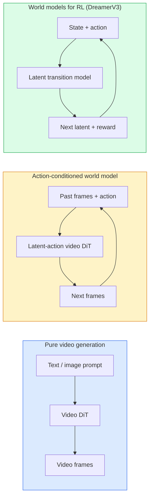

# World Models i dyfuzja wideo

> Model wideo, który przewiduje kolejne sekundy sceny, to symulator świata. Warunkowanie tego predykcji na akcjach daje nauczony silnik gry.

**Typ:** Nauka + Budowanie
**Języki:** Python
**Wymagania wstępne:** Lekcja 10 z Fazy 4 (Dyfuzja), Lekcja 12 z Fazy 4 (Rozumienie wideo), Lekcja 23 z Fazy 4 (DiT + rectified flow)
**Szacowany czas:** ~75 minut

## Cele uczenia się

- Wyjaśnić różnicę między czystym modelem generowania wideo (Sora 2) a modelem świata warunkowanym akcjami (Genie 3, DreamerV3)
- Opisać architekturę video DiT: fragmenty przestrzenno-czasowe, trójwymiarowe kodowanie pozycji, wspólna uwaga na tokenach (T, H, W)
- Prześledzić, jak model świata włącza się do robotyki: planowanie VLM → symulacja modelem wideo → odwrotna dynamika generuje akcje
- Wybrać między Sora 2, Genie 3, Runway GWM-1 Worlds, Wan-Video i HunyuanVideo dla danego przypadku użycia (kreacja wideo, interaktywna symulacja, synteza dla autonomicznej jazdy)

## Problem

Generowanie wideo i modelowanie świata skupiły się w 2026 roku. Model, który potrafi wygenerować spójną minutę wideo, w pewnym sensie nauczył się, jak świat się porusza: trwałość obiektów, grawitacja, przyczynowość, styl. Jeśli warunkujesz tę predykcję na akcjach (idź w lewo, otwórz drzwi), model wideo staje się uczonym symulatorem, który może zastąpić silnik gry, symulator jazdy lub środowisko robotyki.

Stawki są konkretne. Genie 3 generuje interaktywne środowiska z jednego obrazu. Runway GWM-1 Worlds syntezuje nieskończone sceny do eksploracji. Sora 2 produkuje minutowe wideo z zsynchronizowanym dźwiękiem i modelowaną fizyką. NVIDIA Cosmos-Drive, Wayve Gaia-2 i Tesla DrivingWorld generują realistyczne wideo jazdy dla danych treningowych pojazdów autonomicznych. Paradygmat modelu świata cicho podbija sim-to-real dla robotyki.

Ta lekcja to przeglądowa lekcja dająca szeroką perspektywę dla Fazy 4. Łączy generowanie obrazów, rozumienie wideo i rozumowanie agentowe w wzorzec architektoniczny, do którego zmierza dominująca część badań.

## Koncepcja

### Trzy rodziny modelowania świata



- **Sora 2** to czyste generowanie wideo warunkowane promptami. Bez interfejsu akcji. Nie możesz nim "sterować" w połowie generowania.
- **Genie 3**, **GWM-1 Worlds**, **Mirage / Magica** to modele świata warunkowane akcjami. Wnioskują latent actions z obserwowanego wideo, a następnie warunkują predykcje przyszłych klatek na akcjach. Interaktywne — naciskasz klawisze lub przesuwasz kamerę i scena reaguje.
- **DreamerV3** i klasyczna rodzina modeli świata dla RL przewidują w przestrzeni latent z explicit action conditioning, trenowane na sygnale nagrody. Mniej wizualne; bardziej użyteczne dla RL efektywnego próbkowo.

### Architektura video DiT

```
Video latent:          (C, T, H, W)
Patchify (spatial):    grid of P_h x P_w patches per frame
Patchify (temporal):   group P_t frames into a temporal patch
Resulting tokens:      (T / P_t) * (H / P_h) * (W / P_w) tokens
```

Pozycyjne kodowanie jest trójwymiarowe: rotary lub learned embedding dla każdej współrzędnej (t, h, w). Uwaga może być:

- **Full joint** — wszystkie tokeny uczestniczą we wszystkich. O(N^2) z N tokenami. Nieosiągalne dla długich wideo.
- **Divided** — naprzemienna uwaga czasowa (ta sama pozycja przestrzenna, przez czas: `(H*W) * T^2`) i uwaga przestrzenna (ten sam timestamp, przez przestrzeń: `T * (H*W)^2`). Używane przez TimeSformer i większość video DiT.
- **Window** — lokalne okna w (t, h, w). Używane przez Video Swin.

Każdy video diffusion model z 2026 używa jednego z tych trzech wzorców plus AdaLN conditioning (Lekcja 23) i rectified flow.

### Warunkowanie na akcjach: latent action models

Genie uczy się **latent action** na klatkę poprzez dyskryminacyjne przewidywanie akcji między parą kolejnych klatek. Dekoder modelu następnie warunkuje na wnioskowanej latent action — nie na explicitnych klawiszach. Podczas inference użytkownik może określić latent action (lub spróbować jedną z fresh prior) i model generuje następną klatkę zgodną z tą akcją.

Sora pomija interfejs akcji całkowicie. Jego dekoder przewiduje następne spacetime tokens z przeszłych spacetime tokens. Prompt warunkuje start; nic nie steruje nim w połowie generacji.

### Fizyczna plausibilność

Wydanie Sora 2 z 2026 roku explicitnie reklamowało **fizyczną plausibilność**: ciężar, równowagę, trwałość obiektów, przyczynowość. Mierzone przez zespół poprzez ręczne oceny plausibilności; model widocznie poprawia się przy upadających obiektach, zderzeniach postaci i (celowe błędy) (nieudany skok) versus Sora 1.

Plausibilność pozostaje dominującym trybem awarii. Wideo z 2024-2025 ludzi jedzących makaron lub pijących ze szklanek ujawniały brak persistent object representation w modelu. Modele z 2026 (Sora 2, Runway Gen-5, HunyuanVideo) redukują, ale nie eliminują tych problemów.

### Autonomiczne modele świata dla jazdy

Driving world models generują realistyczne sceny drogowe warunkowane trajektoriami, bounding boxes lub mapami nawigacji. Zastosowanie:

- **Cosmos-Drive-Dreams** (NVIDIA) — generuje minuty wideo jazdy dla treningu RL.
- **Gaia-2** (Wayve) — synteza scen warunkowana trajektorią dla ewaluacji polityki (policy).
- **DrivingWorld** (Tesla) — symuluje różne warunki pogodowe, porę dnia, ruch drogowy.
- **Vista** (ByteDance) — reaktywna synteza scen jazdy.

Zastępują drogie zbieranie danych ze świata rzeczywistego dla corner cases — piesi przechodzący na czerwono w nocy, zaśnieżone skrzyżowania, nietypowe typy pojazdów — które w przeciwnym razie wymagałyby milionów mil jazdy.

### Robotyczny stack: VLM + video model + inverse dynamics

Wyłaniająca się trójskładnikowa pętla robotyki:

1. **VLM** parsuje cel ("podnieś czerwoną filiżankę"), planuje sekwencję wysokopoziomowych akcji.
2. **Video generation model** symuluje, jak wykonanie każdej akcji by wyglądało — przewiduje obserwacje N klatek do przodu.
3. **Inverse dynamics model** ekstrahuje konkretne komendy silnikowe, które wyprodukowałyby te obserwacje.

To zastępuje kształtowanie sygnału nagrody i RL wymagający dużej liczby próbek. Model świata robi wyobrażanie; inverse dynamics zamyka pętlę na aktuacji. Genie Envisioner jest jedną instancją; wiele grup badawczych zbiega się do tej struktury.

### Ewaluacja

- **Jakość wizualna** — FVD (Fréchet Video Distance), badania z użytkownikami.
- **Zgodność z promptem** — CLIPScore per frame, ewaluacja typu VQA.
- **Fizyczna plausibilność** — ręcznie oceniana na benchmark suite (wewnętrzny benchmark Sora 2, VBench).
- **Kontrolowalność** (dla interaktywnych modeli świata) — spójność akcja → obserwacja; czy można wrócić do poprzedniego stanu?

### Krajobraz modeli w 2026

| Model | Zastosowanie | Parametry | Output | Licencja |
|-------|-------------|------------|--------|----------|
| Sora 2 | text-to-video, audio | — | 1-min 1080p + audio | API only |
| Runway Gen-5 | text/image-to-video | — | 10s clips | API |
| Runway GWM-1 Worlds | interactive world | — | nieskończone generowanie 3D | API |
| Genie 3 | interactive world from image | 11B+ | interaktywne klatki | research preview |
| Wan-Video 2.1 | open text-to-video | 14B | high-quality clips | non-commercial |
| HunyuanVideo | open text-to-video | 13B | 10s clips | permissive |
| Cosmos / Cosmos-Drive | autonomous driving sim | 7-14B | driving scenes | NVIDIA open |
| Magica / Mirage 2 | AI-native game engine | — | modifiable worlds | product |

## Zbuduj to

### Krok 1: 3D patchify dla wideo

```python
import torch
import torch.nn as nn


class VideoPatch3D(nn.Module):
    def __init__(self, in_channels=4, dim=64, patch_t=2, patch_h=2, patch_w=2):
        super().__init__()
        self.proj = nn.Conv3d(
            in_channels, dim,
            kernel_size=(patch_t, patch_h, patch_w),
            stride=(patch_t, patch_h, patch_w),
        )
        self.patch_t = patch_t
        self.patch_h = patch_h
        self.patch_w = patch_w

    def forward(self, x):
        # x: (N, C, T, H, W)
        x = self.proj(x)
        n, c, t, h, w = x.shape
        tokens = x.reshape(n, c, t * h * w).transpose(1, 2)
        return tokens, (t, h, w)
```

Konwolucja 3D ze stride równym kernel działa jako spatio-temporal patchifier. `(T, H, W) -> (T/2, H/2, W/2)` grid tokenów.

### Krok 2: Trójwymiarowe rotary position encoding

Rotary Position Embeddings (RoPE) oddzielnie aplikowane wzdłuż osi `t`, `h`, `w`:

```python
def rope_3d(tokens, t_dim, h_dim, w_dim, grid):
    """
    tokens: (N, T*H*W, D)
    grid: (T, H, W) sizes
    t_dim + h_dim + w_dim == D
    """
    T, H, W = grid
    n, seq, d = tokens.shape
    if t_dim + h_dim + w_dim != d:
        raise ValueError(f"t_dim+h_dim+w_dim ({t_dim}+{h_dim}+{w_dim}) must equal D={d}")
    assert seq == T * H * W
    t_idx = torch.arange(T, device=tokens.device).repeat_interleave(H * W)
    h_idx = torch.arange(H, device=tokens.device).repeat_interleave(W).repeat(T)
    w_idx = torch.arange(W, device=tokens.device).repeat(T * H)
    # Simplified: just scale channels by frequencies. Real RoPE rotates pairs.
    freqs_t = torch.exp(-torch.log(torch.tensor(10000.0)) * torch.arange(t_dim // 2, device=tokens.device) / (t_dim // 2))
    freqs_h = torch.exp(-torch.log(torch.tensor(10000.0)) * torch.arange(h_dim // 2, device=tokens.device) / (h_dim // 2))
    freqs_w = torch.exp(-torch.log(torch.tensor(10000.0)) * torch.arange(w_dim // 2, device=tokens.device) / (w_dim // 2))
    emb_t = torch.cat([torch.sin(t_idx[:, None] * freqs_t), torch.cos(t_idx[:, None] * freqs_t)], dim=-1)
    emb_h = torch.cat([torch.sin(h_idx[:, None] * freqs_h), torch.cos(h_idx[:, None] * freqs_h)], dim=-1)
    emb_w = torch.cat([torch.sin(w_idx[:, None] * freqs_w), torch.cos(w_idx[:, None] * freqs_w)], dim=-1)
    return tokens + torch.cat([emb_t, emb_h, emb_w], dim=-1)
```

Uproszczona forma addytywna. Real RoPE obraca sparowane kanały na częstotliwościach; informacja pozycyjna jest ta sama.

### Krok 3: Divided attention block

```python
class DividedAttentionBlock(nn.Module):
    def __init__(self, dim=64, heads=2):
        super().__init__()
        self.time_attn = nn.MultiheadAttention(dim, heads, batch_first=True)
        self.space_attn = nn.MultiheadAttention(dim, heads, batch_first=True)
        self.ln1 = nn.LayerNorm(dim)
        self.ln2 = nn.LayerNorm(dim)
        self.ln3 = nn.LayerNorm(dim)
        self.mlp = nn.Sequential(nn.Linear(dim, 4 * dim), nn.GELU(), nn.Linear(4 * dim, dim))

    def forward(self, x, grid):
        T, H, W = grid
        n, seq, d = x.shape
        # time attention: same (h, w), across t
        xt = x.view(n, T, H * W, d).permute(0, 2, 1, 3).reshape(n * H * W, T, d)
        a, _ = self.time_attn(self.ln1(xt), self.ln1(xt), self.ln1(xt), need_weights=False)
        xt = (xt + a).reshape(n, H * W, T, d).permute(0, 2, 1, 3).reshape(n, seq, d)
        # space attention: same t, across (h, w)
        xs = xt.view(n, T, H * W, d).reshape(n * T, H * W, d)
        a, _ = self.space_attn(self.ln2(xs), self.ln2(xs), self.ln2(xs), need_weights=False)
        xs = (xs + a).reshape(n, T, H * W, d).reshape(n, seq, d)
        xs = xs + self.mlp(self.ln3(xs))
        return xs
```

Time attention uczestniczy w ramach każdej pozycji przestrzennej przez czas; space attention uczestniczy w ramach każdej klatki przez pozycje. Dwie operacje O(T^2 + (HW)^2) zamiast jednej O((THW)^2). To jest sedno TimeSformer i każdego nowoczesnego video DiT.

### Krok 4: Złóż tiny video DiT

```python
class TinyVideoDiT(nn.Module):
    def __init__(self, in_channels=4, dim=64, depth=2, heads=2):
        super().__init__()
        self.patch = VideoPatch3D(in_channels=in_channels, dim=dim, patch_t=2, patch_h=2, patch_w=2)
        self.blocks = nn.ModuleList([DividedAttentionBlock(dim, heads) for _ in range(depth)])
        self.out = nn.Linear(dim, in_channels * 2 * 2 * 2)

    def forward(self, x):
        tokens, grid = self.patch(x)
        for blk in self.blocks:
            tokens = blk(tokens, grid)
        return self.out(tokens), grid
```

Nie jest working video generator; strukturalna demo, że każdy kawałek kształtuje się poprawnie.

### Krok 5: Sprawdź kształty

```python
vid = torch.randn(1, 4, 8, 16, 16)  # (N, C, T, H, W)
model = TinyVideoDiT()
out, grid = model(vid)
print(f"input  {tuple(vid.shape)}")
print(f"tokens grid {grid}")
print(f"output {tuple(out.shape)}")
```

Oczekuj `grid = (4, 8, 8)` i `out = (1, 256, 32)` po patching; głowa następnie projektuje na per-token spatio-temporal patches, przekształcane z powrotem do wideo.

## Użyj tego

Production access patterns dla 2026:

- **Sora 2 API** (OpenAI) — text-to-video, zsynchronizowany audio. Premium pricing.
- **Runway Gen-5 / GWM-1** (Runway) — image-to-video, interaktywne światy.
- **Wan-Video 2.1 / HunyuanVideo** — open-source self-host.
- **Cosmos / Cosmos-Drive** (NVIDIA) — driving simulation open weights.
- **Genie 3** — research preview, request access.

Do zbudowania interactive world-model demo: zacznij od Wan-Video dla jakości, nałóż latent-action adapter dla interaktywności, co pozwala zamknąć pętlę: imagines → actions → executed → observations → next imagination.

Dla autonomicznej symulacji jazdy: Cosmos-Drive jest open reference 2026.

Dla robotyki, stack w wild:

1. Language goal → VLM (Qwen3-VL) → high-level plan.
2. Plan → latent-action video model → wygenerowana sekwencja.
3. Rollout → inverse dynamics model → low-level actions.
4. Actions executed → observation fed back into step 1.

## Wyślij to

Ta lekcja produkuje:

- `outputs/prompt-video-model-picker.md` — wybiera między Sora 2 / Runway / Wan / HunyuanVideo / Cosmos dla danego tasku, licencji i latency.
- `outputs/skill-physical-plausibility-checks.md` — skill definiujący zautomatyzowane sprawdzenia (trwałość obiektów, grawitacja, ciągłość) do uruchomienia na dowolnym wygenerowanym wideo przed wysyłką.

## Ćwiczenia

1. **(Łatwe)** Oblicz liczbę tokenów dla 5-sekundowego wideo 360p przy patch-t=2, patch-h=8, patch-w=8. Rozumuj o pamięci dla attention przy tym rozmiarze.
2. **(Średnie)** Zamień divided attention block powyżej na full joint attention block i zmierz kształt oraz liczbę parametrów. Wyjaśnij, dlaczego divided attention jest konieczny dla real video models.
3. **(Trudne)** Zbuduj minimalny latent-action video model: weź dataset (frame_t, action_t, frame_{t+1}) triples (dowolna prosta gra 2D), trenuj tiny video DiT warunkowany na action embeddings i pokaż, że różne akcje produkują różne następne klatki.

## Kluczowe terminy

| Termin | Co ludzie mówią | Co to faktycznie oznacza |
|-------|----------------|----------------------|
| World model | "Learned simulator" | Model, który przewiduje przyszłe obserwacje przy danym stanie i akcji |
| Video DiT | "Spacetime transformer" | Diffusion transformer z 3D patchification i divided attention |
| Latent action | "Inferred control" | Dyskretna lub ciągła latent action wnioskowana z par klatek; używana do warunkowania generacji następnej klatki |
| Divided attention | "Time then space" | Dwie operacje attention per block — przez czas, a potem przez przestrzeń — żeby utrzymać O(N^2) manageable |
| Object permanence | "Things stay real" | Właściwość sceny, którą video models muszą się nauczyć; klasyczny tryb awarii przy jedzeniu, szkle |
| FVD | "Fréchet Video Distance" | Video equivalent FID; primary visual quality metric |
| Inverse dynamics model | "Observations to actions" | Przy (state, next state), output akcja, która je łączy; zamyka robotyczną pętlę |
| Cosmos-Drive | "NVIDIA driving sim" | Open-weights autonomous-driving world model dla RL i ewaluacji |

## Dalsze czytanie

- Sora technical report (OpenAI) — video generation models as world simulators
- Genie: Generative Interactive Environments (Bruce et al., 2024) — latent action world models
- TimeSformer (Bertasius et al., 2021) — divided attention dla video transformers
- DreamerV3 (Hafner et al., 2023) — world models dla RL
- Cosmos-Drive-Dreams (NVIDIA, 2025) — driving world model
- Top 10 Video Generation Models 2026 (DataCamp)
- From Video Generation to World Model — survey repo