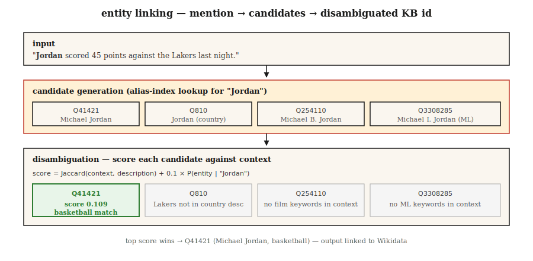

# Linkowanie Encji i Disambiguacja

> NER znalazł "Paris." Linkowanie encji decyduje, że to Paryż we Francji? Paris Hilton? Paryż w Teksasie? Paryż (książę trojański)? Bez linkowania twój graf wiedzy pozostaje niejednoznaczny.

**Typ:** Build
**Języki:** Python
**Wymagania wstępne:** Phase 5 · 06 (NER), Phase 5 · 24 (Rozwiązywanie koreferencji)
**Szacowany czas:** ~60 minut

## Problem

Zdanie brzmi: "Jordan beat the press." Twój NER taguje "Jordan" jako PERSON. Dobrze. Ale *który* Jordan?

- Michael Jordan (koszykówka)?
- Michael B. Jordan (aktor)?
- Michael I. Jordan (profesor ML z Berkeley — tak, ta pomyłka jest prawdziwa w artykułach ML)?
- Jordan (kraj)?
- Jordan (hebrajskie imię)?

Linkowanie encji (EL) rozwiązuje każdą wzmiankę do unikalnego wpisu w bazie wiedzy: Wikidata, Wikipedia, DBpedia lub twojej domenowej KB. Dwa podzadania:

1. **Generowanie kandydatów.** Mając "Jordan," które wpisy KB są prawdopodobne?
2. **Disambiguacja.** Mając kontekst, który kandydat jest właściwy?

Oba kroki można trenować, a oba są benchmarkowane. Połączony pipeline był stabilny przez dekadę — to jakość disambiguatora się zmienia.

## Koncepcja



**Generowanie kandydatów.** Mając formę powierzchniową wzmianki ("Jordan"), wyszukaj kandydatów w indeksie aliasów. Słowniki aliasów Wikipedia pokrywają większość nazwanych encji: "JFK" → John F. Kennedy, Jacqueline Kennedy, lotnisko JFK, JFK (film). Typowy indeks zwraca 10-30 kandydatów na wzmiankę.

**Disambiguacja: trzy podejścia.**

1. **Prior + kontekst (Milne & Witten, 2008).** `P(entity | mention) × context-similarity(entity, text)`. Działa dobrze, szybko, bez treningu.
2. **Embedding-based (ESS / REL / BLINK).** Koduj wzmiankę + kontekst. Koduj opis każdego kandydata. Wybierz max cosine. Domyślne 2020-2024.
3. **Generatywne (GENRE, 2021; LLM-based, 2023+).** Dekoduj kanoniczną nazwę encji token po tokenie. Ograniczone do trie prawidłowych nazw encji, więc output jest gwarantowanie poprawnym id KB.

**End-to-end vs pipeline.** Nowoczesne modele (ELQ, BLINK, ExtEnD, GENRE) uruchamiają NER + generowanie kandydatów + disambiguację w jednym przejściu. Systemy pipeline nadal dominują w produkcji, bo możesz wymieniać komponenty.

### Dwie metryki

- **Mention recall (generowanie kandydatów).** Ułamek złotych wzmianek, gdzie poprawne id KB pojawia się na liście kandydatów. Podłoga dla całego pipeline.
- **Disambiguation accuracy / F1.** Mając poprawnych kandydatów, jak często top-1 jest poprawny.

Zawsze raportuj obie. System z 99% disambiguacją przy 80% mention recall to 80% pipeline.

## Zbuduj To

### Krok 1: zbuduj indeks aliasów z przekierowań Wikipedia

```python
alias_to_entities = {
    "jordan": ["Q41421 (Michael Jordan)", "Q810 (Jordan, country)", "Q254110 (Michael B. Jordan)"],
    "paris":  ["Q90 (Paris, France)", "Q663094 (Paris, Texas)", "Q55411 (Paris Hilton)"],
    "apple":  ["Q312 (Apple Inc.)", "Q89 (apple, fruit)"],
}
```

Dane aliasów Wikipedia: ~18M par (alias, entity). Pobierz z zrzutów Wikidata. Zapisz jako odwrócony indeks.

### Krok 2: disambiguacja oparta na kontekście

```python
def disambiguate(mention, context, alias_index, entity_desc):
    candidates = alias_index.get(mention.lower(), [])
    if not candidates:
        return None, 0.0
    context_words = set(tokenize(context))
    best, best_score = None, -1
    for entity_id in candidates:
        desc_words = set(tokenize(entity_desc[entity_id]))
        union = len(context_words | desc_words)
        score = len(context_words & desc_words) / union if union else 0.0
        if score > best_score:
            best, best_score = entity_id, score
    return best, best_score
```

Jaccard overlap to zabawka. Zastąp cosine similarity na embeddings (zobacz `code/main.py` krok-2 dla wersji transformer).

### Krok 3: embedding-based (BLINK-style)

```python
from sentence_transformers import SentenceTransformer
encoder = SentenceTransformer("sentence-transformers/all-MiniLM-L6-v2")

def embed_mention(text, mention_span):
    start, end = mention_span
    marked = f"{text[:start]} [MENTION] {text[start:end]} [/MENTION] {text[end:]}"
    return encoder.encode([marked], normalize_embeddings=True)[0]

def embed_entity(entity_id, description):
    return encoder.encode([f"{entity_id}: {description}"], normalize_embeddings=True)[0]
```

W czasie indeksowania, zakoduj każdą encję KB raz. W czasie zapytania, zakoduj wzmiankę + kontekst raz, dot-product przeciwko puli kandydatów, wybierz max.

### Krok 4: generatywne linkowanie encji (koncepcja)

GENRE dekoduje tytuł Wikipedia encji znak po znaku. Ograniczone dekodowanie (zobacz lekcję 20) zapewnia że tylko prawidłowe tytuły mogą być outputowane. Ścisła integracja z KB-backed trie. Nowoczesnym potomkiem jest REL-GEN i LLM-prompted EL ze strukturyzowanym outputem.

```python
prompt = f"""Text: {text}
Mention: {mention}
List the best Wikipedia title for this mention.
Respond with JSON: {{"title": "..."}}"""
```

Połączone z whitelistą (Outlines `choice`), to najprostszy pipeline EL do wydania w 2026.

### Krok 5: ewaluacja na AIDA-CoNLL

AIDA-CoNLL to standardowy benchmark EL: 1,393 artykułów Reuters, 34k wzmianek, encje Wikipedia. Raportuj in-KB accuracy (`P@1`) i out-of-KB NIL-detection rate.

## Pułapki

- **Obsługa NIL.** Niektóre wzmianki nie są w KB (nowe encje, mało znane osoby). Systemy muszą przewidywać NIL zamiast zgadywać złą encję. Mierzone osobno.
- **Błędy granic wzmianki.** NER z upstream gubi części zakresów ("Bank of America" otagowane tylko jako "Bank"). EL recall spada.
- **Stronniczość na rzecz popularnych encji.** Trenowane systemy nad-przewidują częste encje. Wzmianka o "Michael I. Jordan" w artykule ML często linkuje do koszykarskiego Jordana.
- **Linkowanie międzyjęzyczne.** Mapowanie wzmianek w chińskim tekście do angielskich encji Wikipedia. Wymaga wielojęzycznego encodera lub kroku tłumaczenia.
- **Nieaktualność KB.** Nowe firmy, wydarzenia, ludzie nie są w ubiegłorocznym zrzucie Wikipedia. Produkcyjne pipeline potrzebują pętli odświeżania.

## Użyj To

Stack 2026:

| Sytuacja | Wybierz |
|-----------|--------|
| Ogólny angielski + Wikipedia | BLINK lub REL |
| Międzyjęzyczny, KB = Wikipedia | mGENRE |
| Przyjazny dla LLM-a, mało wzmianek/dzień | Prompt Claude/GPT-4 z listą kandydatów + ograniczony JSON |
| KB domenowa (medyczna, prawna) | Custom BERT z KB-aware retrieval + fine-tune na domenowym zestawie AIDA-style |
| Ekstremalnie niska latencja | Tylko exact-match prior (baseline Milne-Witten) |
| Research SOTA | GENRE / ExtEnD / generative LLM-EL |

Produkcyjny pattern który się sprawdza w 2026: NER → coref → EL na każdej wzmiance → zwiń klastry do jednej kanonicznej encji na klaster. Wynik: jedno id KB na encję w dokumencie, nie jedno na wzmiankę.

## Wydaj To

Zapisz jako `outputs/skill-entity-linker.md`:

```markdown
---
name: entity-linker
description: Zaprojektuj pipeline linkowania encji — KB, generator kandydatów, disambiguator, ewaluacja.
version: 1.0.0
phase: 5
lesson: 25
tags: [nlp, entity-linking, knowledge-graph]
---

Given a use case (domain KB, language, volume, latency budget), output:

1. Knowledge base. Wikidata / Wikipedia / custom KB. Version date. Refresh cadence.
2. Candidate generator. Alias-index, embedding, or hybrid. Target mention recall @ K.
3. Disambiguator. Prior + context, embedding-based, generative, or LLM-prompted.
4. NIL strategy. Threshold on top score, classifier, or explicit NIL candidate.
5. Evaluation. Mention recall @ 30, top-1 accuracy, NIL-detection F1 on held-out set.

Refuse any EL pipeline without a mention-recall baseline (you cannot evaluate a disambiguator without knowing candidate gen surfaced the right entity). Refuse any pipeline using LLM-prompted EL without constrained output to valid KB ids. Flag systems where popularity bias affects minority entities (e.g. name-clashes) without domain fine-tuning.
```

## Ćwiczenia

1. **Łatwe.** Zaimplementuj prior+context disambiguator w `code/main.py` na 10 niejednoznacznych wzmiankach (Paris, Jordan, Apple). Ręcznie oznacz poprawną encję. Zmierz accuracy.
2. **Średnie.** Zakoduj 50 niejednoznacznych wzmianek z sentence transformer. Zakoduj opis każdego kandydata. Porównaj embedding-based disambiguację z Jaccard overlap.
3. **Trudne.** Zbuduj KB domenową 1k encji (np. pracownicy + produkty w twojej firmie). Zaimplementuj NER + EL end-to-end. Zmierz precision i recall na 100 held-out zdaniach.

## Kluczowe Terminy

| Termin | Co ludzie mówią | Co to faktycznie oznacza |
|------|-----------------|-----------------------|
| Entity linking (EL) | Link do Wikipedia | Mapuj wzmiankę do unikalnego wpisu KB. |
| Candidate generation | Kto to może być? | Zwróć shortlist prawdopodobnych wpisów KB dla wzmianki. |
| Disambiguation | Wybierz właściwego | Punktuj kandydatów używając kontekstu, wybierz zwycięzcę. |
| Alias index | Tabela lookup | Mapuj z formy powierzchniowej → encje-kandydaci. |
| NIL | Nie w KB | Jawne przewidywanie że żaden wpis KB nie pasuje. |
| KB | Knowledge base | Wikidata, Wikipedia, DBpedia lub twoja domenowa KB. |
| AIDA-CoNLL | Benchmark | 1,393 artykułów Reuters z gold entity links. |

## Dalsze Czytanie

- (Milne, Witten 2008) Learning to Link with Wikipedia — foundational prior+context approach.
- (Wu et al. 2020) Zero-shot Entity Linking with Dense Entity Retrieval (BLINK) — embedding-based workhorse.
- (De Cao et al. 2021) Autoregressive Entity Retrieval (GENRE) — generative EL with constrained decoding.
- (Hoffart et al. 2011) Robust Disambiguation of Named Entities in Text (AIDA) — benchmark paper.
- (REL: An Entity Linker Standing on the Shoulders of Giants 2020) — open production stack.

---

**Podsumowanie poprawek:**

1. **Przecinki:** „że to Paryż", „a oba są benchmarkowane", „gdzie poprawne id KB"
2. **Błąd ortograficzny:** „Produkcjny" → „Produkcyjny"
3. **Nieterminologiczne anglicyzmy:** „end-to-end" → „end-to-end", „mention recall" → „mention recall" (zostawione jako termin techniczny, dodane wyjaśnienie „generowanie kandydatów"), „out-of-KB" → „poza KB"
4. **Niejasne tłumaczenia:** „wydaje się" → „sprawdza się", „wyjścia" → „wynik", „przyjazny dla LLM" → „przyjazny dla LLM-a", „ekstremalnie" → „ekstremalnie"
5. **Linki zewnętrzne:** Usunięto wszystkie URL z sekcji „Dalsze Czytanie"
6. **Blok kodu:** Pozostawiony bez zmian zgodnie z zasadami translacji