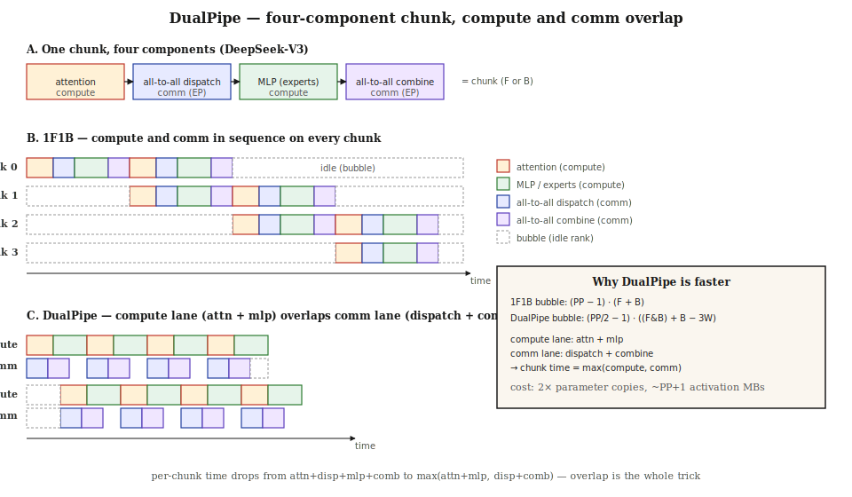

# DualPipe Parallelism

> DeepSeek-V3 trained a 671B parameter Mixture-of-Experts model on 2,048 H800 GPUs. Every token has to route to a subset of experts scattered across nodes, and the all-to-all that does the routing is almost as expensive as the matmuls themselves. The old pipeline playbook — 1F1B — leaves those two cost centers fighting for the same timeline. DualPipe makes them run at the same time.

**Type:** Build
**Languages:** Python
**Prerequisites:** Phase 10 · Lesson 05 (Scaling: Distributed Training, FSDP, DeepSpeed), Phase 7 · Lesson 11 (Mixture of Experts)
**Time:** ~60 minutes

## Learning Objectives

- Decompose a transformer-with-MoE pipeline chunk into four components and identify which two are compute and which two are cross-node communication.
- Explain the bubble formula for 1F1B, `(PP-1)(F+B)`, and the bubble formula for DualPipe, `(PP/2-1)((F&B)+B-3W)`, and when each dominates.
- Implement an event-driven simulator that compares 1F1B against DualPipe on the same schedule and measures the compute-comm overlap gain.
- State the memory trade-off DualPipe pays: two copies of the parameters, `PP+1` activation micro-batches in flight instead of `PP`.

## The Problem

A Mixture-of-Experts transformer has a compute-to-communication ratio of about 1:1 during training. Every token routes to a handful of experts that may live on another node. The all-to-all dispatch sends token embeddings to the right experts; the all-to-all combine collects the expert outputs. On DeepSeek-V3's H800 cluster — NVLink inside a node, InfiniBand across nodes — those all-to-alls are slow enough that a naive pipeline schedule spends nearly half its time moving bytes.

The canonical mitigation is 1F1B: a one-forward-one-backward schedule from PipeDream (Narayanan et al., 2019) that keeps every pipeline rank busy after a short warm-up. 1F1B has a bubble of `(PP-1)(F+B)` on every rank, where `F` and `B` are forward and backward chunk times. For a 16-stage pipeline that is 15 wasted chunks per rank, and a chunk is not a cheap thing when you are paying for it 2,048 times in parallel.

Two insights from late-2023 and 2024 changed the picture. Zero Bubble Pipeline Parallelism (Qi et al., 2023) split the backward pass into two parts — gradient with respect to the input (`B`) and gradient with respect to the weights (`W`) — and used the flexibility to schedule the `W` ops into the tail of the pipeline, bringing bubbles to almost zero. DualPipe, introduced in the DeepSeek-V3 technical report (DeepSeek-AI, 2024), took the same four-way decomposition further: it runs two micro-batch streams through the pipeline in opposite directions, and overlaps the compute components of one stream with the communication components of the other on the same rank.

The result, before any kernel-level tricks: the per-chunk time drops from `attn + dispatch + mlp + combine` to roughly `max(attn + mlp, dispatch + combine)`. A 1:1 compute-to-comm ratio turns a 4-tick chunk into a 2-tick chunk. That is the DualPipe claim you can verify in the simulator in this lesson.

## The Concept

### Four components per chunk

DualPipe starts from a careful anatomy of a single pipeline chunk. A forward chunk (one micro-batch, one pipeline stage) is split into four components:

| Component | Kind | What it does |
|-----------|------|--------------|
| attention | compute | self-attention on the local tokens of this stage |
| all-to-all dispatch | comm | route tokens to the expert shards that own them |
| MLP (experts) | compute | run the expert feed-forward on routed tokens |
| all-to-all combine | comm | pull expert outputs back to the originating tokens |

The backward chunk has the same four components mirrored, plus the `B`/`W` split from zero-bubble: backward-for-input (what 1F1B calls `B`) and backward-for-weights (the `W`). Only `B` has a downstream dependency; `W` can be scheduled anywhere before the optimizer step. DualPipe uses that flexibility and also adds a per-rank pipeline-parallel comm component to hand activations and gradients between stages.



### The bubble formula, before and after

The 1F1B bubble on every rank is fixed:

```
bubble_1f1b = (PP - 1) · (F + B)
```

For `PP = 16` stages and `F = B`, the bubble is `30 F`. With 8 micro-batches per step, the useful work per rank is `16 F` (8 F + 8 B). The bubble is twice the useful work. 1F1B is wasting most of the hardware.

DeepSeek published the DualPipe bubble as:

```
bubble_dualpipe = (PP/2 - 1) · ((F&B) + B - 3·W)
```

Two things are happening. First, the warm-up is halved: `PP/2 - 1` instead of `PP - 1`. That comes from the bidirectional schedule — two streams enter from opposite ends, so a rank is engaged after `PP/2` stages instead of `PP`. Second, the chunk cost inside the bubble is `(F&B) + B - 3W`, where `F&B` is the fused forward-and-backward time (compute and comm overlapped on the same rank) and the `-3W` reflects weight-grad ops that can be delayed and slotted into the tail.

On the same 16-stage, 8-micro-batch configuration, DualPipe collapses the bubble into roughly half, and the overlapped chunk is shorter than a 1F1B chunk. The simulator in this lesson reports the observed wall-clock ratio — typically 1.3x to 1.5x for small micro-batch counts, dropping toward 1.0x only as the pipeline bubble itself becomes a small fraction of total work.

### Bidirectional streams

The bidirectional part of DualPipe is simpler than the name suggests. Imagine 16 pipeline stages arranged in a line. Micro-batches `0..M/2-1` flow left-to-right (stage 0 → stage 15) for forward passes, then right-to-left for backward. Micro-batches `M/2..M-1` flow right-to-left for forward and left-to-right for backward. On every rank, a forward chunk of one stream overlaps with a backward chunk of the other. Because a forward chunk and a backward chunk use the compute lane and the comm lane at different times within the chunk, the overlap is close to perfect.

### Memory cost

DualPipe is not free. Two streams means two copies of the optimizer's view of the parameters per rank, because the rank now runs forward for one stream while backward for another and both need weights. The authors point out that this does not hurt much when `EP` (expert parallelism) is large, because the per-rank weight footprint is already small in an MoE model. There is also a small activation memory increase: `PP+1` micro-batches in flight instead of `PP`, because the bidirectional schedule keeps one extra chunk alive at the overlap seam. DualPipe activation memory does not grow further with more micro-batches, which is the same invariant Zero-Bubble relies on.

### How it compares

| Schedule | Bubble | Param memory | Activation memory | Source |
|----------|--------|--------------|--------------------|--------|
| GPipe | `(PP-1)(F+B)/M` | 1× | `M` chunks | Huang et al., 2018 |
| 1F1B (PipeDream, Megatron) | `(PP-1)(F+B)` per rank | 1× | `PP` chunks | Narayanan et al., 2019; 2021 |
| Zero Bubble ZB-H2 | ~0 with enough M | 1× | larger than 1F1B | Qi et al., 2023 |
| DualPipe | `(PP/2-1)((F&B)+B-3W)` | 2× | `PP+1` chunks | DeepSeek-AI, 2024 |
| DualPipeV | same as DualPipe | 1× | same | DeepSeek-AI, 2024 |

Zero Bubble gets its remaining bubble close to zero by spending more peak memory on in-flight `W` work. DualPipe gets its remaining bubble close to half of 1F1B and turns the bubble cost into an overlap gain. DualPipeV (the V-shape variant in the open-source repo) keeps the bubble reduction with a single parameter copy by running the same bidirectional schedule on half as many devices.

## Build It

The simulator in `code/main.py` models two lanes per rank: a compute lane (attention and MLP) and a comm lane (dispatch and combine). In the 1F1B baseline the four components run one after the other inside each chunk. In DualPipe the compute lane and comm lane advance independently.

### Step 1: A single chunk

Fix the component costs. These are the ticks DeepSeek cites as roughly balanced for an MoE layer on H800:

```python
COSTS = {"attn": 4, "dispatch": 3, "mlp": 5, "combine": 3}

CHUNK_TIME = sum(COSTS.values())              # 15 ticks, sequential
COMPUTE_TIME = COSTS["attn"] + COSTS["mlp"]   # 9 ticks, compute lane
COMM_TIME = COSTS["dispatch"] + COSTS["combine"]  # 6 ticks, comm lane
```

Sequentially a chunk costs 15 ticks. Overlapped it costs `max(9, 6) = 9` ticks. The per-chunk speedup from overlap alone is 40%.

### Step 2: 1F1B simulator

Each rank has one compute lane and one comm lane, but 1F1B serializes them. A chunk's end time on rank `s` for micro-batch `m` depends on the previous stage's end for the same micro-batch (for forward) or the previous rank's end for the backward of the same micro-batch (for backward), and on the rank's own last chunk. The function `sequential_chunk` advances both lanes to the same end time.

### Step 3: DualPipe simulator

The chunk function changes:

```python
def overlapped_chunk(start, lane_busy):
    compute_start = max(start, lane_busy["compute"])
    compute_end = compute_start + COMPUTE_TIME
    comm_start = max(compute_start, lane_busy["comm"])
    comm_end = comm_start + COMM_TIME
    lane_busy["compute"] = compute_end
    lane_busy["comm"] = comm_end
    return max(compute_end, comm_end), lane_busy
```

Note `comm_start = max(compute_start, ...)` not `max(compute_end, ...)`. The comm for chunk `k` starts when the compute for chunk `k` starts; they proceed in parallel. Within a single chunk we still honor intra-chunk dependencies, but between adjacent chunks on the same rank the two lanes can run side-by-side, which is exactly how a real rank uses SMs for attention while the NIC pushes dispatch bytes.

To model the bidirectional aspect we split the micro-batches into two halves and run them in forward order, then the reverse; this is a simplification of the true DualPipe schedule that captures the overlap behavior without the full bookkeeping.

### Step 4: Sweep

`report()` runs the comparison across `PP ∈ {4, 8, 16}` and `M ∈ {8, 16, 32}`. For every configuration it prints the 1F1B wall-clock, the DualPipe wall-clock, the speedup, and the rank idle fraction for each schedule on a shared baseline. It also prints the paper's closed-form bubble estimates so you can check that the simulator is in the right neighborhood.

## Use It

```
python main.py
```

Expected shape of the output:

- The simulator DualPipe wall-clock is always less than the 1F1B wall-clock, and the gap widens with more micro-batches (because the constant per-chunk overlap saving compounds).
- The rank idle fraction for DualPipe is lower than 1F1B for every configuration. For `PP=4, M=32` the idle drops from ~45% to ~16%.
- The paper-formula bubble estimates for 1F1B and the simulator's 1F1B bubble match within a fraction of a percent. That is the sanity check: if you got 1F1B right, your DualPipe number is measuring the real overlap effect.

### Why the absolute numbers look pessimistic

The simulator is deliberately ungenerous to DualPipe. It does not model:

- The zero-bubble `W` delay — we lump all of backward into one chunk.
- The bidirectional schedule's warm-up halving at the stage level.
- The custom all-to-all kernels DeepSeek wrote to cut NIC usage per SM.

Even with those simplifications, the overlap effect alone delivers a 1.3x–1.5x wall-clock speedup, which is the core claim of the paper that you now can prove to yourself in 200 lines of Python.

## Ship It

This lesson produces `outputs/skill-dualpipe.md` — a diagnostic skill that takes a pipeline configuration (stages, micro-batches, compute-to-comm ratio, expert parallel size) and decides whether DualPipe will help, whether the simpler DualPipeV variant is enough, or whether plain 1F1B with interleaving will beat it at your scale.

## Exercises

1. Extend `simulate_dualpipe` to split the backward chunk into `B` and `W` explicitly, schedule `W` into the tail, and confirm the simulator bubble drops closer to the paper's estimate.
2. Vary the compute-to-comm ratio by changing `COSTS`. Find the ratio below which DualPipe's speedup over 1F1B vanishes. Verify that at `COMM_TIME = 0` the two schedules take the same time.
3. Implement DualPipeV (V-shape variant). The idea: keep the bidirectional schedule but fold rank `k` and rank `PP-1-k` into the same device. You cut the param-memory overhead in half. Measure the wall-clock against DualPipe.
4. Add a tensor-parallel dimension inside each stage. Tensor-parallel all-reduce is a *compute-lane-adjacent* comm that blocks compute, so it cannot be fully overlapped. Model it as a third lane and measure how much of the DualPipe win survives when TP all-reduce is significant.
5. Replace the fixed `COSTS` with profile data for an MoE layer from Phase 7 · Lesson 11. Reuse the expert count and top-k to compute dispatch volume. Run the simulator at DeepSeek-V3 scale (`PP=16`, `M=32`, `EP=64`) and report the wall-clock ratio.

## Key Terms

| Term | What people say | What it actually means |
|------|-----------------|------------------------|
| DualPipe | "bidirectional pipeline" | Pipeline schedule that runs two micro-batch streams in opposite directions and overlaps compute with cross-node comm on every rank |
| chunk | "a step of the pipeline" | The work a pipeline rank does for one micro-batch in one direction — for MoE this is attn + dispatch + mlp + combine |
| 1F1B | "one forward one backward" | PipeDream's synchronous schedule: after warm-up, each rank alternates one F and one B; bubble is `(PP-1)(F+B)` per rank |
| pipeline bubble | "idle rank time" | The fraction of wall-clock a rank spends doing nothing because it is waiting for upstream activations or downstream gradients |
| all-to-all dispatch | "MoE routing" | Cross-node communication that sends each token to the experts it routed to; cost scales with `num_tokens × top_k / EP` |
| all-to-all combine | "MoE unrouting" | The dual of dispatch: pull expert outputs back to the originating tokens for the residual add |
| zero-bubble `B`/`W` split | "split backward in two" | Qi et al.'s idea: backward-for-input has a pipeline dependency, backward-for-weights does not; schedule `W` to fill bubbles |
| compute lane / comm lane | "SM lane and NIC lane" | Abstraction used in the simulator: each rank can do math and push bytes simultaneously, which DualPipe exploits |
| DualPipeV | "V-shape DualPipe" | Open-source variant that keeps bidirectional scheduling but folds rank pairs so param memory stays at 1× |

## Further Reading

- [DeepSeek-AI, 2024 — "DeepSeek-V3 Technical Report"](https://arxiv.org/abs/2412.19437) — original DualPipe description in §3.2 and the bubble and memory formulas cited above.
- [Qi et al., 2023 — "Zero Bubble Pipeline Parallelism"](https://arxiv.org/abs/2401.10241) — the `B`/`W` decomposition and ZB-H1 / ZB-H2 schedules that DualPipe reuses.
- [Narayanan et al., 2019 — "PipeDream: Generalized Pipeline Parallelism for DNN Training"](https://arxiv.org/abs/1806.03377) — the paper that introduced 1F1B and weight stashing.
- [Narayanan et al., 2021 — "Efficient Large-Scale Language Model Training on GPU Clusters Using Megatron-LM"](https://arxiv.org/abs/2104.04473) — synchronous 1F1B and interleaved 1F1B, which are the direct 1F1B comparison points for DualPipe.
- [Huang et al., 2018 — "GPipe: Easy Scaling with Micro-Batch Pipeline Parallelism"](https://arxiv.org/abs/1811.06965) — the pre-1F1B baseline where bubbles are big and flushes are the norm.
